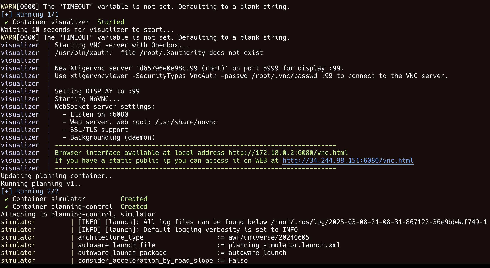
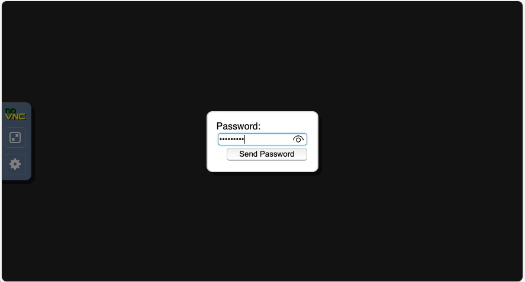

## Execute Autoware Open AD Kit by Docker Compose

Open AD Kit leverages Docker Compose technology to integrate all container initialization and corresponding configurations, allowing you to start with all the settings from the previous session without any modifications.

That said, we can still gain a deeper understanding of the system by examining the `docker/docker-compose.yml` file.

The script first starts the Visualizer service in detached mode, followed by the continuous execution of Planning & Simulation. The detailed ROS commands are defined in the docker/docker-compose.yml file.


### Visualizer Configuration

Similar to the example in the previous session, this Docker Compose service configures and runs a visualization tool (Visualizer) within a Docker container. It renders real-time simulation data using RViz and allows remote access via VNC and Ngrok.

The `visualizer` service maps:

- **volume `./etc/simulation:/autoware/scenario-sim`**

  The volume mapping `./etc/simulation:/autoware/scenario-sim` mounts a local directory (./etc/simulation) to a specific path inside the container (/autoware/scenario-sim). This means that files stored in the ./etc/simulation directory on the host machine will be accessible from inside the container at /autoware/scenario-sim.

- **Port `6080:6080`**

  In the Autoware visualization environment, the 6080:6080 port mapping is used to enable web-based VNC remote desktop access, allowing users to interact with tools like Rviz directly from their browser without needing an external VNC client.
  
  Inside the container, VNC is enabled via the `VNC_ENABLED=true` environment variable, ensuring that the VNC server is running. The VNC server listens on port 6080, making it accessible through a web-based interface, which simplifies remote monitoring and control of autonomous driving simulations, improving development and testing efficiency.

  Enable VNC-based remote visualization to interact with the Autoware environment remotely.
  To access the visualization interface:
	-	On the same machine, open: `http://localhost:6080`
	-	From another device, use: `http://<VISUALIZER_IP_ADDRESS>:6080`

```yml
  visualizer:
    image: ghcr.io/autowarefoundation/demo-packages:visualizer
    container_name: visualizer
    volumes:
      - ./etc/simulation:/autoware/scenario-sim
    ports:
      - 6080:6080
      - 5999:5999
    environment:
      - ROS_DOMAIN_ID=88
      - VNC_ENABLED=true
      - RVIZ_CONFIG=/autoware/scenario-sim/rviz/scenario_simulator.rviz
      - NGROK_AUTHTOKEN=${NGROK_AUTHTOKEN}
      - NGROK_URL=${NGROK_URL}
```


### Planning-Control Module
The second Docker Compose service defines the `planning-control` module within a simulation environment. The planning-control container is responsible for Motion planning, Trajectory generation, Vehicle control

One key aspect to mention is the depends_on directive.
To ensure that planning-control receives sensor data from the simulator, use depends_on to make sure the simulator service starts before planning-control begins execution.

ROS2 command:
The command starts the planning_simulator.launch.xml launch file, which initializes the motion planning module:
- map_path:=/autoware/scenario-sim/map → Loads the simulation map.
- vehicle_model:=sample_vehicle → Uses a predefined vehicle model for testing.
- sensor_model:=sample_sensor_kit → Loads sensor configurations for perception.
- scenario_simulation:=true → Enables scenario-based simulation.
- rviz:=false → Disables RViz visualization inside this container.
- perception/enable_traffic_light:=false → Disables traffic light recognition for this test.


```yml
  planning-control:
    image: ghcr.io/autowarefoundation/demo-packages:planning-control
    container_name: planning-control
    depends_on:
      - simulator 
    volumes:
      - ./etc/simulation:/autoware/scenario-sim
      - $CONF_FILE:/opt/autoware/share/autoware_launch/config/planning/scenario_planning/lane_driving/behavior_planning/behavior_path_planner/autoware_behavior_path_static_obstacle_avoidance_module/static_obstacle_avoidance.param.yaml
      - $COMMON_FILE:/opt/autoware/share/autoware_launch/config/planning/scenario_planning/common/common.param.yaml
    environment:
      - ROS_DOMAIN_ID=88
      - RMW_IMPLEMENTATION=rmw_cyclonedds_cpp
    command: >
      ros2 launch autoware_launch planning_simulator.launch.xml
      map_path:=/autoware/scenario-sim/map
      vehicle_model:=sample_vehicle
      sensor_model:=sample_sensor_kit
      scenario_simulation:=true
      rviz:=false
      perception/enable_traffic_light:=false
```

### Simulator Module

The final Docker Compose service defines the `simulator` module. The simulator is responsible for creating a virtual driving environment, generating sensor data, and providing vehicle state information to other components such as planning-control and visualizer.

Maps local directory (./etc/simulation) to /autoware/scenario-sim inside the container.

ROS2 command:
The following command starts the scenario_test_runner.launch.py launch file, initializing the Autoware simulation:

- scenario:=/autoware/scenario-sim/scenario/yield_maneuver_demo.yaml → Specifies the scenario configuration file.
- sensor_model:=sample_sensor_kit → Uses a predefined sensor configuration.
- vehicle_model:=sample_vehicle → Uses a sample vehicle model.
- global_frame_rate:=20 → Sets the simulation frame rate to 20 FPS.
- launch_rviz:=false → Prevents RViz from launching in the container.

```yml
  simulator:
    image: ghcr.io/autowarefoundation/demo-packages:simulator
    container_name: simulator
    volumes:
      - ./etc/simulation:/autoware/scenario-sim
    environment:
      - ROS_DOMAIN_ID=88
      - RMW_IMPLEMENTATION=rmw_cyclonedds_cpp
    command: >
      ros2 launch scenario_test_runner scenario_test_runner.launch.py
      record:=false
      scenario:=/autoware/scenario-sim/scenario/yield_maneuver_demo.yaml
      sensor_model:=sample_sensor_kit
      vehicle_model:=sample_vehicle
      initialize_duration:=90
      global_timeout:=$TIMEOUT
      global_frame_rate:=20
      launch_autoware:=false
      launch_rviz:=false
```

### Execute Planning Visualizer Demo

To start the Planning Visualizer Demo, execute the following script:

```bash
./docker/run.sh
```

This Bash script sets up environment variables and orchestrates the execution of Open AD Kit's visualizer, planning-control, and simulator using the previously mentioned Docker Compose setup. The script runs in a loop, continuously testing two different planning configurations: CONF_FILE_FAIL and CONF_FILE_PASS.

Once the script starts successfully, you will see a similar output.
You can then use your browser to monitor the simulation data in real-time.



Now you can use the browser to access visualization at the above's URLs:
In this example is http://34.244.98.151:6080/vnc.html

To access the visualizer:
1. Open a web browser and go to: `http://<server-ip>:6080/vnc.html`
2. Click **Connect** on the VNC login screen.

3. Enter the default VNC password: **"openadkit"**.


You are now entered the OpenAD Kit simulation environment.

This demo will continuously repeat the two scenarios.
- **fail_static_obstacle_avoidance.param.yaml**: In the first scenario, the vehicle remains stationary behind the obstacle. 
- **pass_static_obstacle_avoidance.param.yaml**: In the second scenario, the vehicle is permitted to change lanes to maneuver around the obstacle.

The vehicle starts from a stationary position, moves along the road, and stops when there is a vehicle ahead, waiting for the obstruction to clear before proceeding.

After each simulation run, it will automatically restart after 90 seconds. You can use the mouse to adjust different viewing angles for observation.


Congratulations! You have successfully executed the OpenAD Kit demo.
