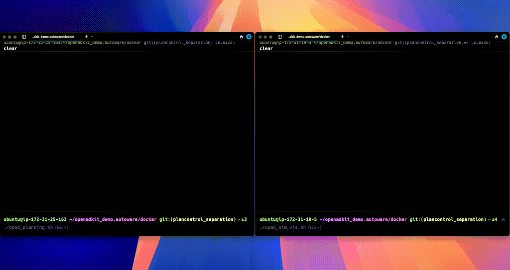

### Demonstrating the Distributed OpenAD Kit in Action

In this section, you’ll bring all the previous setup together and execute the full OpenAD Kit demo across two Arm-based instances.

OpenAD Kit is an open-source reference design for autonomous driving workloads on Arm. 
It demonstrates how Autoware modules can be deployed on scalable infrastructure, whether on a single machine or split across multiple compute nodes.

#### Preparing the Execution Scripts

This setup separates the simulation/visualization environment from the planning-control logic, allowing you to explore how ROS 2 nodes communicate over a distributed system using DDS (Data Distribution Service).

To start the system, you need to configure and run separate launch commands on each machine.

On each instance, copy the appropriate launch script into the `openadkit_demo.autoware/docker` directory.


  
    !/bin/bash
    # Configure the environment variables
    export SCRIPT_DIR=/home/ubuntu/openadkit_demo.autoware/docker
    export CONF_FILE_PASS=$SCRIPT_DIR/etc/simulation/config/pass_static_obstacle_avoidance.param.yaml
    export CONF_FILE_FAIL=$SCRIPT_DIR/etc/simulation/config/fail_static_obstacle_avoidance.param.yaml

    export CONF_FILE=$CONF_FILE_FAIL
    export COMMON_FILE=$SCRIPT_DIR/etc/simulation/config/common.param.yaml
    export NGROK_AUTHTOKEN=$NGROK_AUTHTOKEN
    export NGROK_URL=$NGROK_URL

    # Start planning-control
    echo "Running planning v1.."
    TIMEOUT=120 CONF_FILE=$CONF_FILE_PASS docker compose -f "$SCRIPT_DIR/docker-compose-2ins.yml" up planning-control -d  
  
  
  
    #!/bin/bash
    export SCRIPT_DIR=/home/ubuntu/openadkit_demo.autoware/docker

    export CONF_FILE_FAIL=$SCRIPT_DIR/etc/simulation/config/fail_static_obstacle_avoidance.param.yaml
    export CONF_FILE=$CONF_FILE_FAIL
    export COMMON_FILE=$SCRIPT_DIR/etc/simulation/config/common.param.yaml
    export NGROK_AUTHTOKEN=$NGROK_AUTHTOKEN
    export NGROK_URL=$NGROK_URL
    export TIMEOUT=300

    # Start visualizer once
    docker compose -f "$SCRIPT_DIR/docker-compose-2ins.yml" up visualizer -d
    echo "Waiting 10 seconds for visualizer to start..."
    sleep 10

    # Run simulator scenario 3 times
    for i in {1..3}; do
      echo "Running simulator demo round $i..."
      docker compose -f "$SCRIPT_DIR/docker-compose-2ins.yml" run --rm simulator
      echo "Round $i complete. Waiting 5 seconds before next run..."
      sleep 5
    done
    echo "All simulator runs complete." 
  


You can also find the prepared launch scripts `opad_planning.sh` and `opad_sim_vis.sh` inside the `openadkit_demo.autoware/docker` directory on both instances.

These scripts encapsulate the required environment variables and container commands for each role.

#### Running the Distributed OpenAD Kit Demo

On the Planning-Control node, execute:

```bash
./opad_planning.sh
```

On the Simulation and Visualization node, execute:

```bash
./opad_sim_vis.sh
```


Once both machines are running their respective launch scripts, the Visualizer will generate a web-accessible interface on:

http://[Visualizer public IP address]:6080/vnc.html

You can open this link in a browser to observe the demo behavior, which will closely resemble the output from the [previous learning path](http://learn.arm.com/learning-paths/automotive/openadkit1_container/4_run_openadkit/). 



The containers are now distributed across two separate instances, enabling real-time, cross-node communication.
Behind the scenes, this architecture demonstrates how DDS manages low-latency, peer-to-peer data exchange in a distributed ROS 2 environment.

To support demonstration and validation, the simulator is configured to run three times sequentially, giving you multiple opportunities to observe how data flows between nodes and verify that communication remains stable across each cycle.

Now that you’ve seen the distributed system in action, consider exploring different QoS settings, network conditions, or even adding a third node to expand the architecture further.
