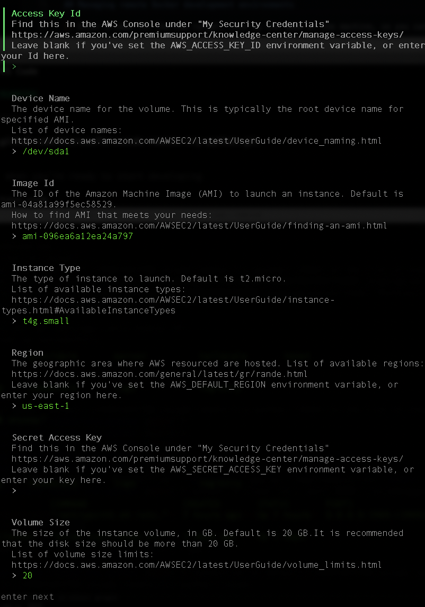

You can also create and manage workspaces on virtual machines from a cloud service provider which are created for you and can be stopped with Daytona.

This is useful when you want to use a remote computer which is billed for the time you use it, such as AWS EC2 instances. 

You can use the AWS provider to create an Arm-based development environment using AWS Graviton processors.

The main difference is that Daytona will create an EC2 instance for you and stop it when the workspace is stopped (and the billing for the EC2 instance will also stop). 

## Use the Daytona AWS provider

To use the AWS provider you need an AWS account and the following items:

1. AWS Access key ID and Secret Access Key. If you don't have them, you can generate them using AWS Identity and Access Management (IAM). For additional information refer to the AWS documentation or the [AWS Credentials](/install-guides/aws_access_keys/) install guide.

2. Amazon Machine Image (AMI) for the operating system you want to use. The Arm-based AMIs are different from x86 so you need to look up the Arm-based AMIs.

3. Instance Type: to create Arm-based workspaces, use a Graviton-based instance type such as M6g, C6g, R6g, or T4g. Most Graviton-based instances have `g` in the name. There are instances for Graviton2, Graviton3, and Graviton4 processors. 

{}
You can use Amazon EC2 `t4g.small` instances powered by AWS Graviton2 processors free for up to 750 hours per month until Dec 31st 2025. 
{}

### Configure an AWS target

Use the same Daytona command to create a new target based on the AWS provider. 

```console
daytona target set
```

1. Select the AWS provider then select `New Target`. 

2. Enter a name for the new target so you can recognize it as an AWS EC2 target in the future.

3. Configure the target with the information below:

Access Key ID: Your access key ID you generate in AWS for your account.

Device Name: This is the root device of your EC2 virtual machine, leave the default.

Image ID: This is the AMI for the operating system you want to run, make sure to use an Arm AMI. For example, Ubuntu 24.04 for Arm is `ami-096ea6a12ea24a797`. 

Instance Type: EC2 instance type to create, for example `t4g.small`.

Region: The AWS region to create the EC2 instance such as `us-east-1` in N. Virginia or `us-west-2` in Oregon. 

Secret Access Key: Also generated for your account along with the access key ID.

Volume Size: size of the disk in GB. Increase the default if you want more disk space.

The values are shown below:



Once the new target is created, you can list the targets and confirm the parameters.

```console
daytona target list 
```

The output is similar to:

```output
Target Name:  g2

Target Provider:  aws-provider

Default:  Yes

Target Options:  {
  "Device Name": "/dev/sda1",
  "Image Id": "ami-096ea6a12ea24a797",
  "Instance Type": "t4g.small",
  "Region": "us-east-1",
  "Volume Size": 20,
  "Volume Type": "gp3"
}
```

You can now use `daytona create` to create another workspace for the example Flask project, but this time on an AWS EC2 Arm-based instance.

```console
daytona create --no-ide https://github.com/microsoft/vscode-remote-try-python/tree/main
```

After the workspace is created, all of the same commands you used on the local workspace can be used to connect, including `daytona code` and `daytona ssh`.

## Start and stop the workspace

When you use the `daytona stop` command on the AWS provided workspace, the EC2 instance is stopped. You can confirm this in your AWS console. The billing for the compute is stopped, but there is a minimal cost for the storage of stopped EC2 instances. 

When you run `daytona start` on the workspace, it doesn't automatically start. You need to manually start the EC2 instance first and then run `daytona start`. 

The Daytona AWS provider takes care of everything related to installing Docker, setting up remote access, creating a security group that is only accessible from your machine. You can see EC2 instance details in your AWS account.

You have now learned how to manage remote development environments with the AWS provider.
