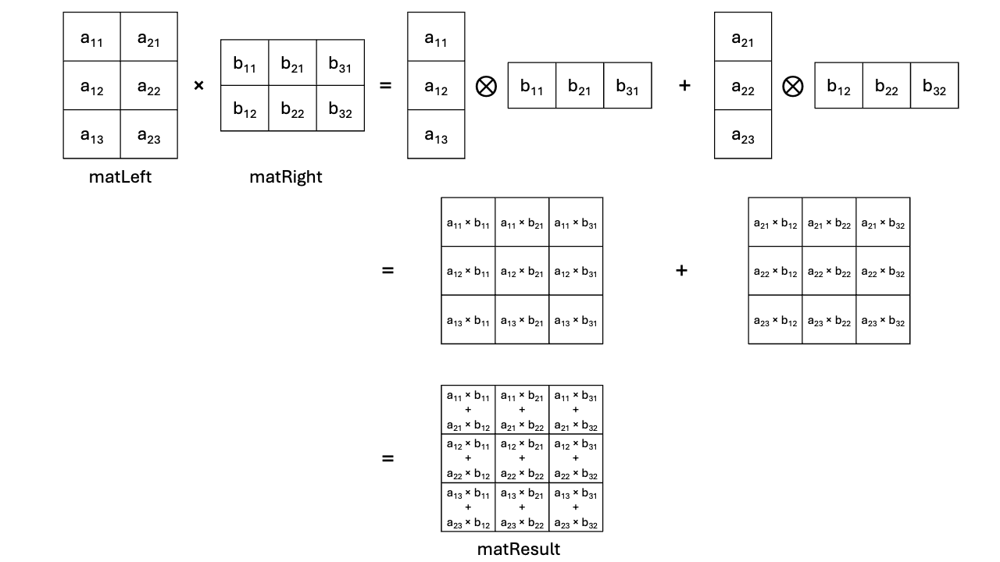

## Matrix multiplication with the outer product

In this section, you will learn how you can use the outer product with the SME engine to improve matrix multiplication.

In this standard matrix multiplication example, the core of the computation can be represented as:

```C
                acc += matLeft[m * K + k] * matRight[k * N + n];
```

Which translates to 1 multiply-accumulate, which is also known as ``macc``, for two loads (``matLeft[m * K + k]``
and ``matRight[k *N + n]``). It therefore has a 1:2 ``macc``  to ``load`` ratio. 

From a memory system perspective, this is not effective, especially since this
computation is done within a triple-nested loop, repeatedly loading data from
memory. 

To exacerbate matters, large matrices might not fit in cache. In order to improve the matrix multiplication efficiency, the goal is to increase the ``macc`` to ``load`` ratio, which means to increase the number of multiply-accumulate operations per load.

Figure 3 below shows how the matrix multiplication of ``matLeft`` (3 rows, 2
columns) by ``matRight`` (2 rows, 3 columns) can be decomposed as the sum of the
outer products:



The SME engine builds on the
[Outer Product](https://en.wikipedia.org/wiki/Outer_product) as matrix
multiplication can be expressed as the
[sum of column-by-row outer products](https://en.wikipedia.org/wiki/Outer_product#Connection_with_the_matrix_product).


## About transposition

From the previous page, you will recall that matrices are laid out in row-major
order. This means that loading row-data from memory is efficient as the memory
system operates efficiently with contiguous data. An example of this is where caches are loaded row by row, and data prefetching is simple - just load the data from ``current address + sizeof(data)``. This is not the case for loading column-data from memory though, as it requires more work from the memory system.

In order to further improve the effectiveness of the matrix multiplication, it
is therefore desirable to change the layout in memory of the left-hand side matrix, which is called ``matLeft`` in the code examples in this Learning Path, which essentially performs a matrix
transposition so that instead of loading column-data from memory, one loads row-data.

{}
It is important to note here that this reorganizes the layout of the matrix in
memory in order for the algorithm implementation to be more efficient. The
transposition affects only the memory layout. ``matLeft`` is transformed to
column-major order, but from a mathematical perspective, ``matleft`` is
*not* transposed.
{}

### Transposition in the real world

In the same way that trees don't reach the sky, the SME engine has physical implementation limits. It operates with tiles in the ZA storage. Tiles are 2D portions of the matrices being processed. SME has dedicated instructions to load data to, and store data from tiles efficiently, as well as instructions to operate with and on tiles, for example the [fmopa](https://developer.arm.com/documentation/ddi0602/latest/SME-Instructions/FMOPA--non-widening---Floating-point-outer-product-and-accumulate-?lang=en)
instruction which takes two vectors as inputs and accumulate all the outer
products to a 2D tile. The tile in ZA storage is what allows SME to increase the
``macc`` to ``load`` ratio, as all the tile elements are loaded to the tile, to
be used with the SME outer product instructions.

Taking into account that the ZA storage is finite, the desirable transposition
of the ``matLeft`` matrix that was discussed in the previous section needs to
adapted to the tile dimensions, so that a tile is easy to access. The
``matLeft`` preprocessing has thus some aspects of transpositions, but takes
into account the tiling as well and is referred to in the code as
``preprocess``.

Here is at the algorithmic level what ``preprocess_l`` does in practice:

```C
void preprocess_l(uint64_t nbr, uint64_t nbc, uint64_t SVL,
                  const float *restrict a, float *restrict a_mod) {

    // For all tiles of SVL x SVL data
    for (uint64_t By = 0; By < nbr; By += SVL) {
        for (uint64_t Bx = 0; Bx < nbc; Bx += SVL) {
            // For this tile
            const uint64_t dest = By * nbc + Bx * SVL;
            for (uint64_t j = 0; j < SVL; j++) {
                for (uint64_t i = 0; i < SVL && (Bx + i) < nbc; i++) {
                    if (By + j < nbr) {
                        a_mod[dest + i * SVL + j] = a[(By + j) * nbc + Bx + i];
                    } else {
                        // These elements are outside of matrix a, so zero them.
                        a_mod[dest + i * SVL + j] = 0.0;
                    }
                }
            }
        }
    }
}
```

``preprocess_l`` will be used to check the assembly and intrinsic versions of
the matrix multiplication perform the preprocessing step correctly. This code is
located in file ``preprocess_vanilla.c``.
