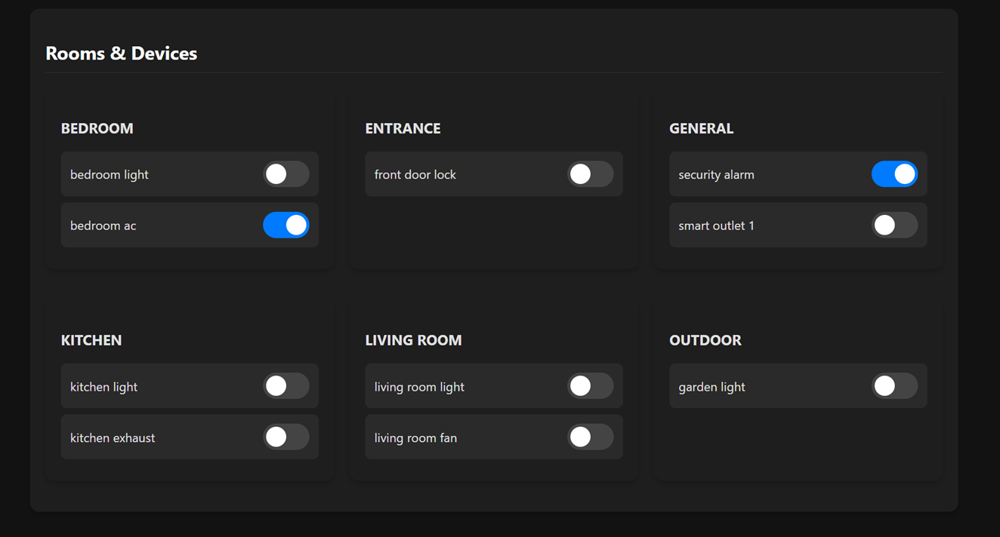
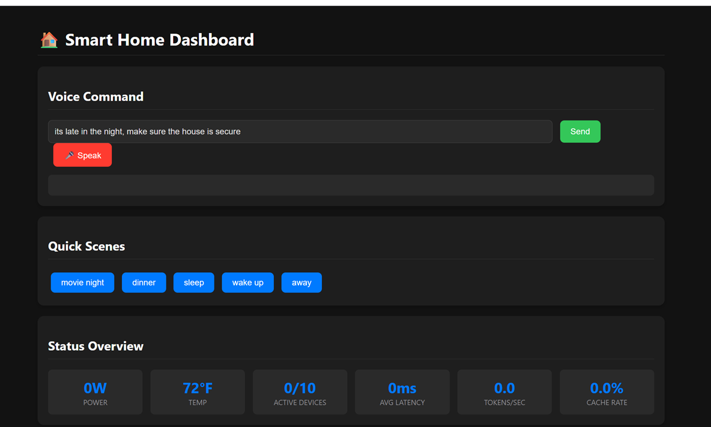
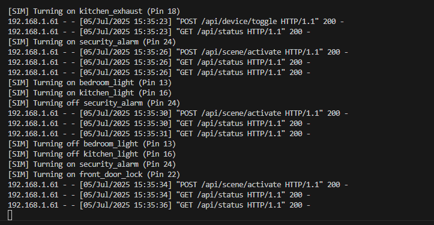

# Run the Smart Home Assistant

Follow these steps to set up and launch your smart home GenAI assistant on your Arm-based board. This code was tested on a Jetson Xavier AGX Development Kit.

{}
This guide assumes you have already installed Python, all required dependencies, and Ollama as described in the previous steps.
{}

### Step 1: Clone the Repository

Deactivate your virtual environment (if you created one earlier) by running:

```bash
deactivate
```

Then, run the following command in your terminal:

```bash
git clone https://github.com/fidel-makatia/EdgeAI_Ollama.git
cd EdgeAI_Ollama
```

### Step 2: (Optional) Activate Your Virtual Environment

If you created a Python virtual environment earlier, activate it now:

```bash
source venv/bin/activate
```

### Step 3: Connect Your Hardware

For this project, I used a Jetson Xavier AGX development kit with the following pin assignments. Feel free to customize these assignments based on your specific single-board computer (SBC) . You do **not** need to connect all the pins for initial testing—using LEDs to simulate each device is perfectly acceptable and makes setup easier.

| Device Name       | Pin | Type      | Room        |
| ----------------- | --- | --------- | ----------- |
| living_room_light | 7   | LIGHT     | living_room |
| living_room_fan   | 11  | FAN       | living_room |
| bedroom_light     | 13  | LIGHT     | bedroom     |
| bedroom_ac        | 15  | AC        | bedroom     |
| bedroom_heater    | 31  | HEATER    | bedroom     |
| kitchen_light     | 16  | LIGHT     | kitchen     |
| kitchen_exhaust   | 18  | FAN       | kitchen     |
| front_door_lock   | 22  | DOOR_LOCK | entrance    |
| security_alarm    | 24  | ALARM     | general     |
| garden_light      | 26  | LIGHT     | outdoor     |
| smart_outlet_1    | 29  | OUTLET    | general     |

{}
You can use any compatible output devices (such as LEDs, relays, or small loads) connected to these pins to represent the actual smart home devices. Adjust the pin assignments as needed to fit your SBC’s available GPIO pins or to match your hardware setup.
{}

### Step 4: Run the Smart Home Assistant

You can run the assistant in several different ways, depending on your use case. By default, the code assumes the model deepseek-r1:7b:



python3 smart_home_assistant.py


python3 smart_home_assistant.py --model llama2:7b


python3 smart_home_assistant.py --port 8080


python3 smart_home_assistant.py --no-api


**Command Explanations**

**Default:**
Runs the app using the default model and starts both the web server and CLI.

**Specify Model:**
Use --model <model-name> to select a specific model (e.g., llama2:7b, deepseek-r1:7b, mistral).

**Custom Web Port:**
Use --port <port-number> to run the web server on a different port (default is 5000).

**CLI Only:**
Use --no-api to disable the web API and just use the command-line interface.

DEFAULT:


CLI ONLY:


### Step 5: Interact With Your Assistant

- If using the web interface, open your browser and navigate to **http://<your-board-ip>:5000** (or your chosen port).

- For CLI mode, type commands directly in the terminal.
  
  

### Troubleshooting

- If you see errors about missing packages, ensure you activated your virtual environment and installed requirements.

- If a model is not loading, check that Ollama is running and the model is available (ollama list).

- If the chosen port is in use, specify a different port with --port.
