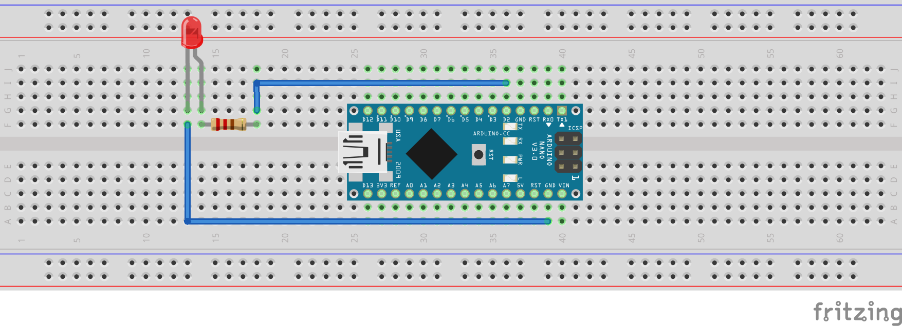
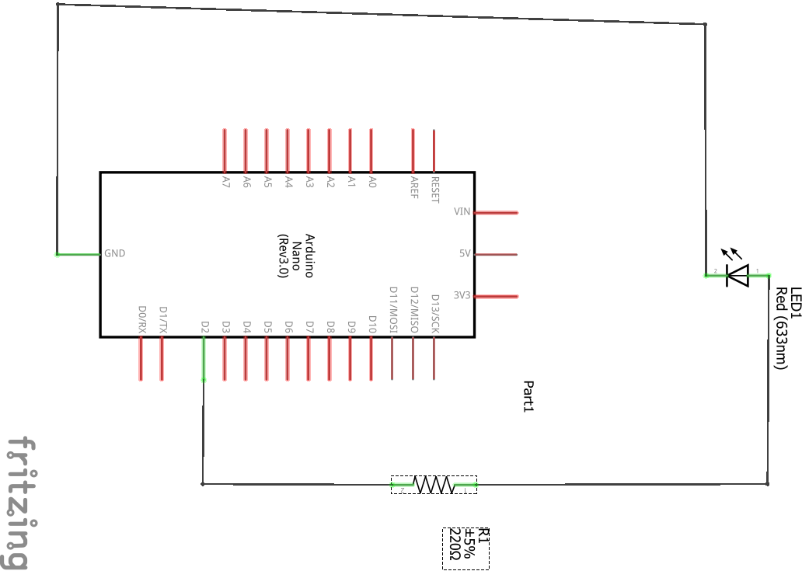

### Arduino Nano RP2040

To get started with your first **TinyML project**, the **Arduino Nano RP2040 Connect** is a good option. Built by Arduino, it uses the **RP2040 microcontroller** and is fully supported by the Arduino core package. The board comes with built-in Wi-Fi, Bluetooth, and an onboard IMU—features that is useful for deploying machine learning models at the edge.

Its compatibility with popular tools like Edge Impulse and the Arduino IDE makes it a suitable choice for TinyML applications. You can learn more about the Arduino Nano RP2040 Connect on the [official Arduino website](https://store.arduino.cc/products/arduino-nano-rp2040-connect-with-headers?_gl=1*1laabar*_up*MQ..*_ga*MTk1Nzk5OTUwMS4xNzQ2NTc2NTI4*_ga_NEXN8H46L5*czE3NDY1NzY1MjUkbzEkZzEkdDE3NDY1NzY5NTkkajAkbDAkaDE1MDk0MDg0ODc.).

## Put everything together

### Step 1: Connect the LED to the Arduino Nano RP2040

To visualize the output of the voice command model, you will use a simple LED circuit.

### Components Needed

- Arduino Nano RP2040 Connect
- 1x LED
- 1x 220Ω resistor
- Breadboard and jumper wires

#### Circuit Diagram

- **Anode (long leg) of the LED** → Connect to **GPIO pin D2** via the 220Ω resistor
- **Cathode (short leg)** → Connect to **GND**

### Step 2: Set Up the Arduino IDEs

To program and deploy your trained model to the Arduino Nano RP2040, you first need to configure your development environment.

Follow the detailed setup instructions provided in the [Arduino Nano RP2040 Install Guide](https://learn.arm.com/install-guides/arduino-pico/)

This guide will walk you through:

- Installing the Arduino IDE
- Adding the board support package for the Nano RP2040

{}
Follow every instruction in the guide *except* `How do I set up the Raspberry Pi Pico W?`, as it is not needed for this project.
{}

### Step 3: Select Your Board and Port in the Arduino IDE

First, open the **Arduino IDE**.

To select your board:

1. Go to **Tools** > **Board**.
2. From the list, choose **Arduino Nano RP2040 Connect**.

To select your port:

1. Connect your Arduino board to your computer using a USB cable.
2. Go to **Tools** > **Port**.
3. Select the port labeled with your board’s name, e.g., `COM4 (Arduino Nano RP2040 Connect)` or `/dev/cu.usbmodem...` on macOS.

*Your Arduino IDE is now ready to upload code to the Arduino Nano RP2040.*
