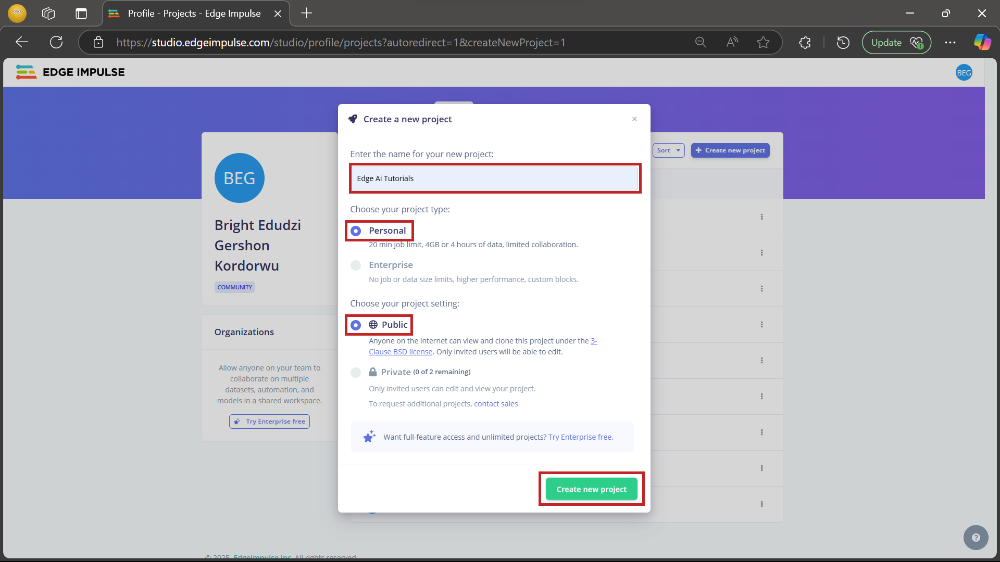
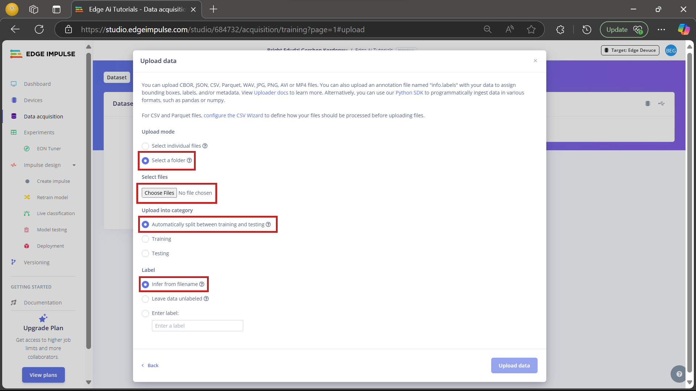
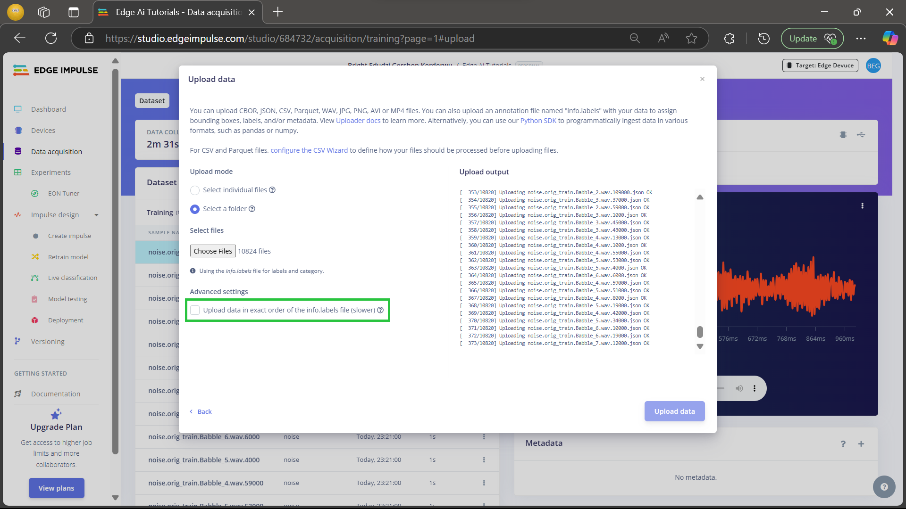
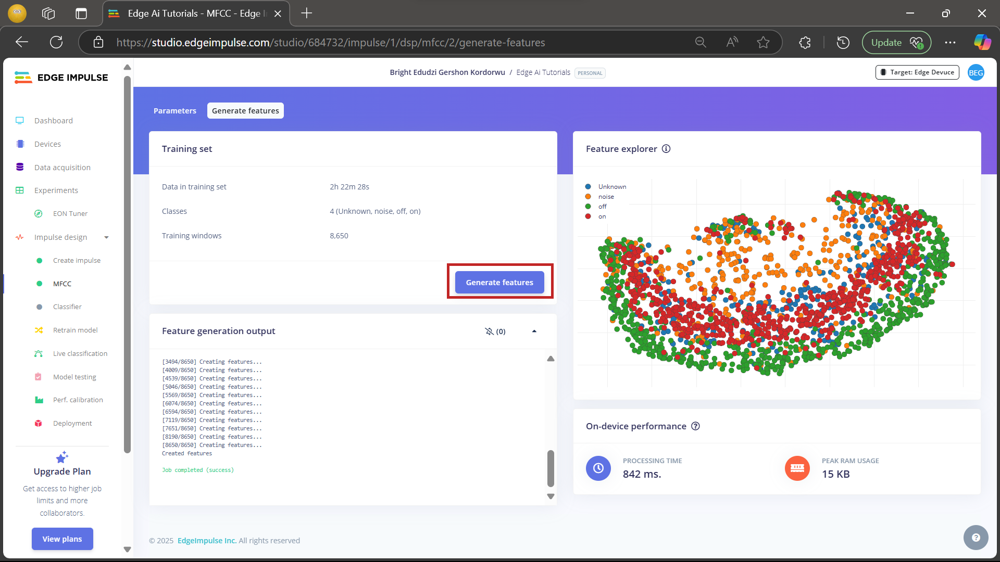
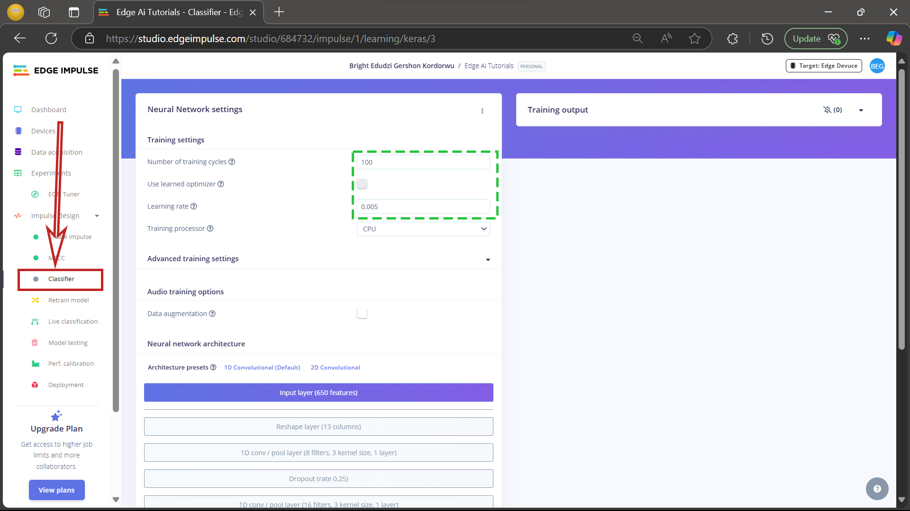
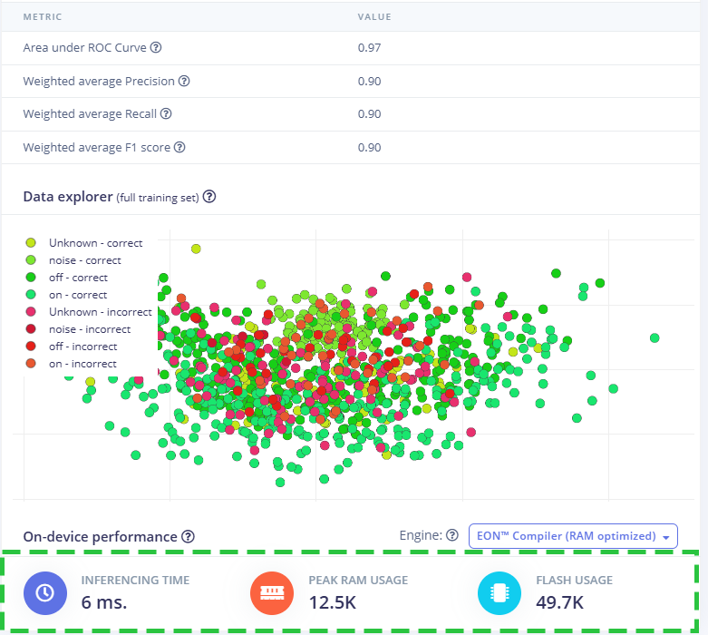

# Using Edge Impulse to Train TinyML models

Now that you've learned the foundational concepts of Edge AI and TinyML, it's time to move from theory to practice.


In this section, you'll use Edge Impulse to train a voice-command classification model and prepare it for deployment to the Arduino Nano RP2040 Connect.


## What is Edge Impulse?

Edge Impulse is a development platform that simplifies building, training, and deploying machine learning (ML) models on embedded systems and edge devices such as microcontrollers, sensors, and single-board computers like the Raspberry Pi or Arduino.

## Key Features of Edge Impulse

| Feature               | Description                                                                                         |
|-----------------------|-----------------------------------------------------------------------------------------------------|
| **Data collection**   | Collects data from sensors, such as accelerometers, microphones, and cameras in real time.              |
| **Preprocessing**     | Provides tools for signal processing and feature extraction tailored for embedded systems.          |
| **Model training**    | Supports built-in ML algorithms and integrates with frameworks like TensorFlow.                     |
| **Edge optimization** | Automatically optimizes models to run efficiently on low-power edge hardware.                      |
| **Deployment**        | Enables seamless deployment to microcontrollers, RTOS-based boards, and Linux devices.             |
| **Web-based platform**| Fully browser-based interface for managing projects and workflows without needing local setup.     |

---

## Why it's important in Edge AI and TinyML

- Bridges the gap between machine learning and embedded development
- Accelerates prototyping and deployment of AI features directly on hardware
- Supports TinyML applications that run on devices with very limited memory and compute power
- Works with popular hardware platforms such as Arduino, Raspberry Pi, Nordic, and STMicroelectronics

## Get started with Edge Impulse

To begin working with TinyML models, visit [Edge Impulse](https://edgeimpulse.com). You'll need to create a free account to access the full platform.

In the following sections, you'll walk through each key page on the Edge Impulse platform using snapshots as a guide. These visuals will help you understand what actions to take and how each part of the interface contributes to building and deploying your machine learning model.


### Create a new project

After you create your account and log in, the first step is to create a new project. Give your project a name that clearly reflects its purpose. This helps with easy identification, especially if you plan to build multiple models.

For example, if you're building a keyword spotting model, you might name it `Wake word detection`.

You'll also need to select the appropriate **project type** and **project settings**, as shown in the snapshot below.



### Configure the target device

After creating your project, the next step is to configure the target device. Since you're using the **Arduino Nano RP2040 Connect**, click the highlighted button to begin the configuration process, as shown in the snapshot below. This ensures that data collection, model training, and deployment are optimized for your hardware.

You can find the full specifications for the Arduino Nano RP2040 Connect on [Arduino’s official product page](https://store.arduino.cc/products/arduino-nano-rp2040-connect).

Follow the settings shown in the screenshot to complete the configuration.


### Add the dataset

With your device configured, the next step is to add your dataset to the project. Click **Add existing data** and follow the configuration settings shown in the screenshot. This lets you upload pre-recorded data instead of collecting it live, which can save time during development.

An example repository has been prepared with assets used throughout this Learning Path. You can clone it with the following command:

```bash
git clone https://github.com/e-dudzi/Learning-Path.git
```

The repository contains a `Dataset.zip` file with the dataset used in this project. Extract the contents to your local machine. For convenience, the dataset is already split into **training** and **testing** sets.




{}
Do not check the green highlighted area during upload. The dataset already includes metadata. Enabling that option may result in much slower upload times and is unnecessary for this project.
{}



### Dataset uploaded successfully

After the dataset is uploaded, you'll see the samples listed in the **Data acquisition** tab, organized by their labels. You can click each sample to inspect the raw signal, view metadata, and even listen to the audio recordings directly within the Edge Impulse interface. This helps confirm that the uploaded data is accurate and ready for training.


{}
This dataset is made up of four labels:
- on
- off
- noise
- unknown
{}


### Create the impulse

Now that your data is ready, it's time to create the impulse. An impulse defines the flow of data from input to output using processing and learning blocks.

Click **Create impulse** in the menu and configure it as shown in the screenshot. Typically, this includes setting the input data type (such as audio), adding a **processing block** (like MFCC), and a **learning block** (such as a neural network classifier).

After configuring the impulse, make sure to **save your changes**.


### Configure the MFCC block

Next, you'll configure the **MFCC (Mel Frequency Cepstral Coefficients)** processing block. This block transforms raw audio into features suitable for training your model.

Click **MFCC** in the left-hand menu under the **Impulse design** section.

Set the parameters exactly as shown in the screenshot. These settings determine how the audio input is segmented and analyzed. Once complete, make sure to **save the parameters**.

These defaults are chosen for this Learning Path, but you can experiment with different values once you're more familiar with Edge Impulse.



The green-highlighted section on the MFCC configuration page provides an estimate of how the model will perform on the target device. This includes memory usage (RAM and flash) and latency, helping ensure the model fits within hardware constraints.


### Generate features

After saving the MFCC parameters, the next step is to generate features from your dataset. Click **Generate features** to begin. Edge Impulse will process your data using the MFCC configuration and create a feature set for training.

When complete, you'll see a **2D feature plot** that shows how the data is distributed across the four labels: `on`, `off`, `noise`, and `unknown`. This helps visually confirm whether the classes are distinct and learnable.



### Set up the classifier

Now it's time to configure the **neural network classifier**, which learns to recognize different audio commands. Click **Classifier** under **Impulse design** and set the parameters as shown in the screenshot.


For this Learning Path, use a learning rate of `0.002` even though the screenshot shows `0.005`. You can experiment later, but `0.002` is a good starting point.


Once all parameters are set, click **Save and train** to begin training your model.



### Review model performance

After training is complete, Edge Impulse will show the model’s performance metrics: **accuracy**, **loss**, and a **confusion matrix**.


- **Accuracy**: how often the model correctly predicts labels  
- **Loss**: how far off predictions are — lower values indicate better performance  
- **Confusion matrix**: shows how well the model classified each label and where errors occurred  

Review these results to see how well the model learned. If needed, adjust settings or retrain.

**On-device performance (EON Compiler - RAM optimized):**

| Metric           | Value   |
|------------------|---------|
| Inference time   | 6 ms    |
| Peak RAM usage   | 12.5 KB |
| Flash usage      | 49.7 KB |



You can also use the pre-trained model found in `ei-edge-ai-tutorials-arduino-1.0.1.zip` from the example repository.

### Deploy the model

To run the trained model on your Arduino Nano RP2040 Connect, export it as an Arduino library:

1. Click **Deployment** in the left menu  
2. Search for **Arduino** and select **Arduino library**  
3. If the export doesn't start automatically, click **Build**  

The model will be downloaded as a `.zip` file you can import into the Arduino IDE.


## Next steps

In the next section, you'll move from model training to real-world deployment. Specifically, you will:

- Connect an **LED** to the **Arduino Nano RP2040** board  
- Set up the **Arduino IDE** for development  
- Deploy the trained model to recognize voice commands and control the LED  


