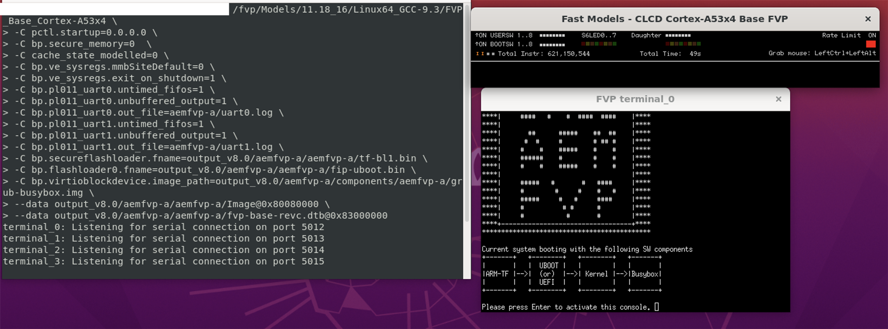

## Run the Linux software stack on an FVP

Once you've built the Linux stack with the correct configuration, you're ready to run it on an Arm CPU Fixed Virtual Platform (FVP).

### Verify the build output

After building, check the output directory to make sure the expected files were generated:

```bash
tree output/aemfvp-a/aemfvp-a/
```
Expected output:

```output
output/aemfvp-a/aemfvp-a/
├── Image -> ../components/linux/Image
├── Image.defconfig -> ../components/linux/Image.defconfig
├── fip-uboot.bin
├── fip-uefi.bin
├── fvp-base-revc.dtb -> ../components/linux/fvp-base-revc.dtb
├── tf-bl1.bin -> ../components/fvp/tf-bl1.bin
├── tf-bl2.bin -> ../components/fvp/tf-bl2.bin
├── tf-bl2u.bin -> ../components/fvp/tf-bl2u.bin
├── tf-bl31.bin -> ../components/fvp/tf-bl31.bin
├── uboot.bin -> ../components/aemfvp-a/uboot.bin
└── uefi.bin -> ../components/aemfvp-a/uefi.bin
```

### Run the software stack

To launch the software stack on the FVP, use a command like the following:
```bash
FVP_Base_Cortex-A55x4 \
-C pctl.startup=0.0.0.0 \
-C bp.secure_memory=0  \
-C cache_state_modelled=0 \
-C bp.ve_sysregs.mmbSiteDefault=0 \
-C bp.ve_sysregs.exit_on_shutdown=1 \
-C bp.pl011_uart0.untimed_fifos=1 \
-C bp.pl011_uart0.unbuffered_output=1 \
-C bp.pl011_uart0.out_file=<PATH_TO_LOG>/uart0.log \
-C bp.pl011_uart1.untimed_fifos=1 \
-C bp.pl011_uart1.unbuffered_output=1 \
-C bp.pl011_uart1.out_file=<PATH_TO_LOG>/uart1.log \
-C bp.secureflashloader.fname=<SRC_PATH>/output/aemfvp-a/aemfvp-a/tf-bl1.bin \
-C bp.flashloader0.fname=<SRC_PATH>/output/aemfvp-a/aemfvp-a/fip-uboot.bin \
-C bp.virtioblockdevice.image_path=<SRC_PATH>/output/aemfvp-a/components/aemfvp-a/grub-busybox.img \
--data cluster0.cpu0=<SRC_PATH>/output/aemfvp-a/aemfvp-a/Image@0x80080000 \
--data cluster0.cpu0=<SRC_PATH>/output/aemfvp-a/aemfvp-a/fvp-base-revc.dtb@0x83000000
```
This will boot Trusted Firmware-A, UEFI/U-Boot, Linux, and BusyBox in sequence.

### Step 3: Troubleshoot FVP Launch Issues

Different FVP models use different CPU instance names. If you see an error like:

```output
Warning: target instance not found: 'FVP_Base_Cortex_A65AEx4_Cortex_A76AEx4.cluster0.cpu0' (data: 'output/aemfvp-a/aemfvp-a/fvp-base-revc.dtb')
```

You need to identify the correct instance name for your platform. Run:

```bash
FVP_Base_Cortex-A65AEx4+Cortex-A76AEx4 -l | grep RVBARADDR | grep cpu0
```

Example output:

```output
cluster0.subcluster1.cpu0.RVBARADDR=0                 # (int   , init-time) default = '0x0'    : Value of RVBAR_ELx register.
```

Update your --data parameters accordingly:

```output
--data cluster0.subcluster0.cpu0.thread0=<SRC_PATH>/output/aemfvp-a/aemfvp-a/Image@0x80080000 \
--data cluster0.subcluster0.cpu0.thread0=<SRC_PATH>/output/aemfvp-a/aemfvp-a/fvp-base-revc.dtb@0x83000000
```

{}
Always confirm the CPU instance name when switching between different FVP models.
{}

### Optional: Use the GUI

You can also run the FVP using its graphical user interface:


