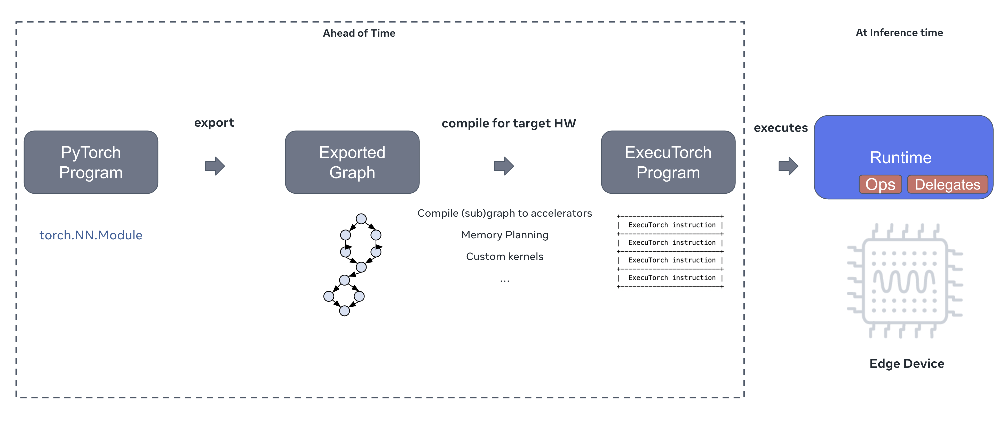

---
# User change
title: "Understand the ExecuTorch workflow"

weight: 3

# Do not modify these elements
layout: "learningpathall"
---

Before setting up your environment, it helps to understand how ExecuTorch processes a model and runs it on Arm-based hardware.

## ExecuTorch pipeline overview

ExecuTorch works in three main stages:

**Export the model**

   - Convert a trained PyTorch model into an operator graph.
   - Identify operators that can be offloaded to the Ethos-U NPU (for example, ReLU, conv, quantize).

**Compile with the AOT compiler**

   - Translate the operator graph into an optimized, quantized format.
   - Use `--delegate` to move eligible operations to the Ethos-U accelerator.
   - Save the compiled output as a `.pte` file.

**Deploy and run**

   - Execute the compiled model on an FVP or physical target.
   - The Ethos-U NPU runs delegated operators; all others run on the Cortex-M CPU.

## Visual overview

## What's next?

Now that you understand how ExecuTorch works, you're ready to set up your environment and install the tools.
