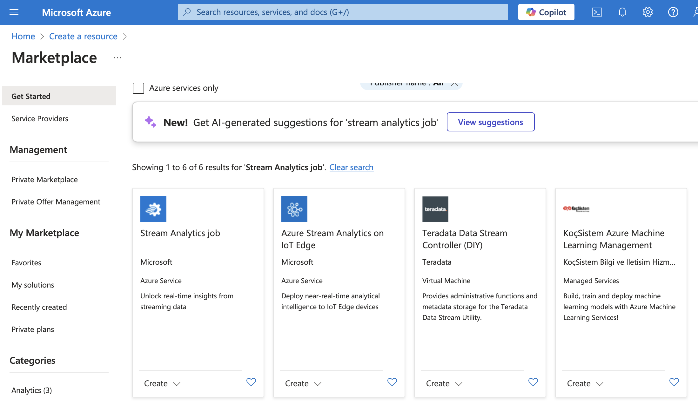
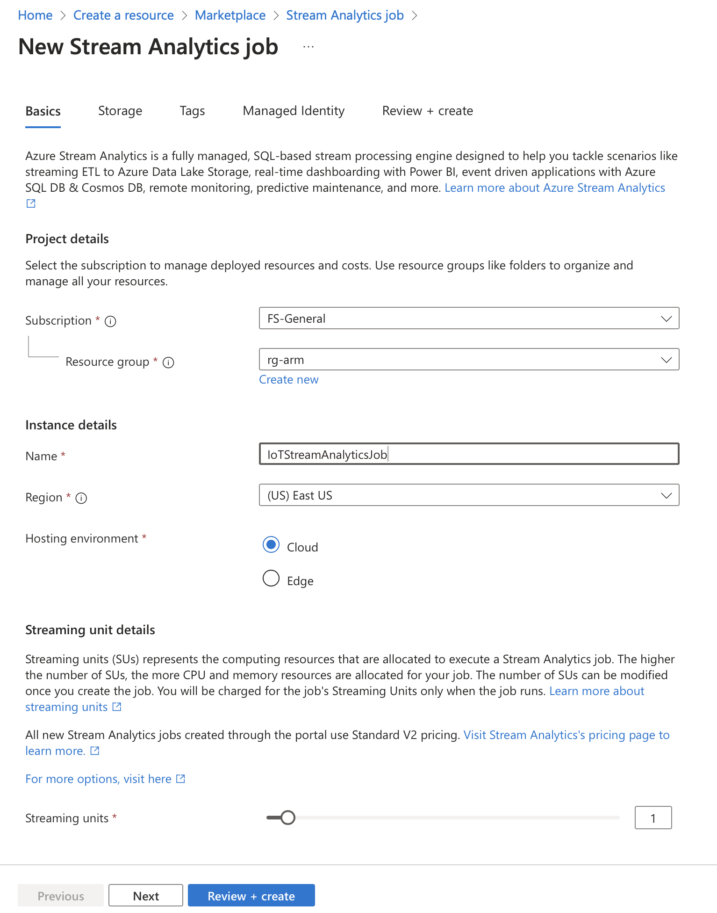
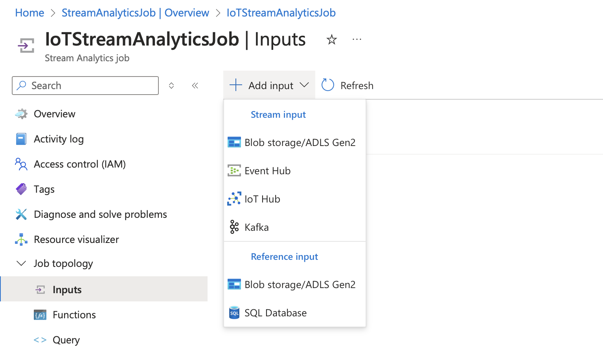
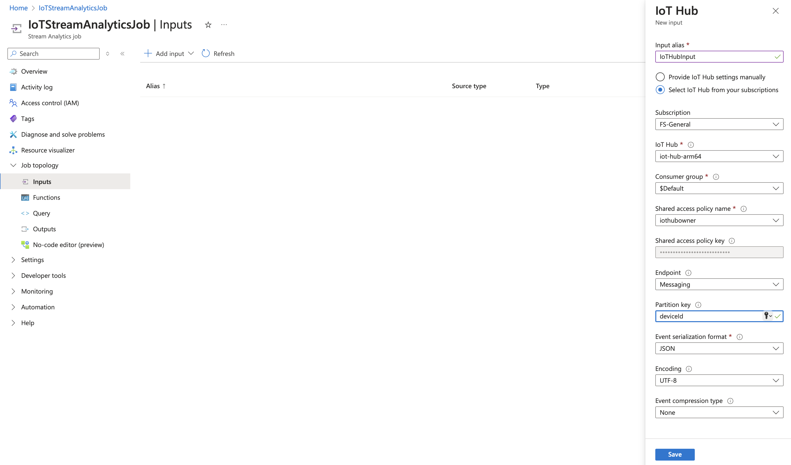
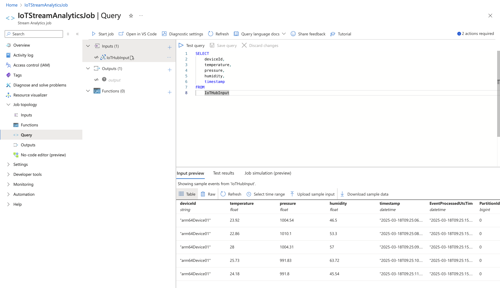

---
# User change
title: "Azure Stream Analytics"

weight: 5

layout: "learningpathall"
---

## Objective
In the previous step, you successfully established a Python application to stream real-time telemetry data from an Arm64 powered IoT device directly to Azure IoT Hub. Now, you will leverage Azure Stream Analytics, a powerful, real-time analytics and complex-event processing engine, to process and route the streaming sensor data. Stream Analytics allows you to easily analyze incoming data streams, run queries in real-time, and seamlessly integrate the processed data into other Azure services. With Stream Analytics, you will define custom queries to view or transform sensor readings, such as temperature, pressure, humidity, and timestamps, and efficiently direct this information to storage, analytics services, or visualization tools. In this section, you will set up Stream Analytics to ingest telemetry data from IoT Hub, and run continuous queries to process this data.

## Azure Stream Analytics
Azure Stream Analytics is a real-time analytics and event-processing service provided by Microsoft Azure, specifically designed to handle large volumes of streaming data from IoT devices, applications, sensors, and other real-time sources. It enables developers and data engineers to create sophisticated analytics pipelines without the complexity of managing infrastructure. By processing data on the fly, Azure Stream Analytics helps users extract immediate insights, detect patterns, trigger alerts, and feed processed information into other Azure services like Azure Cosmos DB, Azure Functions, or Power BI dashboards.

With Azure Stream Analytics, you can write queries using a simple SQL-like syntax, making it straightforward to filter, aggregate, and transform streaming data in real-time. The service provides built-in scalability, fault tolerance, and low latency, ensuring that critical insights are available immediately as data flows into the system. Stream Analytics supports integration with multiple data inputs (such as IoT Hubs and Event Hubs), and outputs, enabling seamless creation of comprehensive, end-to-end IoT data pipelines that can quickly adapt to evolving business needs and handle complex scenarios involving massive data volumes.

Azure Stream Analytics organizes real-time data processing through four main architectural components: Jobs, Inputs, Queries, and Outputs. A Job in Azure Stream Analytics serves as a logical container that encapsulates all aspects of your stream-processing workflow. Each job manages streaming data from start to finish and can be independently started, stopped, or scaled as needed. Within a job, Inputs define the sources of streaming data, typically coming from services like Azure IoT Hub, Event Hubs, or Blob Storage. Queries, written in a familiar SQL-like syntax, specify how the incoming data should be filtered, aggregated, or transformed in real-time. Finally, the processed data flows into Outputs, which can include Azure Cosmos DB, Blob Storage, Azure SQL Database, Azure Functions, or Power BI, making it readily available for further analysis, monitoring, or visualization. 

## Create a Stream Analytics Job
To process and analyze the telemetry data you are streaming to Azure IoT Hub, you will first create an Azure Stream Analytics job. Follow these steps to set it up:
1. Sign in to the Azure Portal.
2. Click “Create a resource”, type “Stream Analytics job” into the search box, and press Enter.
3. From the search results, select Stream Analytics job, then click Create:

4. Provide the necessary information:
* Subscription: Choose the Azure subscription you want to use for this job.
* Resource group: Select the resource group you previously created (e.g., your IoT project’s resource group).
* Name: Provide a meaningful, unique name for your Stream Analytics job (e.g., IoTStreamAnalyticsJob).
* Region: Choose the same Azure region as your IoT Hub for optimal performance and minimal latency.
* Hosting environment: Select Cloud for Azure-managed infrastructure.
* Streaming units: Set this to 1 (appropriate for initial testing and smaller workloads, you can scale up later).



5. After reviewing your settings carefully, click Review + create, confirm that all details are correct, and then click Create to deploy your Azure Stream Analytics job.

Your Stream Analytics job will deploy within a few minutes. Once the deployment is complete, you’ll be ready to configure inputs, define queries, and set outputs for real-time data processing and analytics.

## Configure Azure IoT Hub as an Input for Stream Analytics Job
After successfully creating the Stream Analytics job, you will need to configure your Azure IoT Hub as an input source. This configuration allows Stream Analytics to read real-time telemetry data directly from your IoT devices. Follow these steps:
1. Navigate to your newly created Stream Analytics job in the Azure Portal.
2. In the left-hand menu, under the Job topology section, select Inputs.
3. Click “Add input”, and choose “IoT Hub” as the input type.

4. Enter the following configuration details:
* Input Alias: Provide a name, such as `IoTHubInput`.
* IoT Hub: Select the Azure IoT Hub you created earlier.
* Consumer group: Choose `$Default`, unless you have explicitly created a custom consumer group.
* Shared access policy name: Select `iothubowner` (provides full access for reading data from IoT Hub).
* Endpoint: Select Messaging.
* Partition key: Type `deviceId` (this helps ensure the data streams are partitioned by device identifiers).
* Event serialization format: Select `JSON`, as our telemetry data is transmitted in `JSON` format.
* Encoding: Choose `UTF-8`.
* Event compression type: Set this to None.



4. After entering these details, carefully verify them for accuracy and completeness. Click Save to apply the changes and successfully link your Azure IoT Hub as the input source for your Stream Analytics job. 

Your job is now configured to ingest streaming IoT telemetry data in real-time, preparing it for further analysis, storage, and visualization.

## Define the Stream Analytics Query
Now that you have configured your Azure IoT Hub as an input source, the next step is to create and run a Stream Analytics query. This query defines how incoming IoT data will be filtered, transformed, or routed for further processing. Follow these steps:
1. Navigate to your Stream Analytics job in the Azure Portal.
2. Under the Job topology menu on the left, select Query.
3. In the query editor, enter the following simple `SQL-like` query to stream all incoming data from your IoT device
```SQL
SELECT
    deviceId,
    temperature,
    pressure,
    humidity,
    timestamp
FROM
    IoTHubInput
```

This straightforward query selects all relevant fields (deviceId, temperature, pressure, humidity, and timestamp) directly from your configured input (IoTHubInput), which corresponds to the Azure IoT Hub you previously connected.

Before running this query, ensure your Python IoT simulator `iot_simulator.py` is actively sending telemetry data. After the simulator begins transmitting data, you can test and verify your Stream Analytics query within the Azure Portal using the built-in Test query feature. Doing this allows you to view live-streamed sensor data in real-time and confirm that your streaming pipeline is working as expected:



Constructing queries in Azure Stream Analytics involves using a straightforward SQL-like syntax specifically optimized for real-time stream processing. Typically, a query contains a `SELECT` statement to specify which fields from the incoming telemetry data to process, and a `FROM` statement to indicate the source stream. Queries can be expanded with advanced features such as filtering, aggregations, and temporal window functions to handle more complex scenarios.

In the current example, you implemented a simple query using `SELECT` and `FROM` clauses to view and forward all incoming sensor data from our IoT device without any additional filtering or transformation. This straightforward query effectively demonstrates how Azure Stream Analytics ingests and processes real-time IoT data, establishing a foundation upon which you can build more advanced and powerful data analytics workflows in the future.

You have established a real-time analytics pipeline that integrates with Azure IoT Hub, enabling immediate analysis of sensor data as it arrives in the cloud. In the next step, you will build upon this foundation by defining an additional query within your Azure Stream Analytics job. This new query will direct processed sensor data into Azure Cosmos DB. By writing the streaming IoT data into Cosmos DB, you will securely persist sensor telemetry, making it readily available for long-term storage, efficient retrieval, further analysis, and integration into applications or dashboards.
