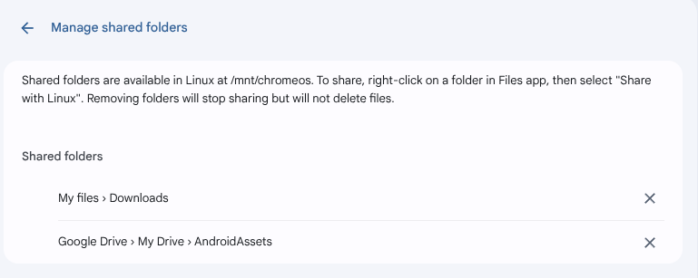

## File sharing between ChromeOS and Linux

Chromebooks with Linux offer convenient file sharing capabilities between the main ChromeOS environment and the Linux subsystem.

Key features:

- **Selective folder sharing**: ChromeOS allows you to share specific folders (not individual files) from the native Files app with the Linux container. This is done by right-clicking a folder and selecting **Share with Linux**. Once shared, these directories become accessible to Linux apps and the command line within the Linux environment.
- **Two-way access**: Files and folders created within the Linux container appear in the **Linux files** section of the ChromeOS Files app, enabling seamless movement of data between environments.
- **Sandboxed security**: The Linux environment is sandboxed for security, meaning it doesn't have access to the full ChromeOS file system by default. Only the folders explicitly shared by you are visible in Linux, ensuring protected data separation.
- **Easy integration**: Shared folders can be navigated from Linux at paths such as `/mnt/chromeos/MyFiles/`. Applications and command-line tools within Linux can read and write to these shared folders.
- **Management tools**: You can manage and revoke shared folder access through the ChromeOS Files app, allowing for flexible control over what is accessible to Linux.

These features make it simple to move files between ChromeOS and Linux applications while maintaining security and user control.

## Configure file system integration

### Share ChromeOS directories

To access your ChromeOS files from within the Ubuntu container, you need to configure shared directories.

You can share directories using the ChromeOS Files application. Right-click on any directory and select **Share with Linux**.

If you share a ChromeOS directory, it appears in `/mnt/chromeos/MyFiles/` in your Ubuntu container. For example, share your Downloads directory in ChromeOS and it is visible in Ubuntu:

```bash
ls /mnt/chromeos/MyFiles/Downloads/
```

### Share Google Drive directories

You can also share Google Drive directories using the ChromeOS Files application. Use the same right-click and select **Share with Linux**.

If you share a Google Drive folder, it appears in `/mnt/chromeos/GoogleDrive/MyDrive/` in your Ubuntu container. For example, share your `AndroidAssets` directory in Google Drive and it is visible in Ubuntu:

```bash
ls /mnt/chromeos/GoogleDrive/MyDrive/AndroidAssets
```

Your shared folders appear in the **Linux settings** under **Manage shared folders** as shown below:



### Share a folder using the command line

You can also share folders using the Termina shell.

Mount the entire ChromeOS file system to `/mnt/chromeos` in the container:

```bash
lxc config device add ubuntu-main shared-chromeos disk source=/mnt/chromeos path=/mnt/chromeos
```

Share your ChromeOS Downloads folder with the container:

```bash
lxc config device add ubuntu-main downloads disk source=/mnt/chromeos/MyFiles/Downloads path=/home/username/Downloads
```

Share your ChromeOS Documents folder with the container:

```bash
lxc config device add ubuntu-main documents disk source=/mnt/chromeos/MyFiles/Documents path=/home/username/Documents
```

## File operations

You can use the `lxc file` command to copy files to and from a container from the Termina shell.

As an example, create a file named `file1`:

```bash
echo "test file 1" >> /mnt/shared/MyFiles/Downloads/file1
```

Copy the file from your ChromeOS Downloads folder to the `/tmp` directory in the container:

```bash
lxc file push file1 u1/tmp/file1
```

Copy the same file back to the Downloads directory with a new name:

```bash
lxc file pull u1/tmp/file1 file2
```

You now have the file in your Downloads directory with a new name.
