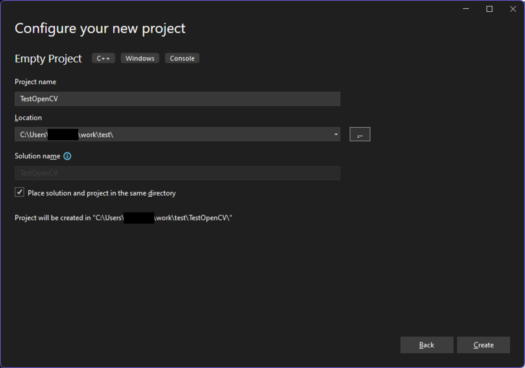
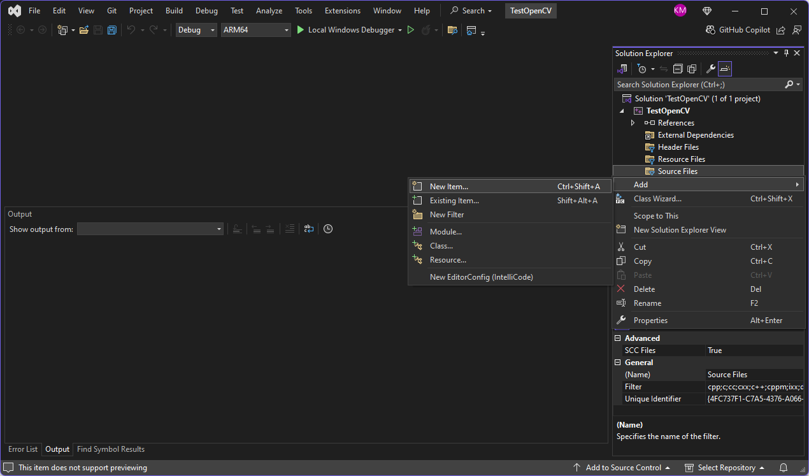
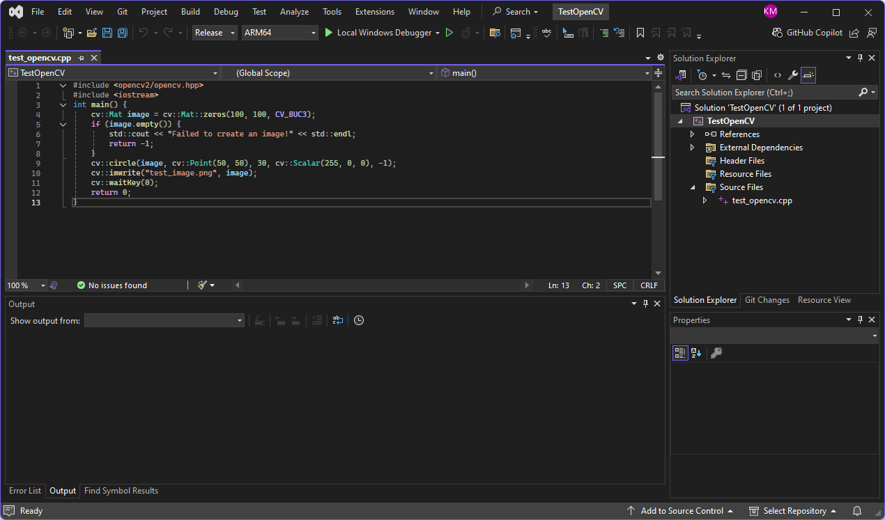
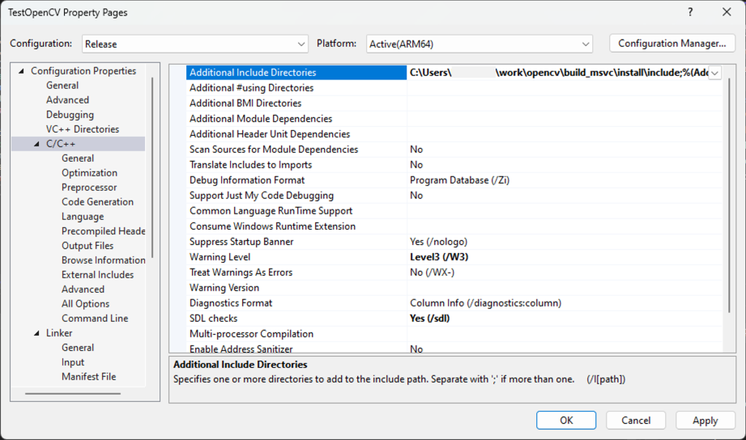
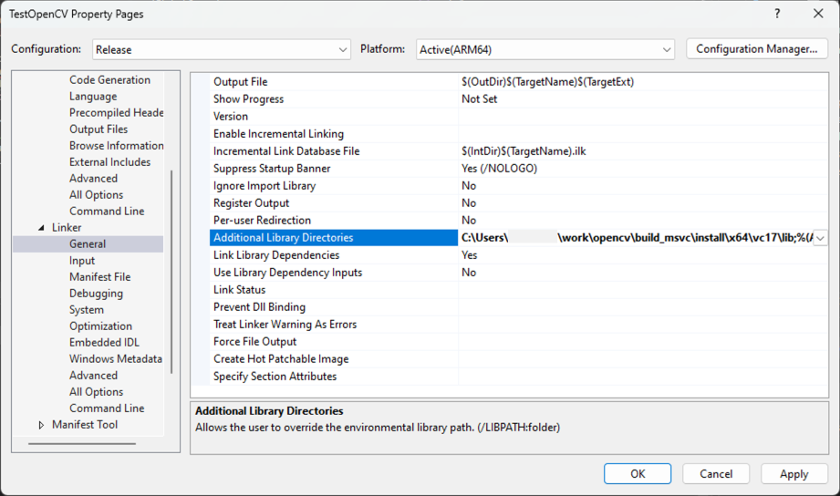
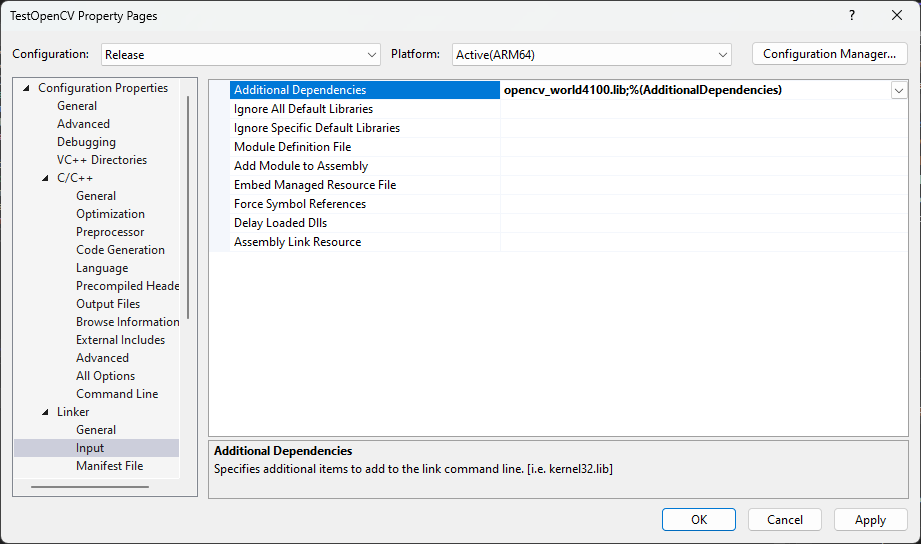
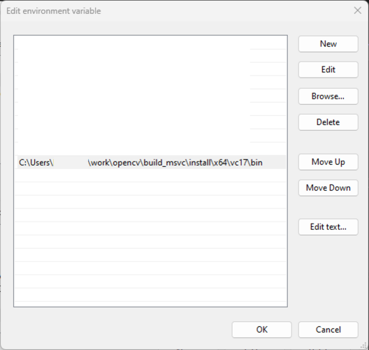

## Build OpenCV with MSVC

### Clone OpenCV repo

Open up a Windows Powershell and checkout the source tree:

```bash
git clone https://github.com/opencv/opencv
cd opencv
git checkout tags/4.10.0
```

{}
You might be able to use a later version. These steps have been tested with the version 4.10.0.
{}

### Pre-build configuration

Here, you will use CMake from the command line. First, run the following command to run the pre-build configuration. 

```bash
mkdir build_msvc
cd build_msvc

cmake `
-S .. `
-B . `
-G "Visual Studio 17 2022" `
-DCMAKE_BUILD_TYPE=Release `
-DBUILD_opencv_world=ON `
-DWITH_ITT=OFF `
-DWITH_OPENCL=OFF `
-DWITH_OPENCLAMDBLAS=OFF `
-DWITH_OPENCLAMDFFT=OFF `
-DWITH_OPENCL_D3D11_NV=OFF `
-DWITH_DIRECTML=OFF `
-DWITH_DIRECTX=OFF `
-DWITH_ADE=OFF `
-DWITH_CAROTENE=OFF
```

The given options specify the following:
- The source code is located one level above the current directory.
- The build will be performed in the current directory.
- The Visual Studio 2022 MSVC compiler will be used as the compiler.
- The built library is generated as a single file that includes all of OpenCV's functionality.
- Unnecessary options have been disabled, assuming processing on Arm CPUs.

&nbsp;

If the configuration is successful, a message similar to the following should be displayed at the end of the execution:

```
-- General configuration for OpenCV 4.10.0 =====================================
--   Version control:               4.10.0
--
--   Platform:
--     Timestamp:                   2024-11-08T08:50:24Z
--     Host:                        Windows 10.0.22631 ARM64
--     CMake:                       3.28.1
--     CMake generator:             Visual Studio 17 2022
--     CMake build tool:            C:/Program Files/Microsoft Visual Studio/2022/Professional/MSBuild/Current/Bin/arm64/MSBuild.exe
--     MSVC:                        1941
--     Configuration:               Debug Release
--
--   CPU/HW features:
--     Baseline:                    NEON
--       requested:                 NEON FP16
--     Dispatched code generation:  NEON_DOTPROD NEON_FP16
--       requested:                 NEON_FP16 NEON_BF16 NEON_DOTPROD
--       NEON_DOTPROD (1 files):    + NEON_DOTPROD
--       NEON_FP16 (2 files):       + NEON_FP16
--
--   C/C++:
--     Built as dynamic libs?:      YES
--     C++ standard:                11
--     C++ Compiler:                C:/Program Files/Microsoft Visual Studio/2022/Professional/VC/Tools/MSVC/14.41.34120/bin/Hostarm64/arm64/cl.exe  (ver 19.41.34123.0)
[...]
--     C Compiler:                  C:/Program Files/Microsoft Visual Studio/2022/Professional/VC/Tools/MSVC/14.41.34120/bin/Hostarm64/arm64/cl.exe
[...]
--   Install to:                    C:/Users/username/work/opencv/build_msvc/install
-- -----------------------------------------------------------------
--
-- Configuring done (97.5s)
-- Generating done (2.8s)
-- Build files have been written to: C:/Users/username/work/opencv/build_msvc
```

### Build and install

Now run the following command to build and install:

```bash
cmake --build . --config Release
cmake --build . --target INSTALL --config Release
```

{}
The build takes approximately 25 mins on Lenovo X13s
{}

&nbsp;

When the build and the install is complete, confirm the shared library have been created:

```bash { output_lines = "2-11" }
ls ./install/x64/vc17/bin
    Directory: C:\Users\username\work\opencv\build_msvc\install\x64\vc17\bin
Mode                 LastWriteTime         Length Name
----                 -------------         ------ ----
-a----        08/11/2024     09:03          43008 opencv_annotation.exe
-a----        08/11/2024     09:03         143872 opencv_interactive-calibration.exe
-a----        08/11/2024     09:03          41984 opencv_model_diagnostics.exe
-a----        08/11/2024     09:12          36864 opencv_version.exe
-a----        08/11/2024     09:12          35328 opencv_version_win32.exe
-a----        08/11/2024     08:50       26391552 opencv_videoio_ffmpeg4100_64.dll
-a----        08/11/2024     09:12          56320 opencv_visualisation.exe
-a----        08/11/2024     09:03       27179008 opencv_world4100.dll
```

```bash { output_lines = "2-9" }
ls ./install/x64/vc17/lib
    Directory: C:\Users\username\work\opencv\build_msvc\install\x64\vc17\lib
Mode                 LastWriteTime         Length Name
----                 -------------         ------ ----
-a----        08/11/2024     08:50            434 OpenCVConfig-version.cmake
-a----        08/11/2024     08:50          15260 OpenCVConfig.cmake
-a----        08/11/2024     08:50            972 OpenCVModules-release.cmake
-a----        08/11/2024     08:50           3879 OpenCVModules.cmake
-a----        08/11/2024     09:02        2849862 opencv_world4100.lib
```

&nbsp;

`opencv_world<version>.lib/dll` will be the library used by your application. Once the library files are correctly generated, run the following command to ensure there are no errors.

```bash { output_lines = "2" }
./install/x64/vc17/bin/opencv_version.exe
4.10.0
```

{}
The genereated directory name contains "x64," but there is no need to worry as the libraries and executable files will definitely run as ARM64.
{}

&nbsp;

## Build OpenCV Applications

Once the OpenCV library has been successfully built, the next step is to link it to a simple application and try using it.

### Create a new project in Visual Studio

First, create a new project in Visual Studio. Launch Visual Studio, click `Create a new project` on the initial screen, then select `Empty Project` and click `Next`. On the next screen, set the `Project name` and `Location`. You can choose any name and location, but for this example, we named the project `TestOpenCV`, as shown below. Then click `Create` to generate the new project.



### Adding a source code

 In `Solution Explorer`, right-click the `Source Files` folder, select `Add`, and then `New Item...`. Create a file named `test_opencv.cpp`.



&nbsp;

Once the file is created, it will open in the editor. Copy and paste the following program into it and save the file.

```cpp
#include <opencv2/opencv.hpp>
#include <iostream>
int main() {
    cv::Mat image = cv::Mat::zeros(100, 100, CV_8UC3);
    if (image.empty()) {
        std::cout << "Failed to create an image!" << std::endl;
        return -1;
    }
    cv::circle(image, cv::Point(50, 50), 30, cv::Scalar(255, 0, 0), -1);
    cv::imwrite("test_image.png", image);
    cv::waitKey(0);
    return 0;
}
```

This program is a simple example that uses OpenCV's functionality to create a 100x100 black image, draw a blue circle on it, and save it as a file.

### Configure build settings

Next, select the `Configuration` dropdown menu in the center of the screen and change it from `Debug` to `Release`. At this stage, your screen should look like the example shown below.



&nbsp;

Now, set up the compile and link settings. Select `Project` from the top menu and click on `TestOpenCV properties`. Edit `Include directories`, `Library directories`, and `Additional dependencies` as shown in the images below, and then click OK.



&nbsp;



&nbsp;



&nbsp;

Finally, ensure that the directory containing the dynamic libraries (DLLs) is added to the `PATH` environment variable. Set this in the Windows system settings. After setting the environment variable, restart Visual Studio to apply the changes.



### Run the build

Once these steps are complete, you're ready to build. From the top menu, select `Debug` and click `Start Without Debugging` or press `Ctrl` + `F5`.

If a console window appears showing that the program exited with code 0 and `test_image.png` is generated in the top-level directory of your Visual Studio project, you have succeeded. When you open the image file, it should look like the example shown below.


Congratulations! You are now ready to create your own OpenCV applications.

