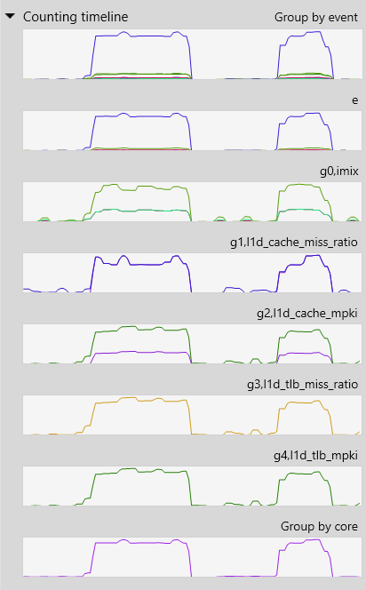
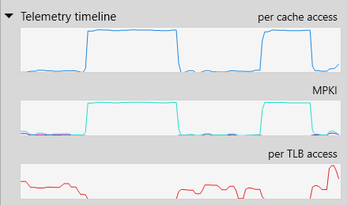

# Overview

WindpwsPerf WPA plugin is a plugin built for WPA that parses JSON output of `wperf` command line tool to visualize counting and telemetry events as timeline graphs.

[**WindowsPerf**](https://github.com/arm-developer-tools/windowsperf) is a lightweight performance profiling tool inspired by Linux perf, specifically tailored for Windows on Arm.
It leverages the ARM64 PMU (Performance Monitor Unit) and its hardware counters to offer precise profiling capabilities.
The [WindowsPerf WPA plugin](https://github.com/arm-developer-tools/windowsperf-wpa-plugin) bridges the gap between the detailed output of **WindowsPerf** and the powerful capabilities of [Windows Performance Analyzer](https://learn.microsoft.com/en-us/windows-hardware/test/wpt/windows-performance-analyzer).

## WindowsPerf WPA Plugin releases

You can find all binary releases of `WindowsPerf WPA Plugin` [here](https://github.com/arm-developer-tools/windowsperf-wpa-plugin/releases).

# Installation

For installation instructions see the [install guide](/install-guides/windows-perf-wpa-plugin).

## Using WindowsPerf WPA Plugin

In order to use the `WindowsPerf WPA Plugin`, we first need to get a `.json` output from a WindowsPerf `wperf stat` command running on a Windows on Arm machine.
{}
In order to get a `.json` output from WindowsPerf, we need to use the `--output` command followed by the filename.
{}

Example:

```command
wperf stat -e ld_spec --output example.json
```

Upon opening Windows Performance Analyzer, we are greeted with the following window:


As we can see, the `WindowsPerf WPA Plugin` is installed correctly and it appears under the Installed Plugins section. We can then click on "Open file..." from the start menu on the left side and we're prompted to choose a `.json` file.


By clicking "Open", the output file is then validated to check its format and compatibility with the plugin, and finally the main WPA window opens up.


### Timeline

The WindowsPerf timeline feature (command line option -t) enable continuous counting of Performance Monitoring Unit (PMU) events.
Users can specify sleep intervals (with -i) between counts and set the number of repetitions (with -n), allowing for detailed and flexible data collection.
Users can take advantage of the `WindowsPerf WPA Plugin` to visualize these complex measurements.
This plugin allows for detailed graphical representation of the PMU event data in WPA.

For this example we will be running the following command:

```command 
wperf stat -m dcache -c 0,1,2,3,4,5,6,7 -t -i 0 -n 50 --json
```

Importing the generated output in WPA will show us the following graph:


We can change the default grouping from `Group by core` to `Group by event` to see the following graph instead:


The WindowsPerf WPA Plugin also generates a graph per event note in order to provide a more in-depth grouping of events. To see all the generated graphs we can expand the `Counting timeline` section in the graph explorer section of WPA.

For this example, the following command was used instead: 

```command 
wperf stat -t -i 0 -m imix,l1d_cache_miss_ratio,l1d_cache_mpki,l1d_tlb_miss_ratio,l1d_tlb_mpki -e inst_spec,vfp_spec,ld_spec,st_spec -c 1 --json
```



We can double click on any graph to expand it under the Analysis tab for further data visualization. 

### Telemetry

The `WindowsPerf WPA Plugin` also allows the visualization of [Arm telemetry metrics](https://developer.arm.com/documentation/109542/0100/About-Arm-CPU-Telemetry-Solution) counted similarly to counting events.

For this example, the following command was used: 

```command 
wperf stat -t -i 0 -m imix,l1d_cache_miss_ratio,l1d_cache_mpki,l1d_tlb_miss_ratio,l1d_tlb_mpki -e inst_spec,vfp_spec,ld_spec,st_spec -c 1 --json
```

Similarlry to the graphs generated per event note for timeline events, we can also see the generated telemetry timeline graphs under the grapher explorer level in WPA. These graphs are generated dynamically so only the relevant metrics for the given `.json` output file are visible.



Once expanded, a more in-depth view is visible under the Analysis tab of WPA.

