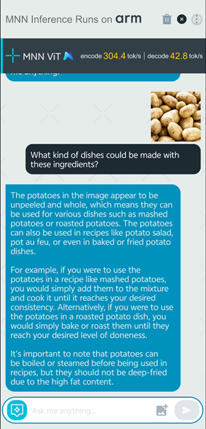

In this section, you will try the Qwen model in action using a demo application using a Android Package Kit (APK)

## Clone MNN repo

A fork of the upstream MNN repository is set up to enable building the app as an Android Studio project. Run the following to clone the repository and checkout the source tree:

```bash
cd $HOME
git clone https://github.com/HenryDen/MNN.git
cd MNN
git checkout origin/MNN_commit
```

## Build the app using Android Studio

### Open project and build

Open Android Studio. Go to **File > Open**. Navigate to the MNN repository you just cloned. Expand the `transformers/llm/engine/` directories, select the `android` one and click `Open`.

This will trigger a build of the project, and you should see a similar output on completion:

```output
BUILD SUCCESSFUL in 1m 42s
```
#### Known build issues

Depending on your Android Studio environment, you may encounter dependency incompatibility with the MNN project. If the build is not successful, you can walk through the following steps to address two known build issues.

1. Add Gradle namespace

For some Gradle versions, you are required to add a `namespace` to your `build.gradle` file.


From the Android menu, open the highlighted file in the above image and add the following to the `android` field.

```output
namespace "com.mnn.llm"
```

2. Align dependencies version

You may see an error in dependencies not having aligned version. Open `app/build.gradle` update the `androidTestImplementation` version:

```output
dependencies {
    androidTestImplementation 'androidx.test.espresso:espresso-core:3.5.1'
    androidTestImplementation 'androidx.test.espresso:espresso-idling-resource:3.5.1'
}
```

### Generate and run the APK

Navigate to **Build > Generate App Bundles or APKs**. Select **Generate APKs**.

The build will be executed, and then the app will be copied and installed on the Android device.

After opening the app, you will see the splash screen:


Finally, you can use the UI to chat with the app. Try uploading an image and ask a question on it.



The final step is to examine how KleidiAI can improve the performance of the model. Continue to the next section to find out.