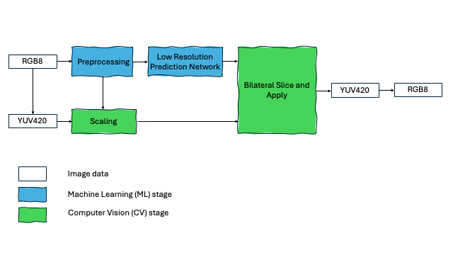

---

title: Overview
weight: 4

### FIXED, DO NOT MODIFY
layout: learningpathall

---

## KleidiAI

[KleidiAI](https://gitlab.arm.com/kleidi/kleidiai) is an open-source library that provides optimized, performance-critical routines - also known as micro-kernels - for artificial intelligence (AI) workloads on Arm CPUs.

These routines are tuned to take full advantage of specific Arm hardware architectures to maximize performance. The [KleidiAI](https://gitlab.arm.com/kleidi/kleidiai) library is designed for easy integration into C or C++ machine learning (ML) and AI frameworks.

Several popular AI frameworks already take advantage of [KleidiAI](https://gitlab.arm.com/kleidi/kleidiai) to improve performance on Arm platforms.

## KleidiCV

[KleidiCV](https://gitlab.arm.com/kleidi/kleidicv) is an open-source library that provides high-performance image processing functions for AArch64.

It is designed to be lightweight and simple to integrate into a wide variety of projects. Some computer vision frameworks, such as OpenCV, leverage [KleidiCV](https://gitlab.arm.com/kleidi/kleidicv) to accelerate image processing on Arm devices.

## AI camera pipelines

This Learning Path provides three example applications that combine AI and computer vision (CV) techniques:
- Background Blur,
- Low-Light Enhancement,
- Neural Denoising.

## Background Blur and Low Light Enhancement

Both applications:
- Use input and output images that are stored in `png` format, with three RGB channels (Red, Green, and Blue). Each channel supports 256 intensity levels (0-255) commonly referred to as `RGB8`.
- Convert the images to the `YUV420` color space for processing.
- Apply the relevant effect (background blur or low-light enhancement).
- Convert the processed images back to `RGB8` and save them as `.png` files.

### Background Blur

The background blur pipeline is implemented as follows:

### Low Light Enhancement

The low-light enhancement pipeline is adapted from the LiveHDR+ method originally proposed by Google Research in 2017:

The Low-Resolution Coefficient Prediction Network (implemented with LiteRT) performs computations such as:
- Strided convolutions.
- Local feature extraction using convolutional layers.
- Global feature extraction using convolutional and fully connected layers.
- Add, convolve, and reshape operations.

## Neural Denoising

Every smartphone photographer has seen it: images that look sharp in daylight
but fall apart in dim lighting. This is because _signal-to-noise ratio (SNR)_
drops dramatically when sensors capture fewer photons. At 1000 lux, the signal
dominates and images look clean; at 1 lux, readout noise becomes visible as
grain, color speckles, and loss of fine detail.

That’s why _neural camera denoising_ is one of the most critical --- and
computationally demanding --- steps in a camera pipeline. Done well, it
transforms noisy frames into sharp, vibrant captures. Done poorly, it leaves
smudges and artifacts that ruin the shot.

As depicted in the diagram below, the Neural Denoising pipeline is using 2
algorithms to process the frames:
- either temporally, with an algorithm named `ultralite` in the code
repository,
- or spatially, with an algorithm named `collapsenet` in the code repository,
- or both.

Temporal denoising uses some frames as history.

The Neural Denoising application works on frames, as emitted by a camera sensor in Bayer format:
- the input frames are in RGGB 1080x1920x4 format,
- the output frames in YGGV 4x1080x1920 format.
