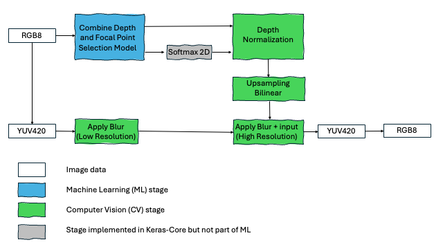

---

title: Overview
weight: 4

### FIXED, DO NOT MODIFY
layout: learningpathall

---

## KleidiAI

[KleidiAI](https://gitlab.arm.com/kleidi/kleidiai) is an open-source library that provides optimized, performance-critical routines - also known as micro-kernels - for artificial intelligence (AI) workloads on Arm CPUs.

These routines are tuned to take full advantage of the capabilities of specific Arm hardware architectures to maximize performance. The [KleidiAI](https://gitlab.arm.com/kleidi/kleidiai) library is designed for easy integration into C or C++ machine learning (ML) and AI frameworks. 

Several popular AI frameworks already take advantage of [KleidiAI](https://gitlab.arm.com/kleidi/kleidiai) to improve performances on Arm platforms.

## KleidiCV

The open-source [KleidiCV](https://gitlab.arm.com/kleidi/kleidicv) library that provides high-performance image processing functions for AArch64. 

It is designed to be lightweight and simple to integrate into a wide variety of projects. Some computer vision frameworks, such as OpenCV, leverage [KleidiCV](https://gitlab.arm.com/kleidi/kleidicv) to accelerate image processing on Arm devices.

## The AI camera pipelines

This Learning Path provides two example applications that combine AI and computer vision (CV) techniques:
- Background Blur.
- Low-Light Enhancement.

Both applications:
- Use input and output images are stored in `ppm` (portable pixmap) format, with 3 RGB channels (Red, Green, and Blue) and 256 color levels each (also known as `RGB8`).
- The images are first converted to the `YUV420` color space, where the background blur or low-light enhancement operations will take place. After the processing is done, the images are converted back to `RGB8` and saved in `ppm` format.

### Background Blur

The pipeline that has been implemented for background blur looks like this:

### Low Light Enhancement

The pipeline implemented for low-light enhancement is adapted from the LiveHDR+ pipeline, as originally proposed by Google Research in 2017, and looks like this:

where the Low-Resolution Coefficient Prediction Network (implemented with TFLite) includes computations like:
- strided convolutions
- local feature extraction with convolutional layers
- global feature extraction with convolutional + fully connected layers
- add, convolve, and reshape