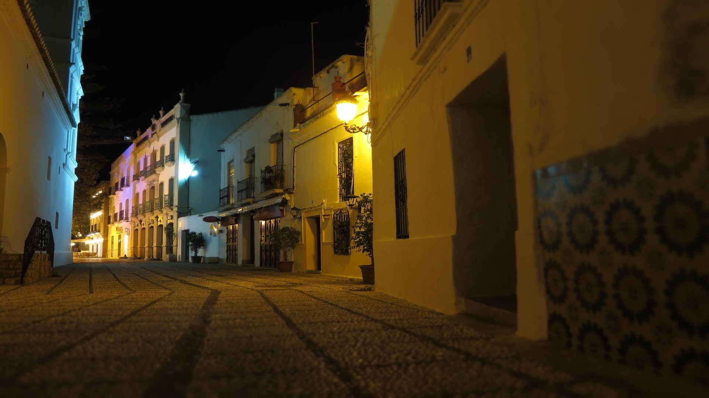

---

title: Run the pipelines
weight: 6

### FIXED, DO NOT MODIFY
layout: learningpathall
---

## Apply transformations

In the previous section, you built the AI Camera Pipelines. In this section, you'll run them to apply transformations to an input image or input frames.


```bash
cd $HOME/ai-camera-pipelines
python3 -m venv venv
. venv/bin/activate
pip install -r ai-camera-pipelines.git/docker/python-requirements.txt
```

### Background Blur

Run the background Blur pipeline, using `resources/test_input.png` as the input image and write the transformed image to `test_output.png`:

```bash
cd $HOME/ai-camera-pipelines
bin/cinematic_mode resources/test_input.png test_output.png resources/depth_and_saliency_v3_2_assortedv2_w_augment_mobilenetv2_int8_only_ptq.tflite
```




### Low-Light Enhancement

Run the Low-Light Enhancement pipeline, using `resources/test_input.png` as the input image and write the transformed image to `test_output2_lime.png`:

```bash
cd $HOME/ai-camera-pipelines
bin/low_light_image_enhancement resources/test_input.png test_output2_lime.png resources/HDRNetLIME_lr_coeffs_v1_1_0_mixed_low_light_perceptual_l1_loss_float32.tflite
```


### Neural denoising

When the SME extension is not available, only temporal neural denoising is
available, so this is what you will run for now --- but stay tuned as the SME extension
will become available very soon:

```bash
./scripts/run_neural_denoiser_temporal.sh
```

The input frames are:
 - first converted from `.png` files in the `resources/test-lab-sequence/` directory to the sensor format (RGGB Bayer) into `neural_denoiser_io/input_noisy*`,
 - those frames are then processed by the Neural Denoiser and written into `neural_denoiser_io/output_denoised*`,
 - last, the denoised frames are converted back to `.png` for easy visualization in directory `test-lab-sequence-out`.


