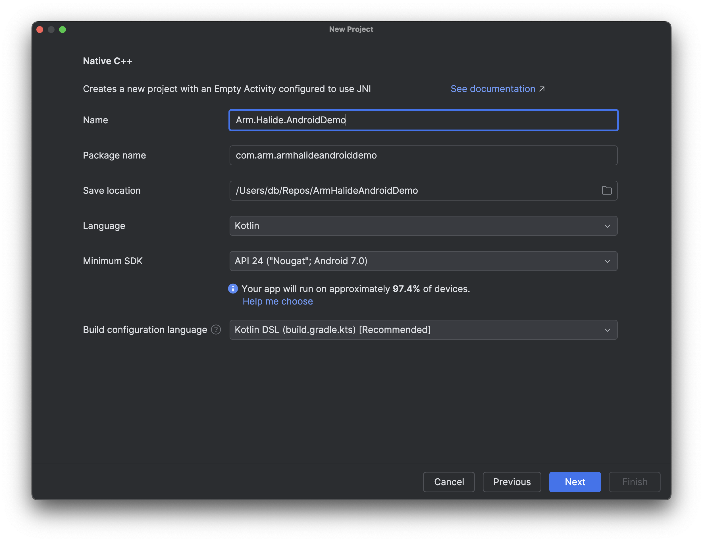
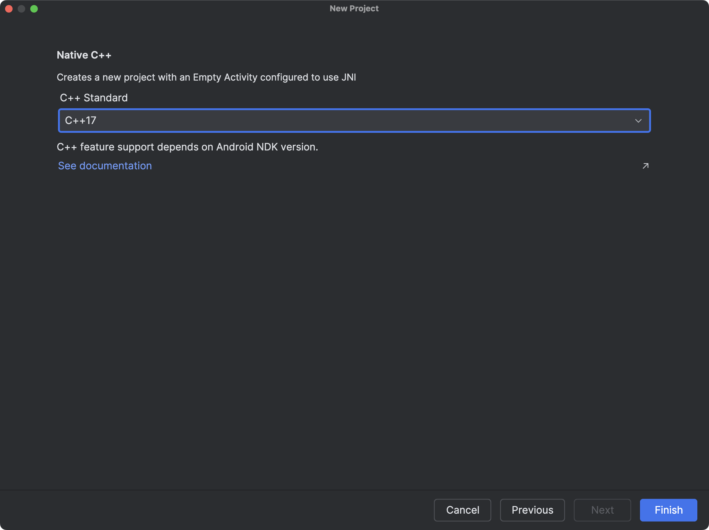
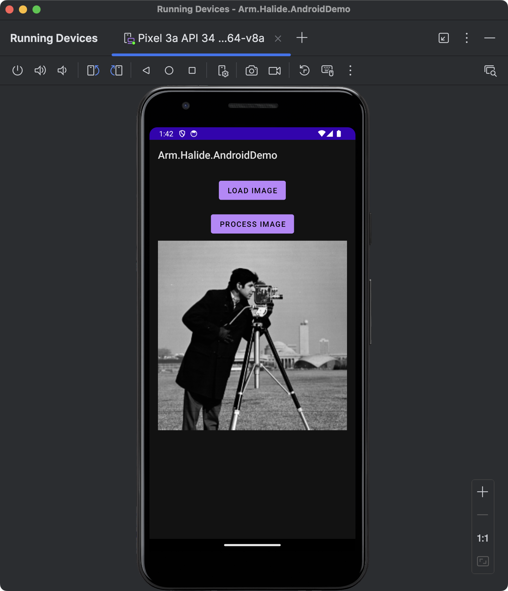
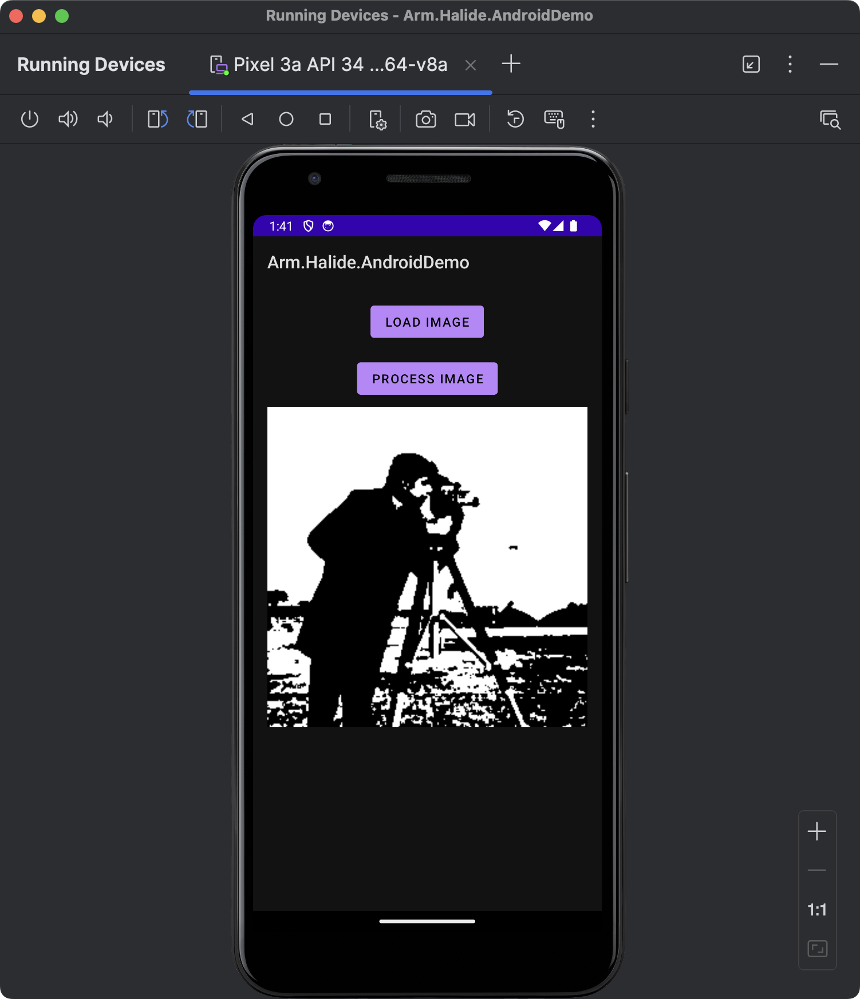

---
# User change
title: "Integrating Halide into an Android (Kotlin) Project"

weight: 6

layout: "learningpathall"
---

## Objective
In this lesson, we’ll learn how to integrate a high-performance Halide image-processing pipeline into an Android application using Kotlin.

## Overview of mobile integration with Halide
Android is the world’s most widely-used mobile operating system, powering billions of devices across diverse markets. This vast user base makes Android an ideal target platform for developers aiming to reach a broad audience, particularly in applications requiring sophisticated image and signal processing, such as augmented reality, photography, video editing, and real-time analytics.

Kotlin, now the preferred programming language for Android development, combines concise syntax with robust language features, enabling developers to write maintainable, expressive, and safe code. It offers seamless interoperability with existing Java codebases and straightforward integration with native code via JNI, simplifying the development of performant mobile applications. 

##  Benefits of using Halide on mobile
Integrating Halide into Android applications brings several key advantages:
1. Performance. Halide enables significant acceleration of complex image processing algorithms, often surpassing the speed of traditional Java or Kotlin implementations by leveraging optimized code generation. By generating highly optimized native code tailored for ARM CPUs or GPUs, Halide can dramatically increase frame rates and responsiveness, essential for real-time or interactive applications.
2. Efficiency. On mobile devices, resource efficiency translates directly to improved battery life and reduced thermal output. Halide’s scheduling strategies (such as operation fusion, tiling, parallelization, and vectorization) minimize unnecessary memory transfers, CPU usage, and GPU overhead. This optimization substantially reduces overall power consumption, extending battery life and enhancing the user experience by preventing overheating.
3. Portability. Halide abstracts hardware-specific details, allowing developers to write a single high-level pipeline that easily targets different processor architectures and hardware configurations. Pipelines can seamlessly run on various ARM-based CPUs and GPUs commonly found in Android smartphones and tablets, enabling developers to support a wide range of devices with minimal platform-specific modifications.
4. Custom Algorithm Integration. Halide allows developers to easily integrate their bespoke image-processing algorithms that may not be readily available or optimized in common libraries, providing full flexibility and control over application-specific performance and functionality.

In short, Halide delivers high-performance image processing without sacrificing portability or efficiency, a balance particularly valuable on resource-constrained mobile devices.

### Android development ecosystem and challenges
While Android presents abundant opportunities for developers, the mobile development ecosystem brings its own set of challenges, especially for performance-intensive applications:
1. Limited Hardware Resources. Unlike desktop or server environments, mobile devices have significant constraints on processing power, memory capacity, and battery life. Developers must optimize software meticulously to deliver smooth performance while carefully managing hardware resource consumption. Leveraging tools like Halide allows developers to overcome these constraints by optimizing computational workloads, making resource-intensive tasks feasible on constrained hardware.
2. Cross-Compilation Complexities. Developing native code for Android requires handling multiple hardware architectures (such as armv8-a, ARM64, and sometimes x86/x86_64). Cross-compilation introduces complexities due to different instruction sets, CPU features, and performance characteristics. Managing this complexity involves careful use of the Android NDK, understanding toolchains, and correctly configuring build systems (e.g., Gradle, CMake). Halide helps mitigate these issues by abstracting away many platform-specific optimizations, automatically generating code optimized for target architectures.
3. Image-Format Conversions (Bitmap ↔ Halide Buffer). Android typically handles images through the Bitmap class or similar platform-specific constructs, whereas Halide expects image data to be in raw, contiguous buffer formats. Developers must bridge the gap between Android-specific image representations (Bitmaps, YUV images from camera APIs, etc.) and Halide’s native buffer format. Proper management of these conversions—including considerations for pixel formats, stride alignment, and memory copying overhead—can significantly impact performance and correctness, necessitating careful design and efficient implementation of buffer-handling routines.

## Project requirements
Before integrating Halide into your Android application, ensure you have the necessary tools and libraries.

### Tools and prerequisites
1. Android Studio. [Download link](https://developer.android.com/studio).
2. Android NDK (Native Development Kit). Can be easily installed from Android Studio (Tools → SDK Manager → SDK Tools → Android NDK).

## Setting up the Android project
### Creating the project
1. Open Android Studio.
2. Select New Project > Native C++.


### Configure the project
1. Set the project Name to Arm.Halide.AndroidDemo.
2. Choose Kotlin as the language.
3. Set Minimum SDK to API 24.
4. Click Next.

5. Select C++17 from the C++ Standard dropdown list.

6. Click Finish.

## Configuring the Android project
Next, configure your Android project to use the files generated in the previous step. First, copy blur_threshold_android.a and blur_threshold_android.h into ArmHalideAndroidDemo/app/src/main/cpp. Ensure your cpp directory contains the following files:
* native-lib.cpp
* blur_threshold_android.a
* blur_threshold_android.h
* CMakeLists.txt

Open CMakeLists.txt and modify it as follows (replace /path/to/halide with your Halide installation directory):
```cpp
cmake_minimum_required(VERSION 3.22.1)

project("armhalideandroiddemo")
include_directories(
        /path/to/halide/include
)

add_library(blur_threshold_android STATIC IMPORTED)
set_target_properties(blur_threshold_android PROPERTIES IMPORTED_LOCATION
        ${CMAKE_CURRENT_SOURCE_DIR}/blur_threshold_android.a
)

add_library(${CMAKE_PROJECT_NAME} SHARED native-lib.cpp)

target_link_libraries(${CMAKE_PROJECT_NAME}
        blur_threshold_android
        android
        log)
```

Open build.gradle.kts and modify it as follows:

```console
plugins {
    alias(libs.plugins.android.application)
    alias(libs.plugins.kotlin.android)
}

android {
    namespace = "com.arm.armhalideandroiddemo"
    compileSdk = 35

    defaultConfig {
        applicationId = "com.arm.armhalideandroiddemo"
        minSdk = 24
        targetSdk = 34
        versionCode = 1
        versionName = "1.0"
        ndk {
            abiFilters += "arm64-v8a"
        }
        testInstrumentationRunner = "androidx.test.runner.AndroidJUnitRunner"
        externalNativeBuild {
            cmake {
                cppFlags += "-std=c++17"
            }
        }
    }

    buildTypes {
        release {
            isMinifyEnabled = false
            proguardFiles(
                getDefaultProguardFile("proguard-android-optimize.txt"),
                "proguard-rules.pro"
            )
        }
    }
    compileOptions {
        sourceCompatibility = JavaVersion.VERSION_11
        targetCompatibility = JavaVersion.VERSION_11
    }
    kotlinOptions {
        jvmTarget = "11"
    }
    externalNativeBuild {
        cmake {
            path = file("src/main/cpp/CMakeLists.txt")
            version = "3.22.1"
        }
    }
    buildFeatures {
        viewBinding = true
    }
}

dependencies {

    implementation(libs.androidx.core.ktx)
    implementation(libs.androidx.appcompat)
    implementation(libs.material)
    implementation(libs.androidx.constraintlayout)
    testImplementation(libs.junit)
    androidTestImplementation(libs.androidx.junit)
    androidTestImplementation(libs.androidx.espresso.core)
}
```

Click the Sync Now button at the top. To verify that everything is configured correctly, click Build > Make Project in Android Studio.

## UI
Now, you'll define the application's User Interface, consisting of two buttons and an ImageView. One button loads the image, the other processes it, and the ImageView displays both the original and processed images.
1. Open the res/layout/activity_main.xml file, and modify it as follows:
```XML
<?xml version="1.0" encoding="utf-8"?>
<LinearLayout
    xmlns:android="http://schemas.android.com/apk/res/android"
    android:layout_width="match_parent"
    android:layout_height="match_parent"
    android:gravity="center_horizontal"
    android:orientation="vertical"
    android:padding="16dp">

    <!-- Button to load the original image -->
    <Button
        android:id="@+id/btnLoadImage"
        android:layout_width="wrap_content"
        android:layout_height="wrap_content"
        android:text="Load Image" />

    <!-- Button to process the image with Halide -->
    <Button
        android:id="@+id/btnProcessImage"
        android:layout_width="wrap_content"
        android:layout_height="wrap_content"
        android:text="Process Image"
        android:layout_marginTop="16dp"
        android:enabled="false" />

    <!-- ImageView to display the original image -->
    <ImageView
        android:id="@+id/imageView"
        android:layout_width="match_parent"
        android:layout_height="wrap_content"
        android:adjustViewBounds="true"
        android:scaleType="fitCenter"
        android:layout_marginTop="8dp"
        android:layout_gravity="fill_horizontal"/>

</LinearLayout>
```

2. In MainActivity.kt, comment out the following line:

```java
//binding.sampleText.text = stringFromJNI()
```

Now you can run the app to view the UI:


## Processing
You will now implement the image processing code. First, pick up an image you want to process. Here we use the camera man. Then, under the Arm.Halide.AndroidDemo/src/main create assets folder, and save the image under that folder as img.png.

Now, open MainActivity.kt and modify it as follows:
```java
package com.arm.armhalideandroiddemo

import android.graphics.Bitmap
import android.graphics.BitmapFactory
import androidx.appcompat.app.AppCompatActivity
import android.os.Bundle
import android.widget.Button
import android.widget.ImageView
import com.arm.armhalideandroiddemo.databinding.ActivityMainBinding
import kotlinx.coroutines.CoroutineScope
import kotlinx.coroutines.Dispatchers
import kotlinx.coroutines.launch
import kotlinx.coroutines.withContext
import java.io.InputStream

class MainActivity : AppCompatActivity() {

    private lateinit var binding: ActivityMainBinding

    private var originalBitmap: Bitmap? = null
    private lateinit var btnLoadImage: Button
    private lateinit var btnProcessImage: Button
    private lateinit var imageView: ImageView

    override fun onCreate(savedInstanceState: Bundle?) {
        super.onCreate(savedInstanceState)

        binding = ActivityMainBinding.inflate(layoutInflater)
        setContentView(binding.root)

        btnLoadImage = findViewById(R.id.btnLoadImage)
        btnProcessImage = findViewById(R.id.btnProcessImage)
        imageView = findViewById(R.id.imageView)

        // Load the image from assets when the user clicks "Load Image"
        btnLoadImage.setOnClickListener {
            originalBitmap = loadImageFromAssets("img.png")
            originalBitmap?.let {
                imageView.setImageBitmap(it)
                // Enable the process button only if the image is loaded.
                btnProcessImage.isEnabled = true
            }
        }

        // Process the image using Halide when the user clicks "Process Image"
        btnProcessImage.setOnClickListener {
            originalBitmap?.let { bmp ->
                // Run the processing on a background thread using coroutines.
                CoroutineScope(Dispatchers.IO).launch {
                    // Convert Bitmap to grayscale byte array.
                    val grayBytes = extractGrayScaleBytes(bmp)

                    // Call your native function via JNI.
                    val processedBytes = blurThresholdImage(grayBytes, bmp.width, bmp.height)

                    // Convert processed bytes back to a Bitmap.
                    val processedBitmap = createBitmapFromGrayBytes(processedBytes, bmp.width, bmp.height)

                    // Update UI on the main thread.
                    withContext(Dispatchers.Main) {
                        imageView.setImageBitmap(processedBitmap)
                    }
                }
            }
        }
    }

    // Utility to load an image from the assets folder.
    private fun loadImageFromAssets(fileName: String): Bitmap? {
        return try {
            val assetManager = assets
            val istr: InputStream = assetManager.open(fileName)
            BitmapFactory.decodeStream(istr)
        } catch (e: Exception) {
            e.printStackTrace()
            null
        }
    }

    // Convert Bitmap to a grayscale ByteArray.
    private fun extractGrayScaleBytes(bitmap: Bitmap): ByteArray {
        val width = bitmap.width
        val height = bitmap.height
        val pixels = IntArray(width * height)
        bitmap.getPixels(pixels, 0, width, 0, 0, width, height)
        val grayBytes = ByteArray(width * height)
        var index = 0
        for (pixel in pixels) {
            val r = (pixel shr 16 and 0xFF)
            val g = (pixel shr 8 and 0xFF)
            val b = (pixel and 0xFF)
            val gray = ((r + g + b) / 3).toByte()
            grayBytes[index++] = gray
        }
        return grayBytes
    }

    // Convert a grayscale byte array back to a Bitmap.
    private fun createBitmapFromGrayBytes(grayBytes: ByteArray, width: Int, height: Int): Bitmap {
        val bitmap = Bitmap.createBitmap(width, height, Bitmap.Config.ARGB_8888)
        val pixels = IntArray(width * height)
        var idx = 0
        for (i in 0 until width * height) {
            val gray = grayBytes[idx++].toInt() and 0xFF
            pixels[i] = (0xFF shl 24) or (gray shl 16) or (gray shl 8) or gray
        }
        bitmap.setPixels(pixels, 0, width, 0, 0, width, height)
        return bitmap
    }

    external fun blurThresholdImage(inputBytes: ByteArray, width: Int, height: Int): ByteArray

    companion object {
        // Used to load the 'armhalideandroiddemo' library on application startup.
        init {
            System.loadLibrary("armhalideandroiddemo")
        }
    }
}
```

This Kotlin Android application demonstrates integrating a Halide-generated image-processing pipeline within an Android app. The main activity (MainActivity) manages loading and processing an image stored in the application’s asset folder.

When the app launches, the Process Image button is disabled. When a user taps Load Image, the app retrieves img.png from its assets directory and displays it within the ImageView, simultaneously enabling the Process Image button for further interaction.

Upon pressing the Process Image button, the following sequence occurs:
1. Background Processing. A Kotlin coroutine initiates processing on a background thread, ensuring the application’s UI remains responsive.
2. Conversion to Grayscale. The loaded bitmap image is converted into a grayscale byte array using a simple RGB-average method, preparing it for processing by the native (JNI) layer.
3. Native Function Invocation. This grayscale byte array, along with image dimensions, is passed to a native function (blurThresholdImage) defined via JNI. This native function is implemented using the Halide pipeline, performing operations such as blurring and thresholding directly on the image data.
4. Post-processing. After the native function completes, the resulting processed grayscale byte array is converted back into a Bitmap image.
5. UI Update. The coroutine then updates the displayed image (on the main UI thread) with this newly processed bitmap, providing the user immediate visual feedback.

The code defines three utility methods:
1. loadImageFromAssets, which retrieves an image from the assets folder and decodes it into a Bitmap.
2. extractGrayScaleBytes - converts a Bitmap into a grayscale byte array suitable for native processing.
3. createBitmapFromGrayBytes - converts a grayscale byte array back into a Bitmap for display purposes.

Note that performing the grayscale conversion in Halide allows us to exploit operator fusion, further improving performance by avoiding intermediate memory accesses. This could be done as follows:
```cpp
// Halide variables
Halide::Var x("x"), y("y"), c("c");

// Original RGB input buffer (interleaved RGB)
Halide::Buffer<uint8_t> inputBuffer(inputRgbData, width, height, 3);

// Convert RGB to grayscale directly in Halide pipeline
Halide::Func grayscale("grayscale");
grayscale(x, y) = Halide::cast<uint8_t>(
    0.299f * inputBuffer(x, y, 0) +
    0.587f * inputBuffer(x, y, 1) +
    0.114f * inputBuffer(x, y, 2)
);

// Continue pipeline: Gaussian blur (example)
Halide::Func blur("blur");
Halide::RDom r(-1, 3, -1, 3);
Halide::Expr kernel[3][3] = {
    {1, 2, 1},
    {2, 4, 2},
    {1, 2, 1}
};

Halide::Expr blurSum = 0;
for (int i = 0; i < 3; ++i) {
    for (int j = 0; j < 3; ++j) {
        blurSum += grayscale(x + r.x, y + r.y) * kernel[i][j];
    }
}
blur(x, y) = Halide::cast<uint8_t>(blurSum / 16);

// Fuse grayscale and blur operations
grayscale.compute_at(blur, x);
```

The JNI integration occurs through an external method declaration, blurThresholdImage, loaded via the companion object at app startup. The native library (armhalideandroiddemo) containing this function is compiled separately and integrated into the application (native-lib.cpp).

You will now need to create blurThresholdImage function. To do so, in Android Studio put the cursor above blurThresholdImage function, and then click Create JNI function for blurThresholdImage:


This will generate a new function in the native-lib.cpp:
```cpp
extern "C"
JNIEXPORT jbyteArray JNICALL
Java_com_arm_armhalideandroiddemo_MainActivity_blurThresholdImage(JNIEnv *env, jobject thiz,
                                                                  jbyteArray input_bytes,
                                                                  jint width, jint height) {
    // TODO: implement blurThresholdImage()
}
```

Implement this function as follows:
```cpp
extern "C"
JNIEXPORT jbyteArray JNICALL
Java_com_arm_armhalideandroiddemo_MainActivity_blurThresholdImage(JNIEnv *env, jobject thiz,
                                                                  jbyteArray input_bytes,
                                                                  jint width, jint height) {
    // Get the input byte array
    jbyte* inBytes = env->GetByteArrayElements(input_bytes, nullptr);
    if (inBytes == nullptr) return nullptr;

    // Wrap the grayscale image in a Halide::Runtime::Buffer.
    Halide::Runtime::Buffer<uint8_t> inputBuffer(reinterpret_cast<uint8_t*>(inBytes), width, height);

    // Prepare an output buffer of the same size.
    Halide::Runtime::Buffer<uint8_t> outputBuffer(width, height);

    // Call your Halide AOT function. Its signature is typically:
    blur_threshold(inputBuffer, outputBuffer);

    // Allocate a jbyteArray for the output.
    jbyteArray outputArray = env->NewByteArray(width * height);
    // Copy the data from Halide's output buffer to the jbyteArray.
    env->SetByteArrayRegion(outputArray, 0, width * height, reinterpret_cast<jbyte*>(outputBuffer.data()));

    env->ReleaseByteArrayElements(input_bytes, inBytes, JNI_ABORT);
    return outputArray;
}
```
Then supplement the native-lib.cpp file by the following includes:
```cpp
#include "HalideBuffer.h"
#include "Halide.h"
#include "blur_threshold_android.h"
```

This C++ function acts as a bridge between Java (Kotlin) and native code. Specifically, the function blurThresholdImage is implemented using JNI, allowing it to be directly called from Kotlin. When invoked from Kotlin (through the external fun blurThresholdImage declaration), the function receives a grayscale image represented as a Java byte array (jbyteArray) along with its width and height.

The input Java byte array (input_bytes) is accessed and pinned into native memory via GetByteArrayElements. This provides a direct pointer (inBytes) to the grayscale data sent from Kotlin. The raw grayscale byte data is wrapped into a Halide::Runtime::Buffer<uint8_t> object (inputBuffer). This buffer structure is required by the Halide pipeline. An output buffer (outputBuffer) is created with the same dimensions as the input image. This buffer will store the result produced by the Halide pipeline. The native function invokes the Halide-generated AOT function blur_threshold, passing in both the input and output buffers. After processing, a new Java byte array (outputArray) is allocated to hold the processed grayscale data. The processed data from the Halide output buffer is copied into this Java array using SetByteArrayRegion. The native input buffer (inBytes) is explicitly released using ReleaseByteArrayElements, specifying JNI_ABORT as no changes were made to the input array. Finally, the processed byte array (outputArray) is returned to Kotlin.

Through this JNI bridge, Kotlin can invoke high-performance native code. You can now re-run the application. Click the Load Image button, and then Process Image. You will see the following results:




In the above code we created a new jbyteArray and copying the data explicitly, which can result in an additional overhead. To optimize performance by avoiding unnecessary memory copies, you can directly wrap Halide’s buffer in a Java-accessible ByteBuffer like so
```java
// Instead of allocating a new jbyteArray, create a direct ByteBuffer from Halide's buffer data.
jobject outputBuffer = env->NewDirectByteBuffer(output.data(), width * height);
```

## Summary
In this lesson, we’ve successfully integrated a Halide image-processing pipeline into an Android application using Kotlin. We started by setting up an Android project configured for native development with the Android NDK, employing Kotlin as the primary language. We then integrated Halide-generated static libraries and demonstrated their usage through Java Native Interface (JNI), bridging Kotlin and native code. This equips developers with the skills needed to harness Halide’s capabilities for building sophisticated, performant mobile applications on Android.