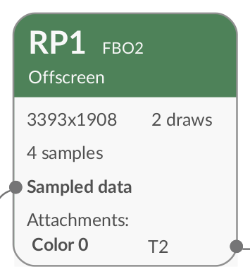
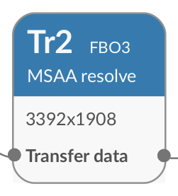
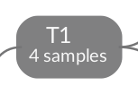
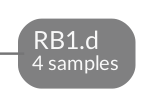

So that we can use render graphs to find application faults, we must first understand what they are telling us.

## Components of a render graph

Here's the graph from the previous section:

Notice that a basic level, render graphs consist of _boxes_ and _arrows_:

* Boxes, formally called _nodes_, represent rendering operations and resources (in other words, processing operations and data). We formally refer to nodes for rendering operations as _execution nodes_.
* Arrows, formally called _edges_, show the movement of data between rendering operations.

Render graphs describe rendering performed by the GPU while it is constructing a single frame. This rendering starts and ends with resources. As a result of graphs being read from left to right:
- The leftmost nodes represent the rendering of input resources, such as one or more textures.
- The rightmost nodes represent the final outputs of the rendering.

{}
To keep the graph as simple as possible, Frame Advisor omits read-only resources.
{}

In an efficiently-generated frame, all workloads and generated resources contribute to the creation of the final [swapchain](https://en.wikipedia.org/wiki/Swap_chain) output image shown on the right of the diagram. Notice in the graph above that the swapchain is shown in a different color.

In a suboptimally-generated frame, there may be other outputs which are not sent to the swapchain and consequently are not shown to a user. These represent unwanted data movement.

## Graph nodes in detail

Let's take a closer look at what can be represented in a node on the render graph.

### Render passes

Most of the execution nodes in the sample graph above are colored green and labelled “RP…” These are [render passes](https://developer.arm.com/documentation/102479/0100/How-Render-Passes-Work).

Render passes transform sets of input images into sets of output images using a rendering pipeline. The way this is declared varies across APIs. In OpenGL ES, [a number of different API calls](https://developer.arm.com/documentation/102479/0100/How-Render-Passes-Work/Render-Passes-in-OpenGL) can indicate the boundaries of a render pass. In Vulkan, [render passes are declared explicitly](https://docs.vulkan.org/spec/latest/chapters/renderpass.html).

Within each execution node representing a render pass, Frame Advisor gives information such as:

- The resolution of the texture being rendered
- A list of the attachments passed to the render pass and the name of each of these attachments.
- The number of API draw calls within the render pass.

{}
When you click an execution node, such as a render pass, Frame Advisor navigates to the associated API call.
{}

### Other types of execution node

The graph also shows a transfer node, colored blue. This is labelled ”Tr…”

Transfer nodes represent data movement between resource locations in memory. They are discussed in more depth in [a later problem-solving section](../inefficient-transfer-workloads).

You may also see other types of execution node. For example, you may see compute nodes if your application uses compute shaders.

### Resource nodes

Resource nodes show inputs and outputs of the execution nodes. They are shown as small grey rectangles with rounded edges.

There are different types of resource node:

- The swapchain: this represents the output of the computation. There is one swapchain on every graph. 
- [Textures](https://www.khronos.org/opengl/wiki/Texture): In the graph, these are marked with a leading letter `T`. 
- [Render buffers](https://www.khronos.org/opengl/wiki/Renderbuffer_Object): Like textures, these represent images. The title of render buffer nodes begins with letters `RB`. The title ends with a code indicating the class of render buffer – for example, `.s` for stencil and `.d` for depth. 

