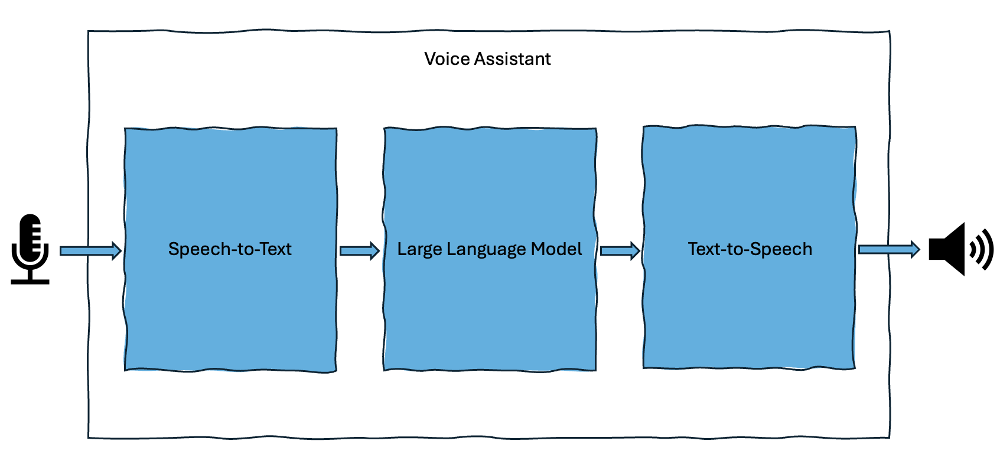

The Voice Assistant application demonstrates an example of a complete voice interaction pipeline for Android.

It generates intelligent responses by utilizing:
1. Speech-to-Text (STT) to transform the user's audio prompt into a text representation
2. A Large Language Model (LLM) to respond to the user's prompt in text form
3. Android Text-to-Speech (TTS) API to produce a voice response.

These three steps correspond to specific components used in the Voice Assistant application. A more detailed description of each step is provided.

## Speech to Text Library

Speech-to-Text is also known as Automatic Speech Recognition. This part of the pipeline focuses on converting spoken language into written text.

Speech recognition is done in the following stages:
- The device's microphone captures spoken language as an audio waveform.
- The audio waveform is broken into small time frames, and features are extracted to represent sound.
- A neural network is used to predict the most likely transcription of audio based on grammar and context.
- The final recognized text is generated for the next stage of the pipeline.

## Large Language Models Library

Large Language Models (LLMs) are designed for natural language understanding, and in this application, they are used for question-answering.

The text transcription from the previous part of the pipeline is used as input to the neural model. During initialization, the application assigns a persona to the LLM to ensure a friendly and informative voice assistant experience. By default, the application uses an asynchronous flow for this part of the pipeline, meaning that parts of the response are collected as they become available. The application UI is updated with each new token, and these are also used for the final stage of the pipeline.

## Text to Speech Component

This part of the application pipeline uses the Android Text-to-Speech API with some extra functionality to ensure smooth and natural speech output.

In synchronous mode, speech is only generated after the full response from the LLM is received. By default, the application operates in asynchronous mode, where speech synthesis starts as soon as a sufficient portion of the response (such as a half or full sentence) is available. Any additional responses are queued for processing by the Android Text-to-Speech engine.
