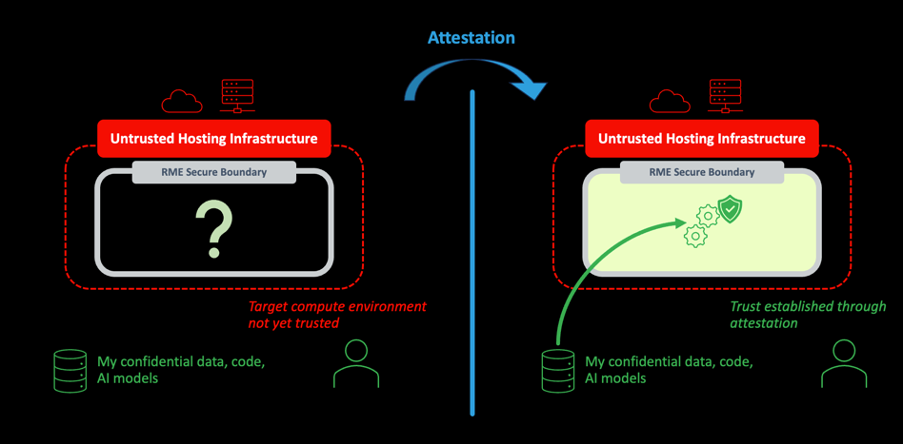

## Overview
Confidential computing is about protecting data in use. This protection comes from the creation of a security boundary around the computation being performed. This security boundary creates what is called a Trusted Execution Environment (TEE). The data and code that executes within the TEE is protected from the outside world. Different technologies exist for creating this secure boundary. In the case of Arm CCA, the Realm Management Extension (RME), which is part of the Arm Architecture v9 for A-profile CPUs, provides the secure boundary.

A secure boundary is necessary for confidential computing, but it is not sufficient alone. There must also be a way to establish trust with the TEE, the target compute environment, that the boundary is protecting. Trusting the environment implicitly does not meet the strict definition of confidential computing. Instead, trust needs to be built by a process that is both explicit and transparent. This process is known as attestation. The role of attestation is described in the Figure 1.

At the heart of the CCA attestation process is a small, self-contained packet of data known as a CCA attestation token. CCA attestation tokens are produced by realms. They contain evidence about the booted state of the realm. They also contain evidence about the state of the CCA host platform on which the realm is running, including details about the hardware and firmware. You will learn more about this evidence later in the learning path.

CCA attestation tokens have two very important properties:

* Firstly, they are cryptographically-signed using a private key that is strongly protected by the platform where the realm is running. 
* Secondly, they can be evaluated remotely using an attestation verification service. 

The verification service acts as a trust authority. It can verify the token’s cryptographic signature, which ensures that the evidence is authentic. It can also compare the evidence against the expectations of a trustworthy platform. In combination, these two properties allow a user of the realm to decide whether the realm will provide an adequate trusted environment for confidential computing.

