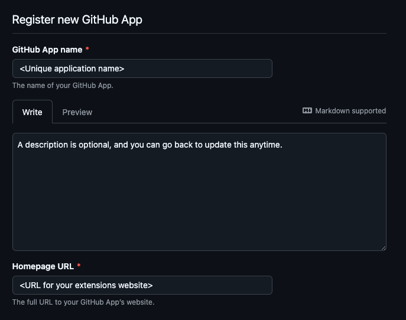
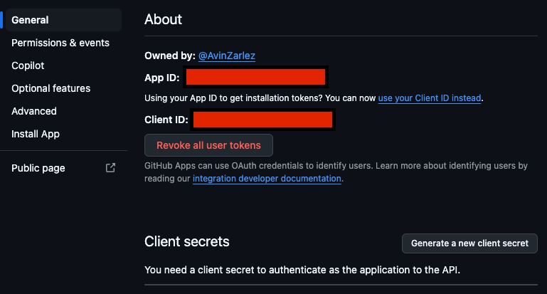

## Create a GitHub app

Now you need to create a Copilot extension on GitHub to connect to the deployed application.

For the most up to date instructions, follow the [official documentation for creating a GitHub App for Copilot Extension](https://docs.github.com/en/copilot/building-copilot-extensions/creating-a-copilot-extension/creating-a-github-app-for-your-copilot-extension#creating-a-github-app).

On any page of [GitHub](https://github.com/), click your profile picture and go to Settings. Scroll down to developer settings, and go to [create a GitHub App](https://github.com/settings/apps).

Your GitHub App must have:
    - A name
    - A homepage URL
    - Make sure Webhook -> Active is deselected

The rest can be the default values.

Scroll to the bottom and click "Create GitHub App"

## Get Client ID and Secret

After you create your app, open it up. You will see listed your Client ID under General -> About.

Under that is **Client Secrets**, click "Generate a new client secret" and save the value. Make sure you copy it before it goes away, you will need it for the next step as part of the flask application.

## Install Application

Click **Install App** in the sidebar, then install your app onto your account.

