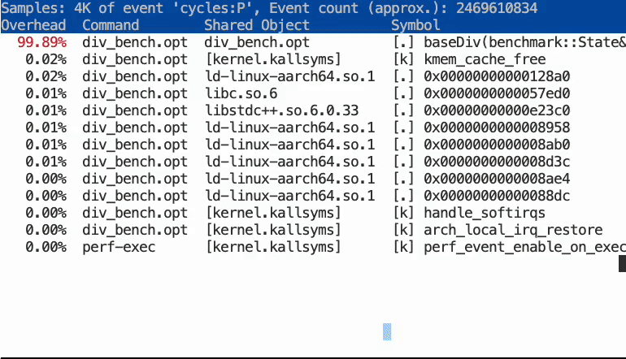

### Building binary with PGO

To generate an binary optimised on the runtime profile. First we need to build an instrumented binary that can record the usage. Run the following command that includes the `-fprofile-generate` flag to build the instrumented binary. 

```bash
g++ -O3 -std=c++17 -fprofile-generate div_bench.cpp -lbenchmark -lpthread -o div_bench.opt
```

Next, run the binary to record the profile. 

```bash
./div_bench.opt
```
An output file, `*.gcda` should be generated in the same directory. To incorporate this profile into the compilation, run the following command with the `-fprofile-use` flag. 

```bash
g++ -O3 -std=c++17 -fprofile-use div_bench.cpp -lbenchmark -lpthread -o div_bench.opt
```

### Running the optimised binary 

Running the newly created `div_bench.opt` binary we observe following improvement.

```output
Running ./div_bench.opt
Run on (4 X 2100 MHz CPU s)
CPU Caches:
  L1 Data 64 KiB (x4)
  L1 Instruction 64 KiB (x4)
  L2 Unified 1024 KiB (x4)
  L3 Unified 32768 KiB (x1)
Load Average: 0.10, 0.03, 0.01
***WARNING*** Library was built as DEBUG. Timings may be affected.
-------------------------------------------------------
Benchmark             Time             CPU   Iterations
-------------------------------------------------------
baseDiv/1500       2.86 us         2.86 us       244429
```

As the terminal output above shows, we have reduced our average execution time from 7.90 to 2.86 microseconds. **This is because we are able to provide the context that the profile data shows the input divisor is always 1500 and the compiler is able to incorporate this into the optimisation process**. Next, let's understand how it was optimised. 

### Inspect Assembly 


As per the previous section, run the following command to record `perf` data and create a report that can be viewed in the terminal. 

```bash
sudo perf record -o perf-division-opt ./div_bench.opt
sudo perf report --input=perf-division-opt
```

As the graphic below shows, the profile provided allowed the optimised program to unroll several times and use many more cheaper operations (also known as strength reduction) to execute our loop far quicker. 

