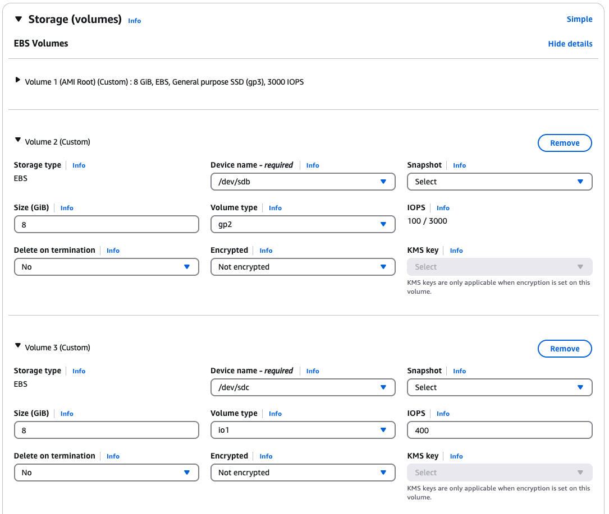

## Characterising your Workload

The basic attributes of a given workload are the following. 

- IOPS
- I/O Size
- Throughput
- Read to Write Ratio
- Random vs Sequential access

The characteristics of many real-world workloads will vary over time, for example an application that periodically flushes writes to disk. Further, the system-wide and process-specific characteristics may be significantly differently. 

## Example Workload

Connect to an Arm-based cloud instance. As an example workload, we will be using the media manipulation tool, FFMPEG on an AWS `t4g.medium` instance, with 2 Elastic Block Storage (EBS) volumes as per the image below. 




```bash
sudo apt update 
sudo apt install ffmpeg iotop -y
```

Download the popular example video, `BigBuckBunny.mp4` to demonstrate a transcoding workload. 

```bash
wget http://commondatastorage.googleapis.com/gtv-videos-bucket/sample/BigBuckBunny.mp4
```

Run the following command to begin transcoding the video and audio using the `H.264` and `aac` transcoders respectively. We use the `-flush_packets` flag to write each chunk of video back to storage.  

```bash
ffmpeg -i BigBuckBunny.mp4 -c:v libx264 -preset fast -crf 23 -c:a aac -b:a 128k -flush_packets 1 output_video.mp4
```
Whilst the transcoding is running, we can use the `pidstat` command to see the disk statistics. 

```bash
pidstat -d -p $(pgrep ffmpeg) 1
```
From the table below, we can observe this process is predominantly writing to disk at ~`300 kB/s`.  

```output
Linux 6.8.0-1024-aws (ip-10-248-213-118)        04/15/25        _aarch64_       (2 CPU)

10:01:24      UID       PID   kB_rd/s   kB_wr/s kB_ccwr/s iodelay  Command
10:01:25     1000     24250      0.00    276.00      0.00       0  ffmpeg
10:01:26     1000     24250      0.00    256.00      0.00       0  ffmpeg
10:01:27     1000     24250      0.00    216.00      0.00       0  ffmpeg
10:01:28     1000     24250      0.00    184.00      0.00       0  ffmpeg
10:01:29     1000     24250      0.00    424.00      0.00       0  ffmpeg
10:01:30     1000     24250      0.00    312.00      0.00       0  ffmpeg
10:01:31     1000     24250      0.00    372.00      0.00       0  ffmpeg
10:01:32     1000     24250      0.00    344.00      0.00       0  ffmpeg
```

Since this example `151MB` video  fits within memory, we observe no `kB_rd/s` for the storage device. However, since we are flushing to storage we observe ~275 `kB_wr/s` for this specific process. 

We can use iotop to confirm that our `ffmpeg` process has the greatest disk utilisation. 

```bash
sudo iotop
```

```output
Total DISK READ:         0.00 B/s | Total DISK WRITE:       332.11 K/s
Current DISK READ:       0.00 B/s | Current DISK WRITE:       0.00 B/s
    TID  PRIO  USER     DISK READ DISK WRITE>    COMMAND                                                       
  24891 be/4 ubuntu      0.00 B/s  332.11 K/s ffmpeg -i BigBuckBunny.mp4 -c:v ~ts 1 output_video.mp4 [mux0:mp4]
      1 be/4 root        0.00 B/s    0.00 B/s systemd --system --deserialize=74
      2 be/4 root        0.00 B/s    0.00 B/s [kthreadd]
```

Using the input, output statistics command (`iostat`) we can observe the system-wide metrics from the `nvme0n1` drive. Please Note that we are using a snapshot of this workload, more accurate characteristics can be obtained by measuring the distribution of a workload. 

```bash
watch -n 0.1 iostat -z nvme0n1
```
You should see output similar to that below. 

```output
Device             tps    kB_read/s    kB_wrtn/s    kB_dscd/s    kB_read    kB_wrtn    kB_dscd
nvme0n1           3.81        31.63       217.08         0.00     831846    5709210          0
```

The following characteristics are calculated as follows. 

1. IOPS

**Value:** 3.81  
_This is taken directly from the `tps` (transfers per second) field._

2. Throughput

**Read:** 31.63 kB/s  
**Write:** 217.08 kB/s  
**Total:** 248.71 kB/s  
_Sum of read and write throughput values._

3. Average I/O Size

**Value:** ≈ 65.3 KB  
_Calculated as total throughput divided by IOPS: 248.71 / 3.81._


4. Read/Write Ratio

**Read:** ~13%  
**Write:** ~87%  
_Computed as: (read or write throughput) ÷ total throughput._

Finally, to the access pattern of our workload (i.e. random vs. sequential) is slightly more complicated. We can infer the locality of our accesses through our understanding of the program, the cache hit rate (for reads), and merge rate on the dispatch side. Metrics that show high degree of merging, cache hits and low wait times suggest that our accesses are sequential in nature. 

Running the following command. 

```bash
iostat -xz nvme0n1
```

```output
Device            r/s     rkB/s   rrqm/s  %rrqm r_await rareq-sz     w/s     wkB/s   wrqm/s  %wrqm w_await wareq-sz     d/s     dkB/s   drqm/s  %drqm d_await dareq-sz     f/s f_await  aqu-sz  %util
nvme0n1          0.66     29.64     0.24  26.27    0.73    44.80    2.92    203.88     3.17  52.01    2.16    69.70    0.00      0.00     0.00   0.00    0.00     0.00    0.00    0.00    0.01   0.15
```

The `wrqm/s` column is the number of write requests merged per second before being issued. Calculated the percentage or writes merged compared to writes is one indicator of how sequental the data accesses are. 
