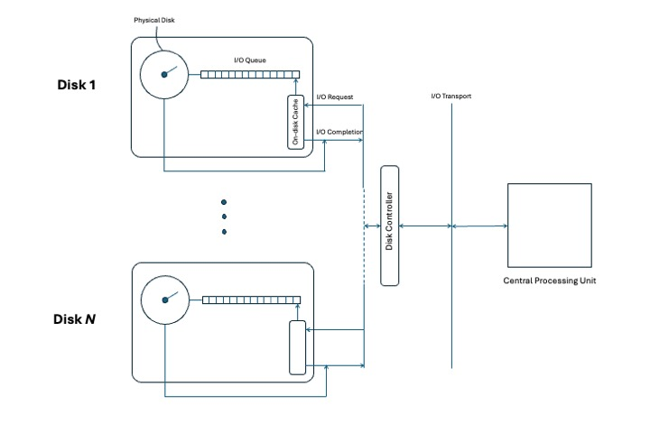

## Introduction

The ideal storage activity of your system is 0. In this situation all of your application data and instructions are available in memory or caches with no reads or writes to a spinning hard-disk drive or solid-state SSD required. However, due to physical capacity limitations, data volatility and need to store large amounts of data, many applications require frequent access to storage media. 

## High-Level Flow of Data

The diagram below is a high-level overview of how data can be written or read from a storage device.  This diagram illustrates a multi-disk I/O architecture where each disk (Disk 1 to Disk N) has an I/O queue and optional disk cache, communicating with a central CPU via a disk controller. Memory is not explicitly shown but resides between the CPU and storage, offering fast access times with the tradeoff of volatile. File systems, though not depicted, operate at the OS/kernel level to handling file access metadata and offer a friendly way to interact through files and directories.

## Key Terms

#### Sectors and Blocks

Sectors are the basic physical units on a storage device. For instance, traditional hard drives typically use a sector size of 512 bytes, while many modern disks use 4096 bytes (or 4K sectors) to improve error correction and efficiency.

Blocks are the logical grouping of one or more sectors used by filesystems for data organization. A common filesystem block size is 4096 bytes, meaning that each block might consist of 8 of the 512-byte sectors, or simply map directly to a 4096-byte physical sector layout if the disk supports it.

#### Input Output Operations per second (IOPS)
IOPS is a measure of how much random read or write requests your storage system can manage. It is worth noting that IOPS can vary by block size depending on the storage medium (e.g., flash drives). Importantly, traditional hard disk drives (HDDs) often don't specify the IOPS. For example the IOPS value for HDD volume on AWS is not shown. 

#### Throughput / Bandwidth
Throughput is the data transfer rate normally in MB/s with bandwidth specifying the maximum amount that a connection can transfer. IOPS x block size can be used to calculate the storage throughput of your application.

#### Queue Depth
Queue depth refers to the number of simultaneous I/O operations that can be pending on a device. Consumer SSDs might typically have a queue depth in the range of 32 to 64, whereas enterprise-class NVMe drives can support hundreds or even thousands of concurrent requests per queue. This parameter affects how much the device can parallelize operations and therefore influences overall I/O performance.

#### I/O Schedule Engine

The I/O engine is the software component within Linux responsible for managing I/O requests between applications and the storage subsystem. For example, in Linux, the kernel’s block I/O scheduler acts as an I/O engine by queuing and dispatching requests to device drivers. Schedulers use multiple queues to reorder requests optimal disk access. 
In benchmarking tools like fio, you might select I/O engines such as sync (synchronous I/O), `libaio` (Linux native asynchronous I/O library), or `io_uring` (which leverages newer Linux kernel capabilities for asynchronous I/O).

#### I/O Wait

This is the perceived time spent waiting for I/O to return the value from the perspective of the CPU core. 
