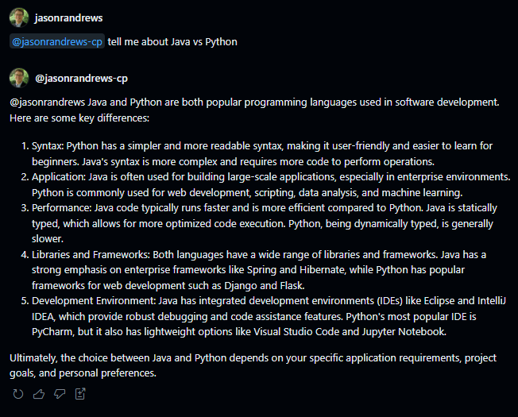

You are now ready to test your GitHub Copilot extension. 

Go to any of the Copilot Chat interfaces you are currently using, such as your browser or VS Code. 

Enter `@your-extension` and a test prompt, such as:

```console
tell me about Java vs Python
```

The first time you enter a prompt, you receive an authorization dialog asking you to enable your extension. 

Confirming the authorization takes you to an ngrok page in the browser. 

Click the button and in the browser you will see the following message from the GET request from your Python server:

```output
Hello! Welcome to the example GitHub Copilot Extension in Python!
```

You will see the extension invoked in the terminal where Python is running and information about the chat printed:

```output
127.0.0.1 - - [31/Jan/2025 23:33:18] "POST / HTTP/1.1" 200 -
User: jasonrandrews
Payload: {'copilot_thread_id': 'eceb9ea8-70a1-4a75-93b6-9096db87c4c6', 'messages': [{'role': 'user', 'content': '@jasonrandrews-cp tell me about Java vs Python', 'copilot_references': [], 'copilot_confirmations': None}, {'role': 'assistant', 'content': "@jasonrandrews Java and Python are both popular programming languages used for different purposes. Here are some key differences between the two:\n\n1. Syntax: Java has a more verbose syntax with strict rules, whereas Python has a more concise and readable syntax. Python's syntax is considered more beginner-friendly.\n\n2. Typing: Java is a statically-typed language, which means you need to declare the type of a variable before using it. Python, on the other hand, is dynamically-typed, allowing you to change the type of a variable during runtime.\n\n3. Performance: Java is typically faster than Python because it is a compiled language, while Python is an interpreted language. However, Python has many libraries and frameworks that leverage lower-level languages like C to improve performance.\n\n4. Application domains: Java is commonly used for building enterprise-level applications, Android apps, and large-scale systems due to its performance and robustness. Python is often used for web development, data analysis, scientific computing, and scripting due to its simplicity and extensive libraries.\n\n5. Community and ecosystem: Both Java and Python have vibrant communities and extensive libraries and frameworks. However, Java has been around longer, resulting in a larger ecosystem and support for enterprise development.\n\nUltimately, the choice between Java and Python depends on your specific needs, the type of application you are building, and personal preference. Both languages have their strengths and weaknesses, and it's worth considering the requirements of your project and your familiarity with each language.", 'copilot_references': [], 'copilot_confirmations': None}, {'role': 'user', 'content': "Current Date and Time (UTC - YYYY-MM-DD HH:MM:SS formatted): 2025-01-31 23:33:54\nCurrent User's Login: jasonrandrews\n", 'name': '_session', 'copilot_references': [{'type': 'github.current-url', 'data': {'url': 'https://github.com/jasonrandrews/arm-learning-paths'}, 'id': 'https://github.com/jasonrandrews/arm-learning-paths', 'is_implicit': True, 'metadata': {'display_name': 'https://github.com/jasonrandrews/arm-learning-paths', 'display_icon': '', 'display_url': ''}}], 'copilot_confirmations': None}, {'role': 'user', 'content': 'how do I install the aws cli on Arm Linux?', 'copilot_references': [], 'copilot_confirmations': []}], 'stop': None, 'top_p': 0, 'temperature': 0, 'max_tokens': 0, 'presence_penalty': 0, 'frequency_penalty': 0, 'response_format': None, 'copilot_skills': None, 'agent': 'jasonrandrews-cp', 'client_id': 'Iv23liSj0dAnWIBmCjzi', 'tools': [], 'functions': None, 'model': ''}
```

You also see HTTP requests on the terminal where ngrok is running.

```output
23:33:18.042 UTC POST /                         200 OK
23:33:00.991 UTC GET  /                         200 OK
```

Lastly, the chat output from your extension is printed. 

Here it is in VS Code:



Your GitHub Copilot Extension is now responding to chat prompts. 

You can now use what you have learned to build different, and more complex, Copilot Extensions.
