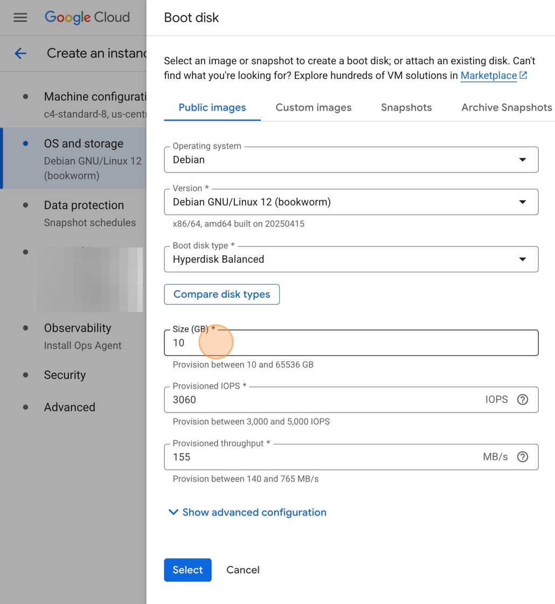
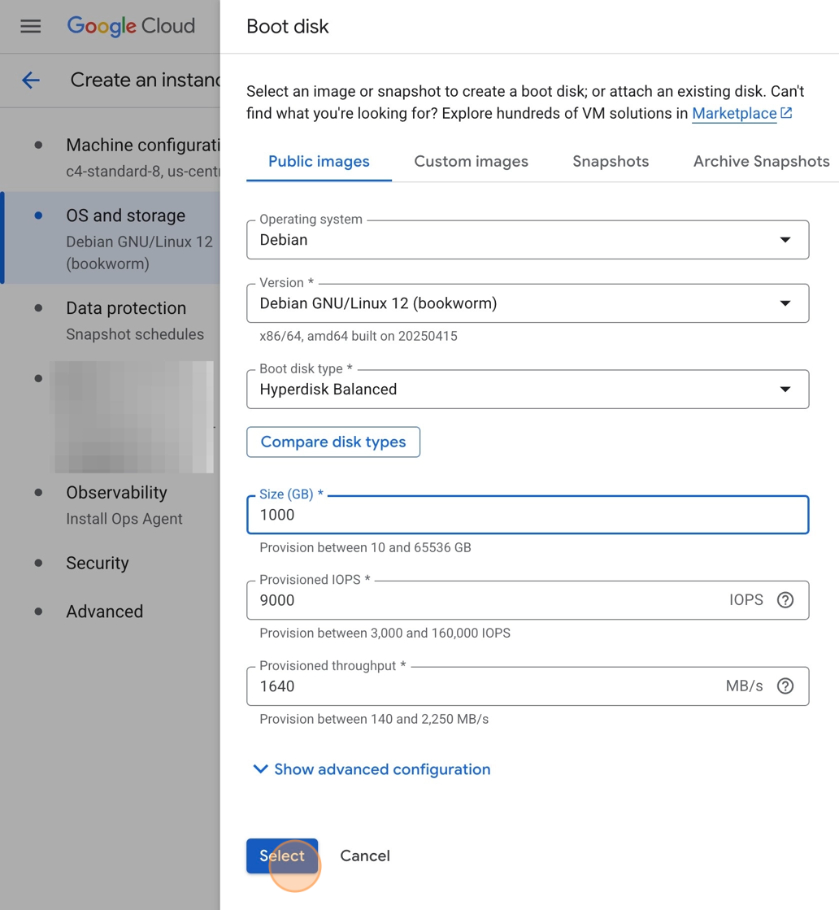

## Overview
 In the previous section, you setup System A, which is a c4a-standard-4. In this section, you will setup the second system used for benchmarking in this learning path, our System B, which will be a c4-standard-8.
 
{}
If you choose to run the benchmark against one or more existing instances, you can skip this section; just refer to the system created in this section as System B going forward. 
{}

### Creating System B

1\. Navigate to [https://console.cloud.google.com/welcome](https://console.cloud.google.com/welcome)

2\. Click into the Search field.

3\. Start typing `vm` until the UI auto-completes `VM Instances`, then click it.

The VM Instances page appears.

5\. Click `Create instance`

The Machine configuration page appears.

6\. Click the `Name` field, and enter "c4" for the `Name`.

8\. Scroll down to the Machine series section, and select the C4 radio button.

9\. Scroll down to the Machine type dropdown, and click it to show all available options.

10\. Select "c4-standard-8" under the Standard tab.

11\. Click the "OS and Storage" tab.

12\. Click "Change"

13\. Click the "Size (GB)" field, then enter "1000" for the value.

15\. Click "Select" to continue.

16\. Click "Create" to bring up the instance.

After a few seconds, our System A starts up, and you are ready to continue on to the next section, where you will launch the second system, System B.