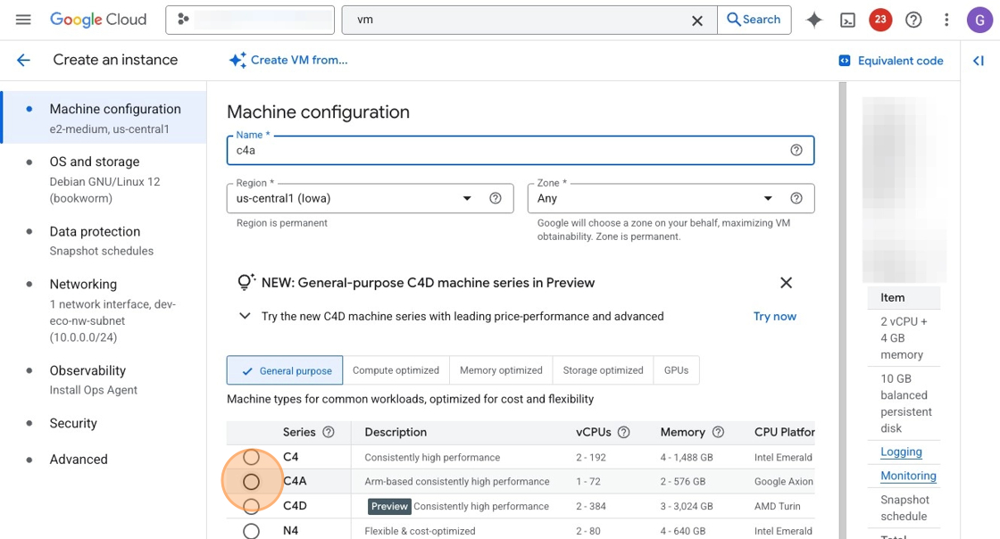

## Launch an Arm-based c4a-standard-4 instance
In this section, you'll launch the first of the two VMs used for benchmarking Go applications: the Arm-based c4a-standard-4 instance on Google Cloud, also referred to as c4a.

## Create the c4a-standard-4 instance

To access the Google Cloud console, navigate to [https://console.cloud.google.com/welcome](https://console.cloud.google.com/welcome).

Now search for VM instances, by using the search field.

To find VM instances, start typing "vm" until the UI auto-completes `VM Instances`, then select it.

The VM Instances page appears.

Now create a new instance, by selecting **Create instance**.

The Machine configuration page appears.

To name your instance, select the **Name** field, and enter "c4a".

Now select machine series by scrolling down to the Machine series section, and selecting the C4A radio button.

To view machine types, scroll down to the Machine type dropdown, and select it to show all available options.

Now choose machine size by selecting **c4a-standard-4** under the Standard tab.

To configure storage, select the **OS and Storage** tab.

To modify storage settings, select **Change**.

To set disk size, select the **Size (GB)** field, then enter "1000" for the value.

Now confirm storage settings by selecting **Select** to continue.

To launch the instance, select **Create** to bring up the instance.

After a few seconds, your c4a instance starts up, and you are ready to continue to the next section. 

In the next section, you will launch the second VM, an Intel-based Emerald Rapids c4-standard-8 (abbreviated to c4), which serves as the comparison system for our benchmarking tests.

