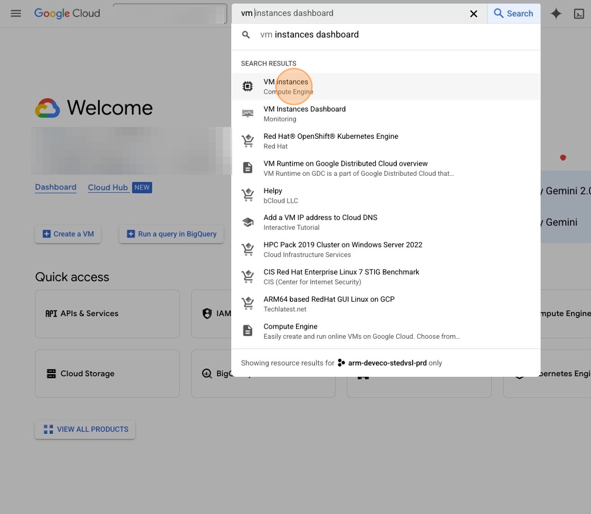

In this section, you'll launch the first of two VMs used for benchmarking Go applications: the Arm-based c4a-standard-4 instance on Google Cloud, (referred to as "c4a").

## Create the c4a-standard-4 instance

Go to the Google Cloud console: [https://console.cloud.google.com/welcome](https://console.cloud.google.com/welcome).

In the search bar at the top, start typing `vm`, then select **VM instances** when it appears.

 On the **VM instances** page, click **Create instance**.

 In the **Name** field, enter the name of the instance - here it should be `c4a`.

Now select the machine series by scrolling down to the Machine series section, and selecting the **C4A** radio button.

To view machine types, scroll down to the **Machine type** dropdown, and select it to show all available options.

Now choose machine size by selecting **c4a-standard-4** under the **Standard** tab.

To configure storage, select the **OS and Storage** tab.

To modify storage settings, select **Change**.

To set disk size, select the **Size (GB)** field and enter "1000" for the value.

 field")

Now confirm storage settings by selecting **Select** to continue.

To launch the instance, select **Create** to bring up the instance.

After a few seconds, your c4a instance is up and running, and you are ready to continue to the next section. 

In the next section, you'll launch the second VM, an Intel-based Emerald Rapids c4-standard-8 (referred to as "c4"), which serves as the comparison system for benchmarking.

