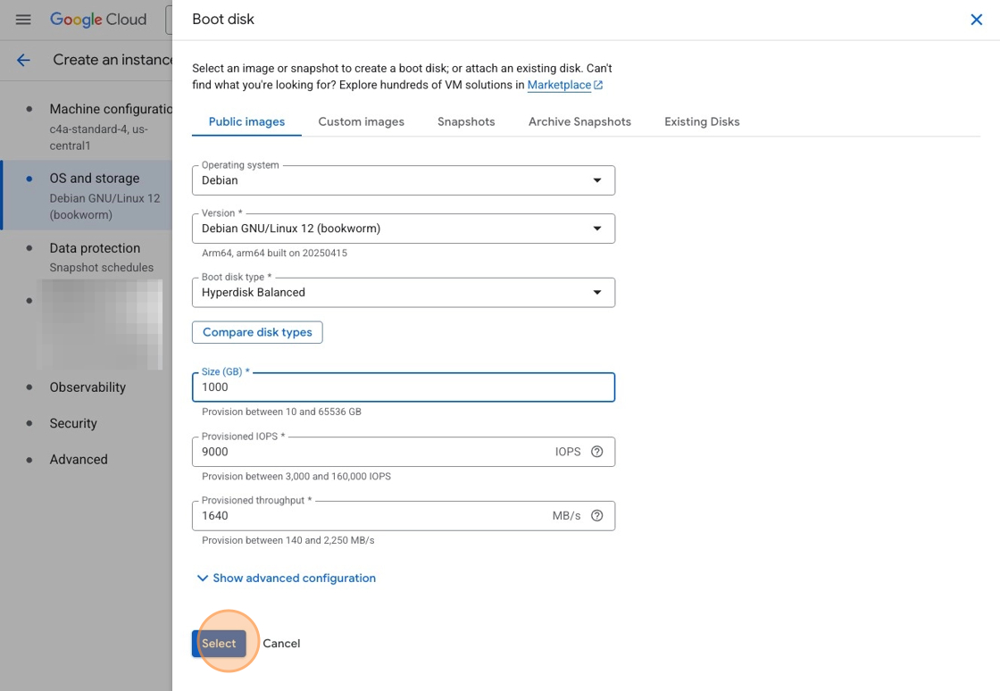

## Overview
 In this learning path, you'll learn how to benchmark Go code against two newly created systems.  In this chapter, you bring up the first system, an Arm-based Google Axion c4a-standard-4 (c4a for short).  

### Creating the c4a-standard-4 instance

1\. Navigate to [https://console.cloud.google.com/welcome](https://console.cloud.google.com/welcome)

2\. Click into the Search field.

3\. Start typing `vm` until the UI auto-completes `VM Instances`, then click it.

The VM Instances page appears.

5\. Click `Create instance`

The Machine configuration page appears.

6\. Click the `Name` field, and enter "c4a" for the `Name`.

8\. Scroll down to the Machine series section, and select the C4A radio button.

9\. Scroll down to the Machine type dropdown, and click it to show all available options.

10\. Select "c4a-standard-4" under the Standard tab.

11\. Click the "OS and Storage" tab.

12\. Click "Change"

13\. Double-click the "Size (GB)" field, then enter "1000" for the value.

15\. Click "Select" to continue.

16\. Click "Create" to bring up the instance.

After a few seconds, our c4a starts up, and you are ready to continue on to the next section, where you will launch the second system, an Intel-based Emerald Rapids c4-standard-8 (c4 for short).

