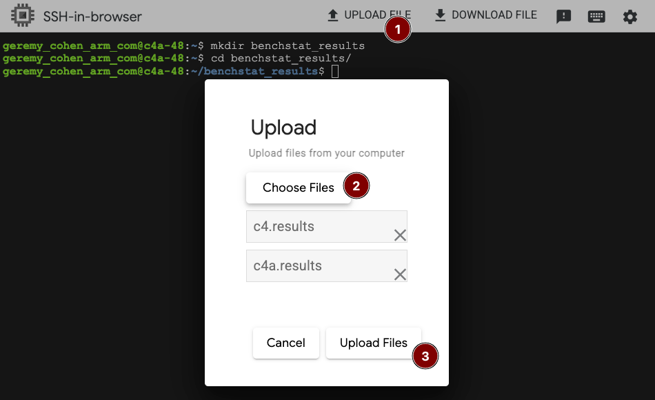

You've run and downloaded the benchmark results from both your Arm-based and x86-based VMs.  Now you can compare them to each other using `benchstat`.


### Inspecting the results files (optional)
With the results files downloaded to your local machine, you can inspect them to see what they look like before you have `benchstat` analyze them.  

1. Open the `c4a.result` file in a text editor, and you'll see something like this:


The file contains the results of the `markdown` benchmark run on the Arm-based c4a VM, showing time and memory stats taken for each iteration.  If you open the `c4.result` file, you'll see similar results for the x86-based c4 VM.

2. Close the text editor.

### Running benchstat to compare results

To compare the results, you'll use `benchstat` to analyze the two result files you downloaded.  Since all the prerequisites are already installed on the `c4` and `c4a` instances, benchstat will be run from one of those instances.

3. As demonstrated in the previous chapter, SSH into the `c4a` instance.


5. Make a temporary benchstat directory to hold the results files, and cd into it, for example:

```bash
mkdir benchstat_results
cd benchstat_results
```

6. Click the `UPLOAD FILE` button in the GCP console, and upload the `c4a.results` AND `c4.results` files you downloaded earlier.  (This uploads them to your home directory, not to the current directory.)



7. You'll know it worked correctly via the confirmation dialog in your terminal:


8. Move the results files to the `benchstat_results` directory, and confirm their presence:

```bash
mv ~/c4a.results ~/c4.results .
ls -al
```
You should see both files in the benchstat_results directory:

```output
c4a-48:~/benchstat_results$ ls
c4.results  c4a.results
```
9. Now you can run `benchstat` to compare the two results files.  Run the following command:

```bash
export GOPATH=$HOME/go
export GOBIN=$GOPATH/bin
export PATH=$PATH:$GOBIN:/usr/local/go/bin
benchstat c4a.results c4.results > c4a_vs_c4.txt
```

10. Run the `cat` command to view the results:

```bash
cat c4a_vs_c4.txt
```

You should see output similar to the following:

```output
geremy_cohen_arm_com@c4a-48:~/benchstat_results$ cat c4a_vs_c4.txt 
                       │ c4a.results │     c4.results     │
                       │   sec/op    │   sec/op     vs base   │
MarkdownRenderXHTML-48   143.9m ± 1%
MarkdownRenderXHTML-96                 158.3m ± 0%
geomean                  143.9m        158.3m       ? ¹ ²
¹ benchmark set differs from baseline; geomeans may not be comparable
² ratios must be >0 to compute geomean

                       │    c4a.results    │        c4.results        │
                       │ average-RSS-bytes │ average-RSS-bytes  vs base   │
MarkdownRenderXHTML-48        22.49Mi ± 6%
MarkdownRenderXHTML-96                            24.78Mi ± 2%
geomean                       22.49Mi             24.78Mi       ? ¹ ²
¹ benchmark set differs from baseline; geomeans may not be comparable
² ratios must be >0 to compute geomean

                       │  c4a.results   │      c4.results       │
                       │ peak-RSS-bytes │ peak-RSS-bytes  vs base   │
MarkdownRenderXHTML-48     23.67Mi ± 4%
MarkdownRenderXHTML-96                      25.11Mi ± 7%
geomean                    23.67Mi          25.11Mi       ? ¹ ²
¹ benchmark set differs from baseline; geomeans may not be comparable
² ratios must be >0 to compute geomean

                       │  c4a.results  │      c4.results      │
                       │ peak-VM-bytes │ peak-VM-bytes  vs base   │
MarkdownRenderXHTML-48    1.176Gi ± 0%
MarkdownRenderXHTML-96                    1.176Gi ± 0%
geomean                   1.176Gi         1.176Gi       ? ¹ ²
¹ benchmark set differs from baseline; geomeans may not be comparable
² ratios must be >0 to compute geomean
```

This output shows the performance differences between the two VMs for the `markdown` benchmark in text format.  If you wanted it in CSV format, you could run the `benchstat` command with the `-format csv` option instead.

### Next steps
At this point, you can download the `c4a_vs_c4.txt` for further analysis or reporting.  You can also run the same or different benchmarks with the same, or different combinations of VMs, and continue comparing results using `benchstat`.

Continuing on to the next section, you will learn how to automate and gain enhanced visuals with sweet and benchstat.


