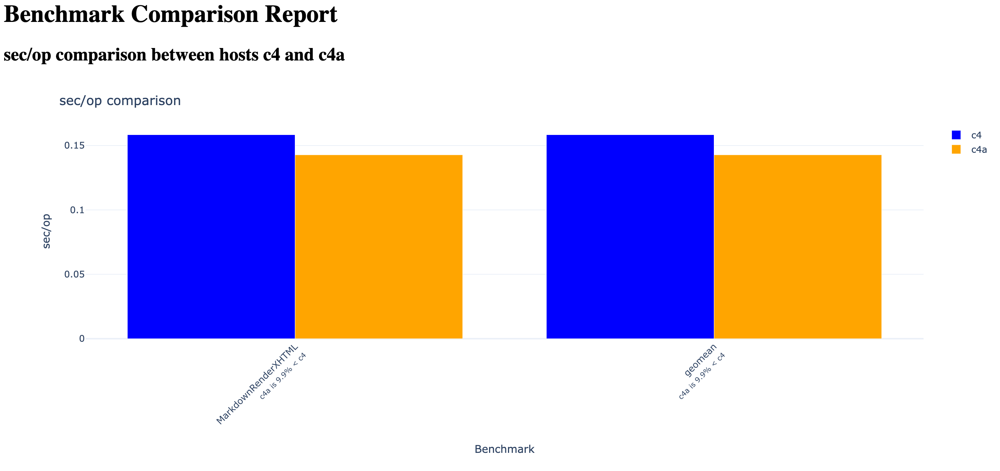

With `rexec_sweet` installed, your benchmarking instances running, and your local machine authenticated with GCP, you're ready to run automated benchmarks across your configured environments.

## Run an automated benchmark and analysis

1. **Run the script:** Execute the `rexec_sweet` script from your local terminal:

```bash
rexec_sweet
```

2. **Select a benchmark:** When prompted, press **Enter** to run the default benchmark (markdown), recommended for your first run.

```bash
Available benchmarks:
1. biogo-igor
2. biogo-krishna
3. bleve-index
4. cockroachdb
5. esbuild
6. etcd
7. go-build
8. gopher-lua
9. markdown (default)
10. tile38
Enter number (1-10) [default: markdown]:
```

3. **Select instances:** The script will proceed and call into GCP to detect all running VMs. You should see the script output:

```output
Available instances:
1. c4 (will be used as first instance)
2. c4a (will be used as second instance)

Do you want to run the first two instances found with default install directories? [Y/n]:
```

4. **Choose your configuration:** You have two options:

   - **Use default settings:** If you want to run benchmarks on the instances labeled with "will be used as nth instance", and you installed Go and Sweet into the default path (~/benchmarks/sweet), you can press **Enter** to accept the defaults.

   - **Custom configuration:** If you are running more than two instances, and the script doesn't suggest the correct two to autorun, or you installed Go and Sweet to non-default folders, select "n" and press **Enter**. The script will then prompt you to select the instances and runtime paths.

In this example, you'll manually select the instances and paths as shown below:

```output
Available instances:
1. c4 (will be used as first instance)
2. c4a (will be used as second instance)

Do you want to run the first two instances found with default install directories? [Y/n]: n

Select 1st instance:
1. c4
2. c4a
Enter number (1-2): 1
Enter remote path for c4 [default: ~/benchmarks/sweet]:

Select 2nd instance:
1. c4
2. c4a
Enter number (1-2): 2
Enter remote path for c4a [default: ~/benchmarks/sweet]:
Output directory: /private/tmp/a/go_benchmarks/results/c4-c4a-markdown-20250610T190407
...
```

After selecting instances and paths, the script will:
   - Run the selected benchmark on both VMs
   - Run `benchstat` to compare the results
   - Push the results to your local machine

```output
Running benchmarks on the selected instances...
[c4a] [sweet] Work directory: /tmp/gosweet3216239593
[c4] [sweet] Work directory: /tmp/gosweet2073316306...
[c4a] ✅ benchmark completed
[c4] ✅ benchmark completed
...
Report generated in results/c4-c4a-markdown-20250610T190407
```

5. **View the report:** Once on your local machine, `rexec_sweet` will generate an HTML report that will open automatically in your web browser.

   If you close the report, you can reopen it by navigating to the results subdirectory and opening report.html in your browser.




{}
If you see output messages from `rexec_sweet.py` similar to "geomeans may not be comparable" or "Dn: ratios must be >0 to compute geomean", this is expected and can be ignored. These messages indicate that the benchmark sets differ between the two VMs, which is common when running benchmarks on different hardware or configurations.
{}

6. **Analyze results:** Upon completion, the script will generate a report in the `results` subdirectory of the current working directory of the `rexec_sweet.py` script, which opens automatically in your web browser to view the benchmark results and comparisons.
