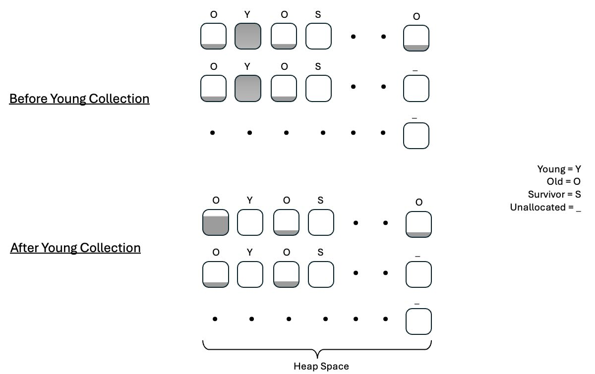

In this section, you will explore the key differences among commonly used production GCs. You will learn about the advantages and disadvantages of each GC, along with guidance on selecting the best one for your Java application.

### Serial Garbage Collector

The Serial Garbage Collector (Serial GC) is a simple, single-threaded garbage collector, primarily designed for small applications or single-processor environments. Java’s heap is divided into two main regions, or generations—the young generation and the old generation—to help manage short-lived and long-lived objects differently. In the Serial GC, both the young and old generations are collected using a single-threaded, “stop-the-world” approach, where all application threads pause during garbage collection. This design can lead to noticeable application pauses, particularly as the heap size grows, making the Serial GC unsuitable for larger, latency-sensitive applications.

In production deployments, the Serial GC is rarely used in high-throughput or multi-threaded applications because it does not utilize the parallel processing capabilities of modern CPUs, resulting in longer pause times compared to other collectors. Its limitations make it inefficient for large-scale applications, where even brief pauses can disrupt user experience. However, for applications with limited memory and CPU resources or those needing a predictable, single-threaded execution model, the Serial GC remains a straightforward and low-overhead option.

### Throughput Garbage Collector

The Parallel GC, also called the Throughput GC, uses the same generational heap structure as the Serial GC, dividing memory into young and old generations to manage short-lived and long-lived objects. Unlike the Serial GC, the Parallel GC uses multiple threads for garbage collection, improving efficiency on larger heaps. When the young generation fills up, a young collection pause occurs, briefly pausing application threads to clear the young space. As shown in the diagram below, data in the young generation space is mostly freed, with surviving objects moved to the old generation.

Once the old generation is full, a full GC pause blocks all application threads for a longer duration to clean both generations. These full GC pauses can degrade performance in latency-sensitive applications, such as database management systems, where interruptions affect responsiveness. The Parallel GC’s multi-threaded approach helps reduce pause times, making it better suited for applications that prioritize throughput and can handle occasional longer pauses for full collection.

### Garbage First Garbage Collector (G1GC)

The G1GC is the default garbage collector starting from JDK version 11. G1 Garbage Collector (GC) works by dividing the heap into discrete regions, typically around 2,048 by default. These regions can be part of either the old or new generation and do not need to be contiguous. The purpose of having regions in the old generation is to allow concurrent background threads to identify and target regions with a higher concentration of unreferenced objects. The tradeoff of using concurrent threads is at the expense of slightly higher CPU utilisation. G1GC is most effective when there is at least ~20% unutilised CPU headroom. 

Although collecting a region still necessitates pausing application threads, G1GC can prioritize regions with the most garbage, thereby minimizing the time spent on garbage collection. The result is that the pause times for full GC pauses is less compared to the throughput collector. The diagram below illustrates how the G1GC is divided into discrete chunks and how memory is freed.

### ZGC and Shenandoah GC

Heap compaction time in Java garbage collection refers to the process of reorganizing live objects in memory to eliminate fragmentation. In the G1GC, heap compaction time is largely determined by the time spent relocating objects within memory, which requires pausing all application threads during the process. In contrast, the ZGC and Shenandoah GC can perform heap compaction concurrently while the application continues running, reducing pause times. ZGC and Shenandoah GCs use a form of locking to implement concurrent heap compaction in a light-weight manner. Starting from JDK version 15, ZGC became production ready. 

The ZGC and Shenandoah GC are particularly suited for applications that require ultra-low pause times and can benefit from concurrent garbage collection, making them ideal for large-scale, latency-sensitive applications like real-time analytics, trading systems, and other interactive services. By allowing heap compaction to occur concurrently, these collectors significantly reduce application pauses compared to G1GC, which pauses all threads during compaction.

However, the tradeoff with these collectors is a higher CPU overhead, as concurrent garbage collection requires additional processing while the application is running. 

### Comparison Table

The following table can be used as a rough guide for your specific java application.

| Garbage Collector | Average Latency (ms) | Maximum Latency (ms) | Pros | Cons | When to Use | Example Application |
|-------------------|----------------------|----------------------|------|------|-------------|---------------------|
| **Serial**        | High (100-500 ms)    | Very High (500+ ms)  | Simple, low overhead | Freezes all application threads | Single-threaded environments, small heaps | Resource-constrained Docker containers |
| **Throughput**    | Moderate (50-200 ms) | High (200-500 ms)    | High throughput, uses multiple threads | Pauses application threads during GC | Applications that can tolerate pauses, need high throughput | Batch processing systems |
| **G1**            | Low to Moderate (10-100 ms) | Moderate (100-200 ms) | Focuses on regions with most garbage, concurrent collection | More complex, higher overhead | Large heaps, applications needing balanced throughput and latency | Web servers, application servers |
| **ZGC**           | Very Low (1-10 ms)   | Low (10-50 ms)       | Minimal pause times, scalable | High memory usage | Applications requiring very low latency | Financial trading systems |
| **Shenandoah**    | Very Low (1-10 ms)   | Low (10-50 ms)       | Concurrent collection, low pause times | Higher CPU usage, more complex | Applications needing low latency and large heaps | Real-time data processing |

