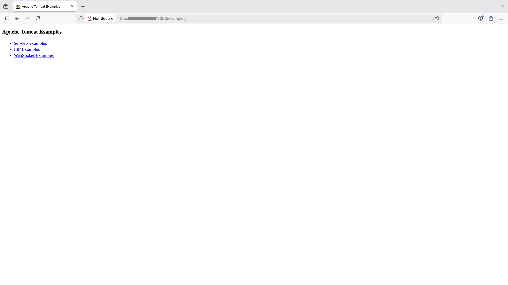

## Overview 

Flame graphs are a widely used entry point for analyzing Java application performance. Tools for generating flame graphs include `async-profiler`, Java agents, `jstack`, and Java Flight Recorder (JFR). This Learning Path focuses on two practical approaches: using `async-profiler` and a Java agent. 

In this section, you'll set up a benchmark environment using Apache Tomcat and `wrk2` to simulate HTTP load and evaluate performance on an Arm-based server.

## Set up the Tomcat benchmark server
[Apache Tomcat](https://tomcat.apache.org/) is an open-source Java Servlet container that runs Java web applications, handles HTTP requests, and serves dynamic content. It supports technologies such as Servlet, JSP, and WebSocket.

## Install the Java Development Kit (JDK)

Install OpenJDK 21 on your Arm-based Ubuntu server: 

```bash
sudo apt update
sudo apt install -y openjdk-21-jdk
```

## Install Tomcat 

Download and extract Tomcat:

```bash
wget -c https://dlcdn.apache.org/tomcat/tomcat-11/v11.0.9/bin/apache-tomcat-11.0.9.tar.gz
tar xzf apache-tomcat-11.0.9.tar.gz
```
Alternatively, you can build Tomcat [from source](https://github.com/apache/tomcat).

## Enable access to Tomcat examples

To access the built-in examples from your local network or external IP, modify the `context.xml` file:

```bash
vi apache-tomcat-11.0.9/webapps/examples/META-INF/context.xml
```
Update the `RemoteAddrValve` configuration to allow all IPs:

<!-- Before -->
<Valve className="org.apache.catalina.valves.RemoteAddrValve" allow="127\.\d+\.\d+\.\d+|::1|0:0:0:0:0:0:0:1" />

<!-- After -->
<Valve className="org.apache.catalina.valves.RemoteAddrValve" allow=".*" />

## Start the Tomcat server

Start the server:

```bash
./apache-tomcat-11.0.9/bin/startup.sh
```

You should see output like:

```output
Using CATALINA_BASE:   /home/ubuntu/apache-tomcat-11.0.9
Using CATALINA_HOME:   /home/ubuntu/apache-tomcat-11.0.9
Using CATALINA_TMPDIR: /home/ubuntu/apache-tomcat-11.0.9/temp
Using JRE_HOME:        /usr
Using CLASSPATH:       /home/ubuntu/apache-tomcat-11.0.9/bin/bootstrap.jar:/home/ubuntu/apache-tomcat-11.0.9/bin/tomcat-juli.jar
Using CATALINA_OPTS:
Tomcat started.
```

## Confirm server access

In your browser, open: `http://${tomcat_ip}:8080/examples`.

You should see the Tomcat welcome page and examples, as shown below:




{}Make sure port 8080 is open in the security group of the IP address for your Arm-based Linux machine.{}

## Set up the benchmarking client using wrk2
[Wrk2](https://github.com/giltene/wrk2) is a high-performance HTTP benchmarking tool specialized in generating constant throughput loads and measuring latency percentiles for web services. `wrk2` is an enhanced version of `wrk` that provides accurate latency statistics under controlled request rates, ideal for performance testing of HTTP servers.

{}
Currently `wrk2` is only supported on x86 machines. Run the benchmark client steps below on an `x86_64` server running Ubuntu.
{}

## Install dependencies 

Install the required packages:

```bash
sudo apt-get update
sudo apt-get install -y build-essential libssl-dev git zlib1g-dev
```

## Clone and build wrk2

Clone the repository and compile the tool:

```bash
sudo git clone https://github.com/giltene/wrk2.git
cd wrk2
sudo make
```

Move the binary to a directory in your system’s PATH:
 
```bash
sudo cp wrk /usr/local/bin
```

## Run the benchmark

Use the following command to benchmark the HelloWorld servlet running on Tomcat:

```bash
wrk -c32 -t16 -R50000 -d60 http://${tomcat_ip}:8080/examples/servlets/servlet/HelloWorldExample
```
You should see output similar to:

```console
Running 1m test @ http://172.26.203.139:8080/examples/servlets/servlet/HelloWorldExample
  16 threads and 32 connections
  Thread calibration: mean lat.: 0.986ms, rate sampling interval: 10ms
  Thread calibration: mean lat.: 0.984ms, rate sampling interval: 10ms
  Thread calibration: mean lat.: 0.999ms, rate sampling interval: 10ms
  Thread calibration: mean lat.: 0.994ms, rate sampling interval: 10ms
  Thread calibration: mean lat.: 0.983ms, rate sampling interval: 10ms
  Thread calibration: mean lat.: 0.989ms, rate sampling interval: 10ms
  Thread calibration: mean lat.: 0.991ms, rate sampling interval: 10ms
  Thread calibration: mean lat.: 0.993ms, rate sampling interval: 10ms
  Thread calibration: mean lat.: 0.985ms, rate sampling interval: 10ms
  Thread calibration: mean lat.: 0.990ms, rate sampling interval: 10ms
  Thread calibration: mean lat.: 0.987ms, rate sampling interval: 10ms
  Thread calibration: mean lat.: 0.990ms, rate sampling interval: 10ms
  Thread calibration: mean lat.: 0.984ms, rate sampling interval: 10ms
  Thread calibration: mean lat.: 0.991ms, rate sampling interval: 10ms
  Thread calibration: mean lat.: 0.978ms, rate sampling interval: 10ms
  Thread calibration: mean lat.: 0.976ms, rate sampling interval: 10ms
  Thread Stats   Avg      Stdev     Max   +/- Stdev
    Latency     1.00ms  454.90us   5.09ms   63.98%
    Req/Sec     3.31k   241.68     4.89k    63.83%
  2999817 requests in 1.00m, 1.56GB read
Requests/sec:  49997.08
Transfer/sec:     26.57MB
```


