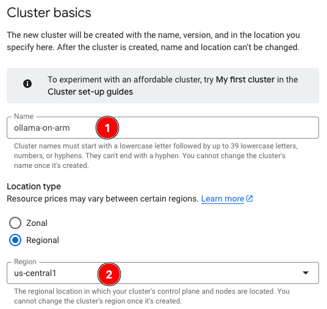
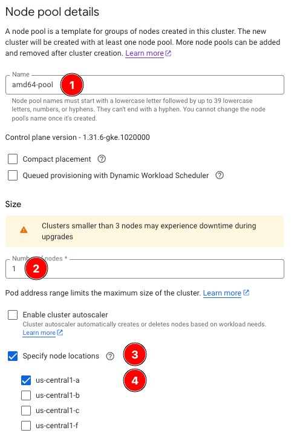

## Overview

Arm CPUs are widely used in traditional ML and AI use cases. In this Learning Path, you learn how to run [ollama](https://ollama.com/) on Arm-based CPUs in a hybrid architecture (x86 and Arm) K8s cluster.

## Cost to Run

TODO
 
### Create the cluster

1. From within GCP Console, navigate to [Google Kubernetes Engine](https://console.cloud.google.com/kubernetes/list/overview) and click *Create*.

2. Select *Standard*->*Configure*

The *Cluster basics* tab appears.

3. For *Name*, enter *ollama-on-arm*
4. For *Region*, enter *us-central1*.

{}
Although this will work in all regions and zones where C4 and C4a instance types are supported, for this demo, we use *us-central1* and *us-central1-1a* regions and zones.  In addition, with simplicity and cost savings in mind, only one node per architecture is used.. 
{}

5. Click on *NODE POOLS*->*default-pool*
6. For *Name*, enter *x86-pool*
7. For size, enter *1*
8. Select *Specify node locations*, and select *us-central1-a*

8. Click on *NODE POOLS*->*Nodes*
9. For *Series*, select *C4*
10. For *Machine Type*, select *c4-standard-4*

{}
We've chosen node types that will support one pod per node.  If you wish to run multiple pods per mode, assume each node should provide ~10GB per pod. 
{}

11. *Click* the *Create* button at the bottom of the screen.

It will take a few moments, but when the green checkmark is showing next to the ollama-on-arm cluster, you're ready to continue to the next lesson!

