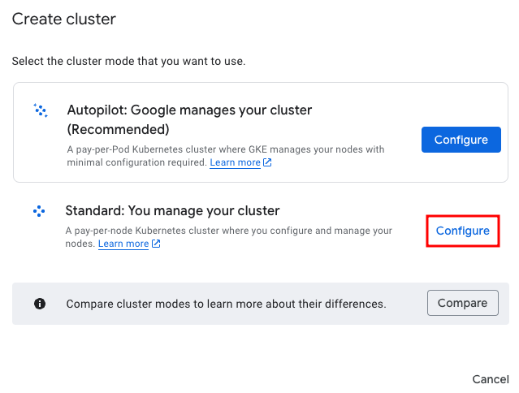

## Overview

Arm CPUs are widely used in traditional ML and AI use cases. In this Learning Path, you learn how to run [ollama](https://ollama.com/) on Arm-based CPUs in a hybrid architecture (amd64 and Arm) K8s cluster.

To demonstrate this in a real life scenario, you're going to bring up a Kubernetes cluster with an amd64 node, and add an Arm node.  Each node will be running the same container image via a single ollama pod, so we'll have two pods total (one running amd64, and one running Arm).  You'll run three services, one that only targets amd64 pods, one that only targets Arm pods, and one that targets both amd64 and Arm pods.

TODO:  IMAGE

Once you have all three services running, you'll be empowered to experiment with migration options, price/performance, applying the knowledge to other workloads in your environment as you see fit. 

## Cost to Run

TODO
 
### Create the cluster

1. From within GCP Console, navigate to [Google Kubernetes Engine](https://console.cloud.google.com/kubernetes/list/overview) and click *Create*.

2. Select *Standard*->*Configure*



The *Cluster basics* tab appears.

3. For *Name*, enter *ollama-on-arm*
4. For *Region*, enter *us-central1*.


{}
Although this will work in all regions and zones where C4 and C4a instance types are supported, for this demo, we use *us-central1* and *us-central1-1a* regions and zones.  In addition, with simplicity and cost savings in mind, only one node per architecture is used.. 
{}

5. Click on *NODE POOLS*->*default-pool*
6. For *Name*, enter *amd64-pool*
7. For size, enter *1*
8. Select *Specify node locations*, and select *us-central1-a*


8. Click on *NODE POOLS*->*Nodes*
9. For *Series*, select *C4*
10. For *Machine Type*, select *c4-standard-4*

{}
We've chosen node types that will support one pod per node.  If you wish to run multiple pods per mode, assume each node should provide ~10GB per pod. 
{}


11. *Click* the *Create* button at the bottom of the screen.

It will take a few moments, but when the green checkmark is showing next to the ollama-on-arm cluster, you're ready to continue to test your connection to the cluster.

### Connect to the cluster

{}
The following assumes you have gcloud and kubectl already installed.  If not, please follow the instructions on the first page under "Prerequisites". 
{}

You'll first setup your newly created K8s cluster credentials using the gcloud utility.  Enter the following in your command prompt (or cloud shell), and make sure to replace "YOUR_PROJECT_ID" with the ID of your GCP project:

```bash
export ZONE=us-central1
export CLUSTER_NAME=ollama-on-Arm64
export PROJECT_ID=YOUR_PROJECT_ID
gcloud container clusters get-credentials $CLUSTER_NAME --zone $ZONE --project $PROJECT_ID
```
If you get the message:

```commandline
CRITICAL: ACTION REQUIRED: gke-gcloud-auth-plugin, which is needed for continued use of kubectl, was not found or is not executable. Install gke-gcloud-auth-plugin for use with kubectl by following https://cloud.google.com/kubernetes-engine/docs/how-to/cluster-access-for-kubectl#install_plugin
```
This command should help resolve it:

```bash
gcloud components install gke-gcloud-auth-plugin
```
Finally, test the connection to the cluster with this command:

```commandline
kubectl cluster-info
```
If you receive a non-error response, you're successfully connected to the k8s cluster!