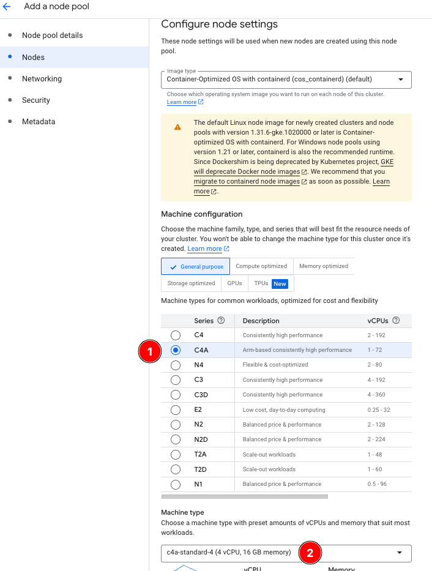

## Overview
At this point you have a what many people in their K8s Arm journey start with -- a workload running on an amd64 cluster. As mentioned earlier, the easiest way to experiment with Arm in your K8s cluster is to run both architectures simultaneously, not just for the sake of learning how to do it, but also to see first-hand the price/performance advantages of running Arm-based nodes.

Next, you'll add an Arm-based node pool to the cluster, and from there, apply an ollama Arm deployment and service to mimic what we did in the last chapter.

### Adding the arm64-pool node pool

To add Arm nodes to the cluster:

1. From the Clusters menu, select *ollama-on-multiarch*
2. Select *Add node pool*
3. For *Name*, enter *arm64-pool*
4. For *Size*, enter *1*
5. Check *Specify node locations* and select *us-central1-a*


6. Select the *Nodes* tab to navigate to the *Configure node settings* screen
7. Select *C4A* : *c4a-standard-4* for Machine *Configuration/Type*.

{}
To make an apples-to-apples comparison of amd64 and arm64 performance, the c4a-standard-4 is spun up as the arm64 "equivalent in cores" to the previously deployed c4-standard-8 in the amd64 node pool.
{}



8. Select *Create*
9. After provisioning completes, select the newly created *arm64-pool* from the *Clusters* screen to take you to the *Node pool details* page.

Note the taint GKE applies by default to the Arm Node of *NoSchedule* if arch=arm64:


Without a toleration for this taint, we won't be able to schedule any workloads on it!  But do not fear, as the nodeSelector in the amd64 (and as you will shortly see, the arm64) Deployment YAMLs not only defines which architecture to target, [but in the arm64 use case](https://cloud.google.com/kubernetes-engine/docs/how-to/prepare-arm-workloads-for-deployment#schedule-with-node-selector-arm), it also adds the required toleration automatically.

```yaml
nodeSelector:
    kubernetes.io/arch: arm64 # or amd64
```

### Deployment and Service
We can now apply the arm64-based deployment.

1. Copy the following YAML, and save it to a file called arm64_ollama.yaml:

```yaml
apiVersion: apps/v1
kind: Deployment
metadata:
  name: ollama-arm64-deployment
  labels:
    app: ollama-multiarch
  namespace: ollama
spec:
  replicas: 1
  selector:
    matchLabels:
      arch: arm64
  template:
    metadata:
      labels:
        app: ollama-multiarch
        arch: arm64
    spec:
      nodeSelector:
        kubernetes.io/arch: arm64
      containers:
      - image: ollama/ollama:0.6.1
        name: ollama-multiarch
        ports:
        - containerPort: 11434
          name: http
          protocol: TCP
        volumeMounts:
        - mountPath: /root/.ollama
          name: ollama-data
      volumes:
      - emptyDir: {}
        name: ollama-data
---
apiVersion: v1
kind: Service
metadata:
  name: ollama-arm64-svc
  namespace: ollama
spec:
  sessionAffinity: None
  ports:
  - nodePort: 30666
    port: 80
    protocol: TCP
    targetPort: 11434
  selector:
    arch: arm64
  type: LoadBalancer
---
apiVersion: v1
kind: Service
metadata:
  name: ollama-multiarch-svc
  namespace: ollama
spec:
  sessionAffinity: None
  ports:
  - nodePort: 30667
    port: 80
    protocol: TCP
    targetPort: 11434
  selector:
    app: ollama-multiarch
  type: LoadBalancer
```

When the above is applied:

* A new Deployment called *ollama-arm64-deployment* is created.  Like the amd64 deployment, it pulls the same multi-architectural (both amd64 and arm64) image from Dockerhub [ollama image from Dockerhub](https://hub.docker.com/layers/ollama/ollama/0.6.1/images/sha256-28b909914d4e77c96b1c57dea199c60ec12c5050d08ed764d9c234ba2944be63).

Of particular interest is the *nodeSelector* *kubernetes.io/arch*, with the value of *arm64*.  This will ensure that this deployment only runs on arm64-based nodes, utilizing the arm64 layer of the ollama multi-architecture container image. As mentioned earlier, this *nodeSelector* triggers the automatic creation of the toleration for the arm64 nodes.

* Two new load balancer Services are created.  The first, *ollama-arm64-svc* is created, analogous to the existing service, targets all pods with the *arch: arm64* label (our arm64 deployment creates these pods.)  The second service, *ollama-multiarch-svc*, target ALL Pods, regardless of the architecture they are running.  This service will show us how we can mix and match pods in production to serve the same app regardless of node/pod architecture.

You may also notice that a *sessionAffinity* tag was added to this Service to remove sticky connections to the target pods; this removes persistent connections to the same pod on each request.


### Apply the arm64 Deployment and Service

1. Run the following command to apply the arm64 deployment, and service definitions:

```bash
kubectl apply -f arm64_ollama.yaml
```

You should get the following responses back:

```bash
deployment.apps/ollama-arm64-deployment created
service/ollama-arm64-svc created
service/ollama-multiarch-svc created
```

2. Get the status of the pods, and the services, by running the following:

```commandline
kubectl get nodes,pods,svc -nollama 
```

Your output should be similar to the following, showing two nodes, two pods, and three services:

```commandline
NAME                                              STATUS   ROLES    AGE     VERSION
node/gke-ollama-on-arm-amd64-pool-62c0835c-93ht   Ready    <none>   91m     v1.31.6-gke.1020000
node/gke-ollama-on-arm-arm64-pool-2ae0d1f0-pqrf   Ready    <none>   4m11s   v1.31.6-gke.1020000

NAME                                           READY   STATUS    RESTARTS   AGE
pod/ollama-amd64-deployment-cbfc4b865-msftf    1/1     Running   0          29m
pod/ollama-arm64-deployment-678dc8556f-956d6   1/1     Running   0          2m52s

NAME                           TYPE           CLUSTER-IP       EXTERNAL-IP      PORT(S)        AGE
service/ollama-amd64-svc       LoadBalancer   1.2.3.4          1.2.3.4          80:30668/TCP   29m
service/ollama-arm64-svc       LoadBalancer   1.2.3.4          1.2.3.4          80:30666/TCP   2m52s
service/ollama-multiarch-svc   LoadBalancer   1.2.3.4          1.2.3.4          80:30667/TCP   2m52s
```

When the pods show *Running* and the service shows a valid *External IP*, we're ready to test the ollama arm64 service!

### Test the ollama on arm web service 

To test the service, use the previously created model_util.sh from the last section; instead of the *amd64* parameter, replace it with *arm64*:

3. Run the following to make an HTTP request to the amd64 ollama service on port 80:

```commandline
./model_util.sh arm64 hello
```

You should get back the HTTP response, as well as the logline from the pod that served it:

```commandline
Server response:
Using service endpoint 34.44.135.90 for hello on arm64
Ollama is running

Pod log output:

[pod/ollama-arm64-deployment-678dc8556f-956d6/ollama-multiarch] 2025-03-25T21:25:21.547384356Z
```
Once again, we're looking for "Ollama is running".  If you see that, congrats, you've successfully setup your GKE cluster with both amd64 and arm64 nodes and pods running a Deployment with the ollama multi-architecture container!

Next, let's do some simple analysis of the cluster's performance.