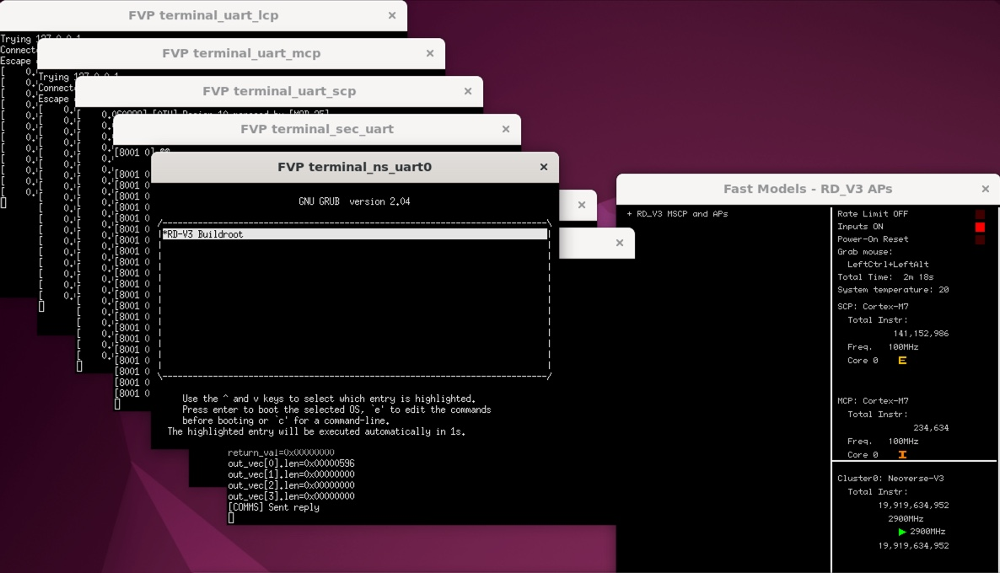
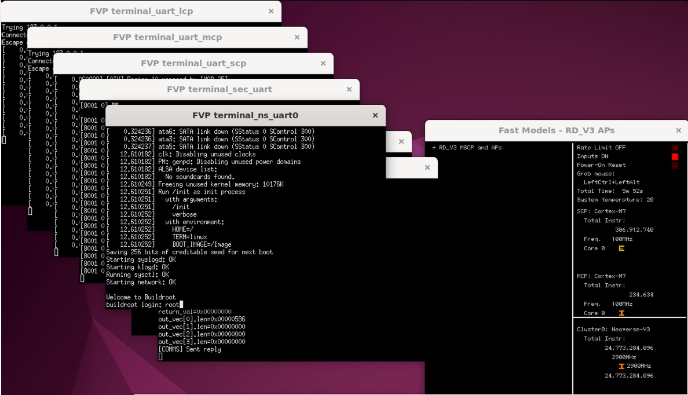

## Simulating RD‑V3 with Arm FVP

In the previous module, you built the complete CSS‑V3 firmware stack.  
Now, you’ll use Arm Fixed Virtual Platform (FVP) to simulate the system—allowing you to verify the boot sequence without any physical silicon.
This simulation brings up the full stack from BL1 to Linux shell using Buildroot.

### Step 1: Download and Install the FVP Model

Before downloading the RD‑V3 FVP, it’s important to understand that each reference design release tag corresponds to a specific version of the FVP model.

For example, the **RD‑INFRA‑2025.07.03** release tag is designed to work with **FVP version 11.29.35**.

You can refer to the [RD-V3 Release Tags](https://neoverse-reference-design.docs.arm.com/en/latest/platforms/rdv3.html#release-tags) for a full list of release tags, corresponding FVP versions, and their associated release notes, which summarize changes and validated test cases.

Download the matching FVP binary for your selected release tag using the link provided in this course:

```bash
mkdir -p ~/fvp
cd ~/fvp
wget https://developer.arm.com/-/cdn-downloads/permalink/FVPs-Neoverse-Infrastructure/RD-V3/FVP_RD_V3_11.29_35_Linux64_armv8l.tgz

tar -xvf FVP_RD_V3_11.29_35_Linux64_armv8l.tgz
./FVP_RD_V3.sh
```

The FVP installation may prompt you with a few questions—choosing the default options is sufficient for this learning path. By default, the FVP will be installed in `/home/ubuntu/FVP_RD_V3`.

### Step 2: Remote Desktop Set Up

The RD‑V3 FVP model launches multiple UART consoles—each mapped to a separate terminal window for different subsystems (e.g., Neoverse V3, Cortex‑M55, Cortex‑M7, panel).

If you're accessing the platform over SSH, these console windows won't open properly.  
To interact with all UART consoles, we recommend installing a Remote Desktop environment using XRDP.

In AWS Ubuntu 22.04 instance, you need install required packages:


```bash
sudo apt update
sudo apt install -y ubuntu-desktop xrdp xfce4 xfce4-goodies pv xterm sshpass socat retry
sudo systemctl enable --now xrdp
```

To allow remote desktop connections, you need to open port 3389 (RDP) in your EC2 security group:
- Go to the EC2 Dashboard → Security Groups
- Select the security group associated with your instance
- Under the Inbound rules tab, click Edit inbound rules
- Add the following rule:
   - Type: RDP
   - Port: 3389
   - Source: your local machine IP

For better security, limit the source to your current public IP instead of 0.0.0.0/0.


***Switch to Xorg (required on Ubuntu 22.04):***

Wayland is the default display server on Ubuntu 22.04, but it is not compatible with XRDP.  
To enable XRDP remote sessions, you need to switch to Xorg by modifying the GDM configuration.

Open the `/etc/gdm3/custom.conf` in a text editor.
Find the line: 

```
#WaylandEnable=false
```

Uncomment it by removing the # so it becomes:

```
WaylandEnable=false
```

Then restart the GDM display manager for the change to take effect:
```bash
sudo systemctl restart gdm3
```

After reboot, XRDP will use Xorg and you should be able to connect to the Arm server via Remote Desktop.

### Step 3: Launch the Simulation

Once connected via Remote Desktop, open a terminal and launch the RD‑V3 FVP simulation:

```bash
cd ~/rdv3/model-scripts/rdinfra
export MODEL=/home/ubuntu/FVP_RD_V3/models/Linux64_armv8l_GCC-9.3/FVP_RD_V3
./boot-buildroot.sh -p rdv3 &
```

The command will launch the simulation and open multiple xterm windows, each corresponding to a different CPU.
You can start by locating the ***terminal_ns_uart0*** window — in it, you should see the GRUB menu.

From there, select RD-V3 Buildroot in the GRUB menu and press Enter to proceed.


Booting Buildroot will take a little while — you’ll see typical Linux boot messages scrolling through.
Eventually, the system will stop at the `Welcome to Buildroot` message on the ***terminal_ns_uart0*** window.

At the `buildroot login:` prompt, type `root` and press Enter to log in.


Congratulations — you’ve successfully simulated the boot process of the RD-V3 software you compiled earlier, all on FVP!

### Step 4: Understand the UART Outputs

When you launch the RD‑V3 FVP model, it opens multiple terminal windows—each connected to a different UART channel.  
These UARTs provide console logs from various firmware components across the system.

Below is the UART-to-terminal mapping based on the default FVP configuration:

| Terminal Window Title      | UART | Output Role                        | Connected Processor  |
|----------------------------|------|------------------------------------|-----------------------|
| `FVP terminal_ns_uart0`    | 0    | Linux Kernel Console (BusyBox)     | Neoverse‑V3 (AP)      |
| `FVP terminal_ns_uart1`    | 1    | TF‑A / UEFI Logs                   | Neoverse‑V3 (AP)      |
| `FVP terminal_uart_scp`    | 2    | SCP Firmware Logs (power, clocks)  | Cortex‑M7 (SCP)       |
| `FVP terminal_rse_uart`    | 3    | RSE Secure Boot Logs               | Cortex‑M55 (RSE)      |
| `FVP terminal_uart_mcp`    | 4    | MCP Logs (management, telemetry)   | Cortex‑M7 (MCP)       |
| `FVP terminal_uart_lcp`    | 5    | LCP Logs (per-core power control)  | Cortex‑M55 (LCP)      |
| `FVP terminal_sec_uart`    | 6    | Secure World / TF‑M Logs           | Cortex‑M55            |


Logs are also captured under `~/rdv3/model-scripts/rdinfra/platforms/rdv3/rdv3`, each UART redirected to its own log file.
You can also explore refinfra-*.txt log files to validate subsystem states.

For example, if you’d like to verify that each CPU core has its GICv3 redistributor and LPI table correctly initialized, you can refer to the relevant messages in refinfra-24812-uart-0-nsec_<date-time>.txt.


```
[    0.000056] Remapping and enabling EFI services.
[    0.000078] smp: Bringing up secondary CPUs ...
[    0.000095] Detected PIPT I-cache on CPU1
[    0.000096] GICv3: CPU1: found redistributor 10000 region 0:0x0000000030200000
[    0.000096] GICv3: CPU1: using allocated LPI pending table @0x0000008080200000
[    0.000109] CPU1: Booted secondary processor 0x0000010000 [0x410fd840]
[    0.000125] Detected PIPT I-cache on CPU2
[    0.000126] GICv3: CPU2: found redistributor 20000 region 0:0x0000000030240000
[    0.000126] GICv3: CPU2: using allocated LPI pending table @0x0000008080210000
[    0.000139] CPU2: Booted secondary processor 0x0000020000 [0x410fd840]
[    0.000155] Detected PIPT I-cache on CPU3
[    0.000156] GICv3: CPU3: found redistributor 30000 region 0:0x0000000030280000
[    0.000156] GICv3: CPU3: using allocated LPI pending table @0x0000008080220000
[    0.000169] CPU3: Booted secondary processor 0x0000030000 [0x410fd840]
[    0.000185] Detected PIPT I-cache on CPU4
[    0.000186] GICv3: CPU4: found redistributor 40000 region 0:0x00000000302c0000
[    0.000186] GICv3: CPU4: using allocated LPI pending table @0x0000008080230000
[    0.000199] CPU4: Booted secondary processor 0x0000040000 [0x410fd840]
[    0.000215] Detected PIPT I-cache on CPU5
[    0.000216] GICv3: CPU5: found redistributor 50000 region 0:0x0000000030300000
[    0.000216] GICv3: CPU5: using allocated LPI pending table @0x0000008080240000
[    0.000229] CPU5: Booted secondary processor 0x0000050000 [0x410fd840]
[    0.000245] Detected PIPT I-cache on CPU6
[    0.000246] GICv3: CPU6: found redistributor 60000 region 0:0x0000000030340000
[    0.000246] GICv3: CPU6: using allocated LPI pending table @0x0000008080250000
[    0.000259] CPU6: Booted secondary processor 0x0000060000 [0x410fd840]
...

```

You can try to identify the SCP, RSE, and kernel boot logs across their respective terminals.

Successfully tracing these logs confirms your simulation environment and firmware stack are functioning correctly—all without physical silicon.
