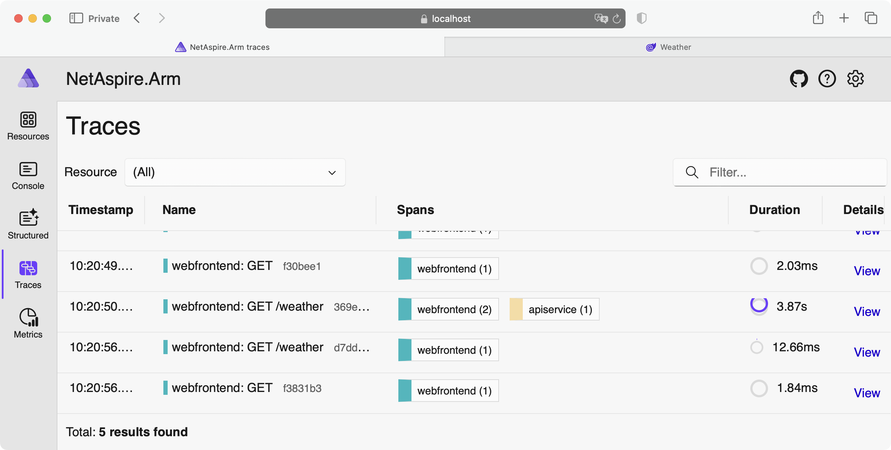

## Modify the Project

Now you can move on to add additional computations to mimic computationally-intensive work. 

Go to the `NetAspire.Arm.ApiService` project, and create a new file, and name it `ComputationService.cs`. 

Add the code shown below to this file:

```cs
static class ComputationService
{
    public static void PerformIntensiveCalculations(int matrixSize)
    {
        var matrix1 = GenerateMatrix(matrixSize);
        var matrix2 = GenerateMatrix(matrixSize);

        // Matrix multiplication 
        var matrixResult = Enumerable.Range(0, matrixSize)            
            .SelectMany(i => Enumerable.Range(0, matrixSize)
                .Select(j =>
                {
                    double sum = 0;
                    for (int k = 0; k < matrixSize; k++)
                    {
                        sum += matrix1[i * matrixSize + k] * matrix2[k * matrixSize + j];
                    }
                    return sum;
                }))
            .ToArray();        
    }

    private static double[] GenerateMatrix(int matrixSize) {
        return Enumerable.Range(1, matrixSize * matrixSize)
            .Select(x => Random.Shared.NextDouble())
            .ToArray();
    }   
}
```

This code defines a static class, ComputationService, designed to perform computationally-intensive tasks; in particular, matrix multiplication. It contains a public method, PerformIntensiveCalculations, which generates two matrices of a specified size, multiplies them, and stores the resulting matrix.

* The private method, GenerateMatrix, creates a one-dimensional array representing a matrix of the given size (matrixSize x matrixSize). Each element in the matrix is initialized with a random double-value generated using Random.Shared.NextDouble().

* The public method, PerformIntensiveCalculations, multiplies two matrices (matrix1 and matrix2) element-by-element using nested loops and LINQ. It iterates through each row of the first matrix and each column of the second matrix, calculating the dot product for each element in the resulting matrix. The result of the multiplication is stored in a flattened one-dimensional array, called matrixResult.

This code is provided for demonstrating heavy computational operations, such as large matrix manipulations, and can simulate workloads in scenarios that mimic intensive data processing or scientific calculations.

Now open the `Program.cs` file in the `NetAspire.Arm.ApiService` directory, and modify the `MapGet` function of the app as shown:

```cs
app.MapGet("/weatherforecast", () =>
{
    ComputationService.PerformIntensiveCalculations(matrixSize: 800);

    var forecast = Enumerable.Range(1, 5).Select(index =>
        new WeatherForecast
        (
            DateOnly.FromDateTime(DateTime.Now.AddDays(index)),
            Random.Shared.Next(-20, 55),
            summaries[Random.Shared.Next(summaries.Length)]
        ))
        .ToArray();
    return forecast;
});
```

This triggers matrix multiplications when you select **Weather** in the web-frontend application.

To test the code, re-run the application using the following command:

```console
dotnet run --project NetAspire.Arm.AppHost 
```

Next, navigate to the web frontend, select **Weather**, and then return to the dashboard. Click **Traces** and note that the operation now takes significantly longer to complete — approximately four seconds in the example below:



You are now ready to deploy the application to the cloud.
