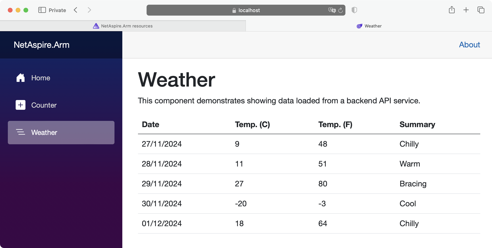
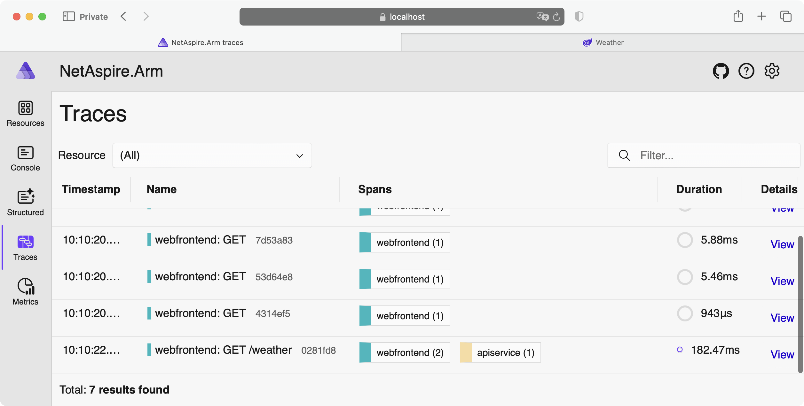

## Run the Project
The application will issue a certificate. Before you run the application, add support to trust the HTTPS development certificate by running:
 
```console
dotnet dev-certs https --trust
```

Now run the project:
```console
cd .\NetAspire.Arm\
dotnet run --project NetAspire.Arm.AppHost 
```

The output will look like below:
```output
Building...
info: Aspire.Hosting.DistributedApplication[0]
      Aspire version: 8.2.2+5fa9337a84a52e9bd185d04d156eccbdcf592f74
info: Aspire.Hosting.DistributedApplication[0]
      Distributed application starting.
info: Aspire.Hosting.DistributedApplication[0]
      Application host directory is: /Users/db/Repos/NetAspire.Arm/NetAspire.Arm.AppHost
info: Aspire.Hosting.DistributedApplication[0]
      Now listening on: https://localhost:17222
info: Aspire.Hosting.DistributedApplication[0]
      Login to the dashboard at https://localhost:17222/login?t=81f99566c9ec462e66f5eab5aa9307b0
```

Click on the link generated for the dashboard. In this case it is: https://localhost:17222/login?t=81f99566c9ec462e66f5eab5aa9307b0. This will direct you to the application dashboard, as shown below:


On the dashboard, locate and click the endpoint link for `NetAspire.Arm.Web`. This will take you to the Blazor based web application. In the Blazor app, navigate to the Weather section to access and display data retrieved from the WeatherForecast API:



Return to the dashboard and select the Traces option. This section provides detailed telemetry tracing, allowing you to view the flow of requests, track service dependencies, and analyze performance metrics for your application:



By following these steps, you will explore the key components of the .NET Aspire application, including its dashboard, data interaction through APIs, and telemetry tracing capabilities.
