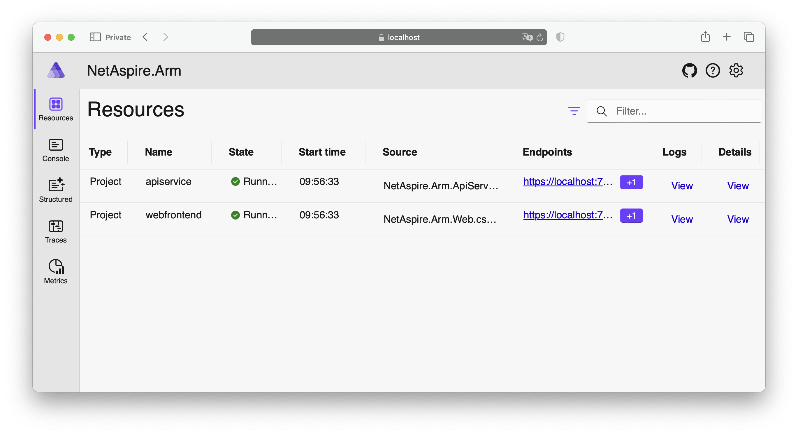

## Run the Project
The application will issue a certificate. Before you run the application, add support to trust the HTTPS development certificate by running:
 
```console
dotnet dev-certs https --trust
```

Now run the project:
```console
cd .\NetAspire.Arm\
dotnet run --project NetAspire.Arm.AppHost 
```

The output will look like below:
```output
Building...
info: Aspire.Hosting.DistributedApplication[0]
      Aspire version: 8.2.2+5fa9337a84a52e9bd185d04d156eccbdcf592f74
info: Aspire.Hosting.DistributedApplication[0]
      Distributed application starting.
info: Aspire.Hosting.DistributedApplication[0]
      Application host directory is: /Users/db/Repos/NetAspire.Arm/NetAspire.Arm.AppHost
info: Aspire.Hosting.DistributedApplication[0]
      Now listening on: https://localhost:17222
info: Aspire.Hosting.DistributedApplication[0]
      Login to the dashboard at https://localhost:17222/login?t=81f99566c9ec462e66f5eab5aa9307b0
```

Click on the link generated for the dashboard. In this case it is: https://localhost:17222/login?t=81f99566c9ec462e66f5eab5aa9307b0. This will direct you to the application dashboard, as shown below:



On the dashboard, locate and click the endpoint link for `NetAspire.Arm.Web`. This will take you to the Blazor based web application. In the Blazor app, navigate to the Weather section to access and display data retrieved from the WeatherForecast API:


Return to the dashboard and select the Traces option. This section provides detailed telemetry tracing, allowing you to view the flow of requests, track service dependencies, and analyze performance metrics for your application:


By following these steps, you will explore the key components of the .NET Aspire application, including its dashboard, data interaction through APIs, and telemetry tracing capabilities.

## Modify the Project
You will now include additional code for the purpose of demonstrating computation intense work. Go to the `NetAspire.Arm.ApiService` project, and create a new file `ComputationService.cs`. Add the code shown below to this file:

```cs
static class ComputationService
{
    public static void PerformIntensiveCalculations(int matrixSize)
    {
        var matrix1 = GenerateMatrix(matrixSize);
        var matrix2 = GenerateMatrix(matrixSize);

        // Matrix multiplication 
        var matrixResult = Enumerable.Range(0, matrixSize)            
            .SelectMany(i => Enumerable.Range(0, matrixSize)
                .Select(j =>
                {
                    double sum = 0;
                    for (int k = 0; k < matrixSize; k++)
                    {
                        sum += matrix1[i * matrixSize + k] * matrix2[k * matrixSize + j];
                    }
                    return sum;
                }))
            .ToArray();        
    }

    private static double[] GenerateMatrix(int matrixSize) {
        return Enumerable.Range(1, matrixSize * matrixSize)
            .Select(x => Random.Shared.NextDouble())
            .ToArray();
    }   
}
```

This code defines a static class, ComputationService, designed to perform computationally intensive tasks, specifically matrix multiplication. It contains a public method, PerformIntensiveCalculations, which generates two matrices of a specified size, multiplies them, and stores the resulting matrix.

The private method GenerateMatrix creates a one-dimensional array representing a matrix of the given size (matrixSize x matrixSize). Each element in the matrix is initialized with a random double value generated using Random.Shared.NextDouble().

The public method PerformIntensiveCalculations multiplies two matrices (matrix1 and matrix2) element by element using nested loops and LINQ. It iterates through each row of the first matrix and each column of the second matrix, calculating the dot product for each element in the resulting matrix. The result of the multiplication is stored in a flattened one-dimensional array, matrixResult.

This code is provided for demonstrating heavy computational operations, such as large matrix manipulations, and can simulate workloads in scenarios that mimic intensive data processing or scientific calculations.

Then, open the `Program.cs` file in the `NetAspire.Arm.ApiService` directory and add modify the `MapGet` function of the app as shown:

```cs
app.MapGet("/weatherforecast", () =>
{
    ComputationService.PerformIntensiveCalculations(matrixSize: 800);

    var forecast = Enumerable.Range(1, 5).Select(index =>
        new WeatherForecast
        (
            DateOnly.FromDateTime(DateTime.Now.AddDays(index)),
            Random.Shared.Next(-20, 55),
            summaries[Random.Shared.Next(summaries.Length)]
        ))
        .ToArray();
    return forecast;
});
```

This will trigger matrix multiplications when you click Weather in the web frontend application.

To test the code, re-run the application using the following command:

```console
dotnet run --project NetAspire.Arm.AppHost 
```

Next, navigate to the web frontend, click Weather, and then return to the dashboard. Click Traces to observe that the operation now takes significantly longer to complete—approximately 4 seconds in the example below:


You are now ready to deploy the application to the cloud.
