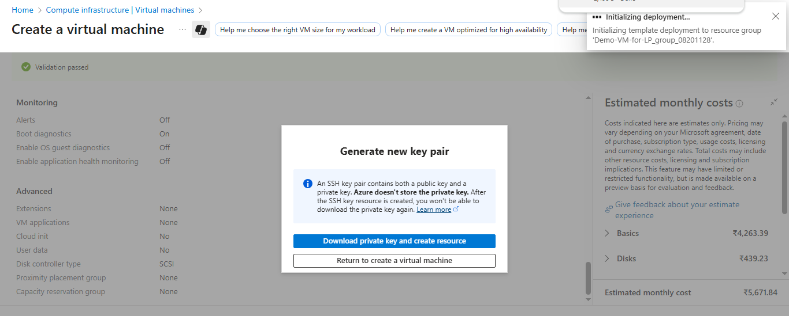

## Set up your development environment

There are several ways to create an Arm-based Cobalt 100 virtual machine: 

- The Microsoft Azure portal
- The Azure CLI
- Your preferred infrastructure as code (IaC) tool

In this section, you will use the Azure portal to create a virtual machine with the Arm-based Azure Cobalt 100 processor.

This Learning Path focuses on the general-purpose virtual machines in the D-series. For further information, see the Microsoft Azure guide for the [Dpsv6 size series](https://learn.microsoft.com/en-us/azure/virtual-machines/sizes/general-purpose/dpsv6-series).

While the steps to create this instance are included here for convenience, for further information on setting up Cobalt on Azure, see [Deploy a Cobalt 100 virtual machine on Azure Learning Path](/learning-paths/servers-and-cloud-computing/cobalt/).

## Create an Arm-based Azure virtual machine

Creating a virtual machine based on Azure Cobalt 100 is similar to creating any other virtual machine on Azure. 

To get started, launch the Azure portal and navigate to **Virtual Machines**. Then follow these steps:

- Select **Create**, then select **Virtual machine** from the drop-down list.
- In the **Basics** tab, fill in information about the instance such as **Virtual machine name** and **Region**.
- Select the image for your virtual machine (for example, Ubuntu Pro 24.04 LTS) and select **Arm64** as the VM architecture.
- In the **Size** field, select **See all sizes**, select the **D-series v6** family of virtual machines, then select **D4ps_v6**.

- Now select **SSH public key** as the authentication type. Azure can generate an SSH key pair for you and store it for future use. It is a fast, simple, and secure way to connect to your virtual machine.
- Enter the **Administrator username** for your VM.
- Select **Generate new key pair**, then select **RSA SSH format** as the SSH key type. RSA can offer better security with keys longer than 3072 bits. 
- Give a **Key pair name** to your SSH key.
- In **Inbound port rules**, select **HTTP (80)** and **SSH (22)** as the inbound ports. The default port for NGINX when handling standard web traffic (HTTP) is 80.

Now select the **Review + create** tab and review the configuration for your virtual machine. It should look like the following:

When you have made your selection, select **Create**, then **Download private key and create resources**.

Your virtual machine should soon be ready and start running. You can SSH into the virtual machine using the private key and the **Public IP** details.

{} To find out more about Arm-based virtual machines on Azure, see the section *Getting Started with Microsoft Azure* within the Learning Path [Get started with Arm-based cloud instances](/learning-paths/servers-and-cloud-computing/csp/azure). {}
