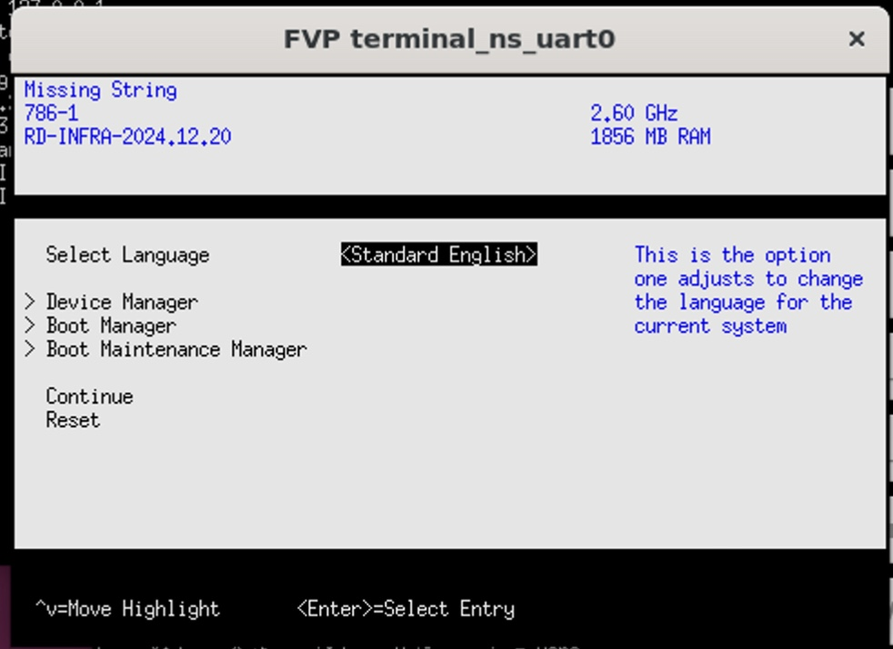

## Prepare Pre-Silicon OpenBMC Simulation

With your environment prepared, you can now simulate the full pre-silicon firmware boot flow using the Arm Neoverse RD-V3 reference design.
You’ll build the OpenBMC image, launch the Arm Fixed Virtual Platform (FVP), and observe the full boot process of both the BMC and host UEFI firmware in a simulated environment.

This simulation launches multiple UART consoles—each mapped to a separate terminal window for different subsystems (e.g., Neoverse V3, Cortex‑M55, Cortex‑M7, and the Cortex-A BMC).

These graphical terminal windows require a desktop session. If you're accessing the simulation over SSH (e.g., on an AWS instance), they may not display properly.

To ensure proper display and interactivity, we recommend installing a Remote Desktop environment using XRDP.

In AWS Ubuntu 22.04 instance, you need install required packages:

```bash
sudo apt update
sudo apt install -y ubuntu-desktop xrdp xfce4 xfce4-goodies pv xterm sshpass socat retry
sudo systemctl enable --now xrdp
```

You may need to follow the Step 2 on RDv3 [learning path](https://learn.arm.com/learning-paths/servers-and-cloud-computing/neoverse-rdv3-swstack/4_rdv3_on_fvp/) to setup the networking and GDM configuration.

Once connected via Remote Desktop, open a terminal and launch the RD‑V3 FVP simulation:

## Execute Pre-Silicon OpenBMC Simulation

To make the simulation process smoother and more intuitive, you’ll need to modify a script from Arm’s GitLab repository.

```bash
cd ~
wget https://gitlab.arm.com/server_management/PoCs/fvp-poc/-/raw/2a79ae93560969a3b802dfb3d7d89f9fd9dee5a6/run.sh
```

Before running the simulation, open the run.sh script and locate the line that defines FVP_KEYWORD.
This variable determines when the host FVP should be launched by monitoring OpenBMC’s console output.
If not set correctly, the script may hang or fail to start the host simulation.
Update the line to:

```
FVP_KEYWORD="terminal2: Listening for serial connection on port"
```

Then, execute the script.

```bash
chmod +x ./run.sh
./run.sh -m ~/FVP_RD_V3_R1/models/Linux64_GCC-9.3/FVP_RD_V3_R1
```

The `run.sh` script will:

- Launch the OpenBMC FVP and wait for BMC boot
- Automatically start the host FVP for RD-V3 (running UEFI)
- Connect the UART consoles between the BMC and host via virtual pipes
- Connect MCTP and IPMI tunnels between the OpenBMC FVP and the RD-V3 host FVP
- Stop the OpenBMC FVP and RD-V3 host FVP when CTRL+C is pressed


Once the simulation is running, the `OpenBMC FVP console` will stop at the Linux login prompt:

```
[  OK  ] Started phosphor systemd target monitor.
[  OK  ] Started Sensor Monitor.
         Starting Hostname Service...
         Starting Phosphor Software Manager...
         Starting Phosphor BMC State Manager...
         Starting Phosphor Time Manager daemon...
[  OK  ] Finished SSH Key Generation.
[  OK  ] Finished Wait for /xyz/openbmc_project/state/chassis0.
[   27.454083] mctpserial0: invalid tx state 0
[FAILED] Failed to start OpenBMC ipKVM daemon.
Phosphor OpenBMC (Phosphor OpenBMC Project Reference Distro) nodistro.0 fvp ttyAMA0
         Starting Time & Date Service...
fvp login:
```

Type OpenBMC default username `root` and password is `0penBmc`.


{}
The first character of the password is the number ***0***, not a capital ***O***.
{}

After login, you’ll be dropped into the OpenBMC shell — a minimal Linux environment running inside the simulated BMC.

The host-side UEFI simulation will appear in the `FVP terminal_ns_uart0` console. 
You may briefly see the UEFI Firmware Setup Menu—select `Continue` to proceed with boot. 
The system will then enter GRUB and begin booting Linux.



The simulation will carry on the CSS-V3-R1 part, enter the GRUB menu. Press Enter to proceed.

A successful simulation will show login prompts on both BMC and host consoles. You can also confirm success by seeing the final system state in the Web UI or UART output.


To avoid excessive network bandwidth usage, the following is a 60×-speed simulation recording.
It gives you a quick visual overview of how OpenBMC and UEFI boot and interact during pre-silicon execution.


After simulation completes, logs for both the BMC and host will be stored in `~/logs`. These are useful for verifying boot success or troubleshooting issues.

- `obmc_boot.log`: BMC boot output  
- `obmc_console.log`: BMC serial output  
- `fvp_boot.log`: Host UEFI boot output

By reviewing the contents of the logs folder, you can verify the expected system behavior or quickly diagnose
any anomalies that arise during boot or runtime.

With the simulation running successfully, you’re now ready to perform real-time testing between the host and the BMC.  
In the next module, you’ll explore how to interact with the BMC using UART and IPMI from the host side—validating communication channels in a pre-silicon context.
