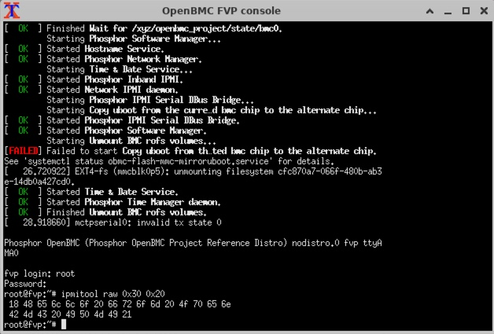

## Customize IPMI Commands in OpenBMC

With the host console accessible through OpenBMC, you're now ready to extend its functionality by implementing a custom IPMI command handler.

The Intelligent Platform Management Interface ([IPMI](https://en.wikipedia.org/wiki/Intelligent_Platform_Management_Interface)) is a standardized protocol for managing and monitoring servers, even when the operating system is not running. In OpenBMC, IPMI support is built-in and can be extended using custom handlers through the D-Bus/IPMI infrastructure.

In this module, you'll implement a custom IPMI command handler that returns a simple string response. You'll write the handler in C++, package it with a BitBake recipe, build it into the OpenBMC image, and test it using `ipmitool` inside the simulated FVP environment.

### Step 1: Create a BitBake Recipe

Create a new file named phosphor-ipmi-example.bb at the same folder.

```bash
touch ~/openbmc/meta-evb/meta-evb-arm/meta-evb-fvp-base/recipes-phosphor/ipmi/phosphor-ipmi-example.bb
```

Paste the following content:

```bash
SUMMARY = "Custom IPMI commands"
LICENSE = "CLOSED"
PR = "r1"
SRC_URI = "file://fvp-ipmi.cpp"
S = "${UNPACKDIR}"

DEPENDS += "phosphor-ipmi-host sdbusplus systemd"
TARGET_CXXFLAGS += " -std=c++23"
TARGET_LDFLAGS += " -lsystemd -lsdbusplus"

do_compile() {
    ${CXX} ${TARGET_CXXFLAGS} -fPIC -shared \
    -o libmyipmi.so ${UNPACKDIR}/fvp-ipmi.cpp \
    -I${STAGING_INCDIR} -L${STAGING_LIBDIR} \
    ${TARGET_LDFLAGS}
}

do_install() {
    install -d ${D}${libdir}/ipmid-providers
    install -m 0644 libmyipmi.so ${D}${libdir}/ipmid-providers/
}

FILES:${PN} += "${libdir}/ipmid-providers/libmyipmi.so"
```

### Step 2: Create a Custom IPMI Handler

Create a folder `phosphor-ipmi-example` at the same path, and add a new file `fvp-ipmi.cpp`:

```bash
mkdir ~/openbmc/meta-evb/meta-evb-arm/meta-evb-fvp-base/recipes-phosphor/ipmi/phosphor-ipmi-example
touch ~/openbmc/meta-evb/meta-evb-arm/meta-evb-fvp-base/recipes-phosphor/ipmi/phosphor-ipmi-example/fvp-ipmi.cpp
```

```c++
#include <ipmid/api.hpp>
#include <ipmid/utils.hpp>
#include <string>

// Example handler: return a string
ipmi::RspType<std::string> myIpmiCommand() {
    std::string reply = "Hello from OpenBMC IPMI!";
    return ipmi::responseSuccess(reply);
}

void register_my_ipmi() __attribute__((constructor));
void register_my_ipmi() {
    ipmi::registerHandler(
        ipmi::prioOemBase,
        0x30,                   // NetFn code
        0x20,                   // command code
        ipmi::Privilege::Admin, 
        myIpmiCommand
    );
}
```

This function registers a custom IPMI handler using NetFn `0x30` and Command `0x20`. 
When triggered, it returns a static ASCII string: `"Hello from OpenBMC IPMI!"`.
At runtime, this string is encoded as a sequence of hex bytes and sent back through the IPMI response. 
You'll observe this by running `ipmitool raw` and decoding the output.

### Step 3: Add to Build Configuration

To verify the IPMI command, you need to add the following to the configuration to install ipmitool and phosphor-ipmi-example. 

Edit fvp.conf at: `~/openbmc/meta-evb/meta-evb-arm/meta-evb-fvp-base/conf/machine/fvp.conf`

Append the following packages:

```bash
IMAGE_INSTALL:append = "\ 
    phosphor-ipmi-example \
    ipmitool \
"
```

Now rebuild the OpenBMC image with your IPMI handler included:

```bash
cd ~/openbmc
source setup fvp
bitbake obmc-phosphor-image
```

After the build completes, the generated image will contain both `ipmitool` and `phosphor-ipmi-example`.

For more details about the final image configuration, you can inspect the generated FVP configuration file at `~/openbmc/build/fvp/tmp/deploy/images/fvp/obmc-phosphor-image-fvp.fvpconf`.

### Step 4: Verify the IPMI Command in Simulation

After launching the FVP simulation and logging into the OpenBMC console, run the following command to invoke your custom IPMI handler:

```bash
ipmitool raw 0x30 0x20
```

This command invokes your custom IPMI handler registered under:
* NetFn: 0x30 (OEM function)
* Command: 0x20

You should see a response similar to:
```
root@fvp:~# ipmitool raw 0x30 0x20
 18 48 65 6c 6c 6f 20 66 72 6f 6d 20 4f 70 65 6e 
 42 4d 43 20 49 50 4d 49 21
```

This response is a sequence of hexadecimal bytes returned by the BMC:
* The first byte indicates the length of the payload — in this case `0x18`, 24 bytes.
* The remaining 24 bytes represent the actual data payload, encoded as ASCII.



To decode the message, copy the payload portion (excluding the first byte) and run:

```bash
echo "48 65 6c 6c 6f 20 66 72 6f 6d 20 4f 70 65 6e 42 4d 43 20 49 50 4d 49 21" | tr -d ' ' | xxd -r -p
```

The output will be:
```
"Hello from OpenBMC IPMI!"
```
This output confirms that the custom string returned by your `myIpmiCommand()` function has been correctly encoded and transmitted via IPMI:
```
std::string reply = "Hello from OpenBMC IPMI!";
return ipmi::responseSuccess(reply);
```

The response from `ipmitool raw` confirms that your custom IPMI handler was:

- Successfully compiled and included in the OpenBMC image  
- Properly registered to respond to NetFn `0x30`, Command `0x20`  
- Correctly executed in the simulated environment via IPMI raw access  
- Returning the intended payload, encoded as ASCII and received in hex format

By decoding the hex payload into ASCII, you’ve verified the full path from handler registration to command execution and payload delivery.

You’ve now successfully implemented and tested a custom IPMI command in OpenBMC using pre-silicon simulation.

This sets the foundation for adding OEM commands or platform-specific extensions to your BMC firmware.  
You can now expand this pattern to support argument parsing, custom data formats, or system-level control—enabling rapid prototyping of features such as sensor telemetry, power domain control, or boot policy configuration.
