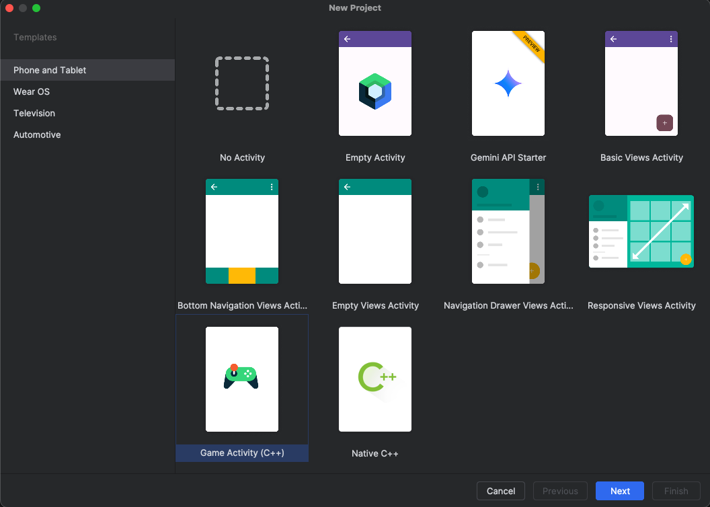
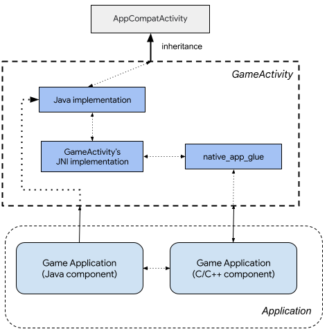

## Set up your Android Studio Project

Start by creating a new Android Studio project.

Open Android Studio, click **New Project**, and select **Game Activity (C++)** as shown below:



* Set the **Name** field to **dawnwebgpu**. 

* Click **Next** to continue. 

* Finish setting up the new project by accepting all the default selections until the project is created. 

The project is created in `~/AndroidStudioProjects`.

## About the Game Activity

GameActivity is a Jetpack library designed to assist Android games in processing app cycle commands, input events, and text input in the application's C/C++ code. 

GameActivity is a direct descendant of NativeActivity and shares a similar architecture:



With GameActivity, you can focus on game development and avoid spending excessive amounts of time dealing with the Java Native Interface (JNI) code.

GameActivity performs the following functions:

* It interacts with the Android framework through the Java-side component.
* It passes app cycle commands, input events, and input text to the native side.
* It renders into a SurfaceView, making it easier for games to interact with other UI components.

{}
You can find more information about Android Game Activity and its capabilities in the [Game Activity documentation](https://developer.android.com/games/agdk/game-activity).
{}

## Download project source files

The process of creating a WebGPU application involves adding a number of files from GitHub to your Game Activity project. 

The objective of this part of the Learning Path is to show you how to take the Game Activity template and modify it to become a WebGPU application. 

To get started, open a terminal, create a new directory, and download the project files:

```bash
mkdir ~/webgpu-files ; cd ~/webgpu-files
wget https://github.com/varunchariArm/Android_DawnWebGPU/archive/refs/heads/main.zip
```

Unzip the project files:

```bash
unzip main.zip
```

You now have a directory named **Android_DawnWebGPU-main** in the **webgpu-files** directory. 

During the following sections, you will copy some of the required files from the **Android_DawnWebGPU-main** directory into your Game Activity project to learn how to create WebGPU applications.

## Upgrade the application to include Dawn

Return to Android Studio and start work on the WebGPU application. 

The Android Game Activity framework uses OpenGLES3 for graphics. You can remove this dependency and replace it with WebGPU. 

Add WebGPU to the project using the following steps:

* In Android Studio, navigate to the project view, and find the **app** --> **cpp** folder.

* Open the terminal in Android Studio. You are now in the **dawnwebgpu** directory.

* Create a new directory and download the WebGPU header file from GitHub.

* Run the commands below to download the `webgpu.hpp` header file:

```console
mkdir -p app/src/main/cpp/webgpu/include/webgpu
cd app/src/main/cpp/webgpu/include/webgpu
cp ~/webgpu-files/Android_DawnWebGPU-main/app/src/main/cpp/webgpu/include/webgpu/webgpu.hpp .
cd ../..
```

Next, copy the remaining WebGPU files to your project. 

```console
cp ~/webgpu-files/Android_DawnWebGPU-main/app/src/main/cpp/webgpu/CMakeLists.txt .
cp ~/webgpu-files/Android_DawnWebGPU-main/app/src/main/cpp/webgpu/FetchDawn.cmake .
cp ~/webgpu-files/Android_DawnWebGPU-main/app/src/main/cpp/webgpu/fetch_dawn_dependencies.py .
cp ~/webgpu-files/Android_DawnWebGPU-main/app/src/main/cpp/webgpu/webgpu.cmake .
cd ..
```

Notice that `FetchDawn.cmake` uses a stable `chromium/6536` branch of Dawn repository. 

{}
WebGPU is a constantly evolving standard and hence its implementation, Dawn is also under active development. For sake of stability, we have chosen a stable branch for our development. Updating to latest or different branch may cause breakage.
{}

To add Dawn to our application, there are two options:

1. Create a shared/static library from the Dawn source and use it in application.
2. Download the source as a dependency and build it as part of the project build.

You will use the second option here, since it provides more flexibility for debug.

The files `webgpu/webgpu.cmake` and `CMakeLists.txt` facilitate downloading and building WebGPU with Dawn implementation and integrating Dawn into the project.

4. Add WebGPU to the project.

WebGPU is added to the project in the file `CMakeLists.txt`.

Copy the updated file by running the command:

```bash
cp ~/webgpu-files/Android_DawnWebGPU-main/app/src/main/cpp/CMakeLists.txt .
```

Review `CMakeLists.txt` and see that the `options`, `include`, and `add_subdirectory` are added from the original Game Activity file.

```output
#Set Dawn build options
option(DAWN_FETCH_DEPENDENCIES "" ON)
option(DAWN_USE_GLFW "" ON)
option(DAWN_SUPPORTS_GLFW_FOR_WINDOWING "" OFF)
option(DAWN_USE_X11 "" OFF)
option(ENABLE_PCH "" OFF)

include(utils.cmake)
add_subdirectory(webgpu)
```

Also look at the `CMakeLists.txt` file and see that the `target_link_libraries` is changed to remove the WebGL components and add the `webgpu` libraries. 

```output
# Configure libraries CMake uses to link your target library.
target_link_libraries(dawnwebgpu
        # The game activity
        game-activity::game-activity

        # webgpu dependency
        webgpu
        jnigraphics
        android
        log)
```


The `webgpu.hpp` header file acts like an interface, exposing all WebGPU functions and variables to the main Application.

Navigate to the next section to continue building the WebGPU application. 
