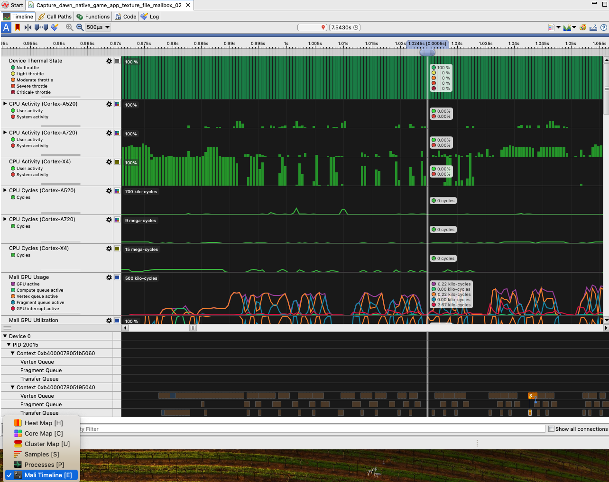

## Arm Streamline Performance Analyzer

Profiling an application, to make sure it is performant is an important step in the Android application development cycle. The default profiler in the Android Studio is great to profile CPU, but does not provide details when it comes to GPU. Arm has developed a comprehensive profiling software, Streamline, to profile both CPU and GPU. Streamline is an application profiler that can capture data from multiple sources, including:

* Program Counter (PC) samples from running application threads.
* Samples from the hardware Performance Monitoring Unit (PMU) counters in the Arm CPU, Arm® Mali™ GPUs, and Arm Immortalis™ GPUs.
* Thread scheduling information from the Linux kernel.
* Software-generated annotations and counters from running applications.

{}
If you wan to learn more about streamline, you can refer to the ["Getting Started with Streamline"](https://developer.arm.com/documentation/101816/0903/Getting-started-with-Streamline)
{}

## Profiling the application using Streamline

Make sure you have downloaded, installed and performed the initial set up as described in ["set up streamline"](2-env-setup.md#install-arm-streamline) section. Once you have selected the device, the application and metrics to be collected, click on the **start capture** button. This would automatically start the application and begin collecting the profiling data. Make sure the application is running as desired on your phone, after a few seconds, you can stop the capture. Please wait till Streamline completes processing the data. Switch to *Mali Timeline* view as shown below:

You might have to zoom into the data to the maximum (`500 us`), since we are rendering a very simple 3D object. Now lets analyze 2 consecutive frames as shown below:

As you can see from the above picture, there is some overlap between Fragment Queue of first frame and Vertex Queue of the consecutive frame. This shows that the application is hitting the **Fast Path** that Arm has implemented to optimize performance of Dawn for Mali GPUs. The overlap is quiet small since we are rendering the same simple 3D object under different orientation, you can extend the application to render complex objects with multiple *Uniform BUffers*. This would show the overlap in detail.

{}
Feel free to experiment with different counters in Streamline and explore the other CPU profiling data as well.
{}
